# ZDT_X42S 第二代闭环步进电机用户手册

**版本：V1.0.5（2026.05.27）**

> 转录说明：按原 PDF 共 110 页的顺序转录，保留原文内容、章节编号和页码定位；重复页眉、页脚及背景水印未转录。表格转换为 Markdown，合并单元格的后续位置留空；接线图、尺寸图和软件截图以原图保留，图内文字请查看图片。原文中的操作指令属于手册内容。


---

<a id="page-1"></a>

<!-- 原 PDF 第 1 页 -->

**原文第 1 页**

ZDT_X42S 第二代闭环步进电机  
用户手册 V1.0.5  


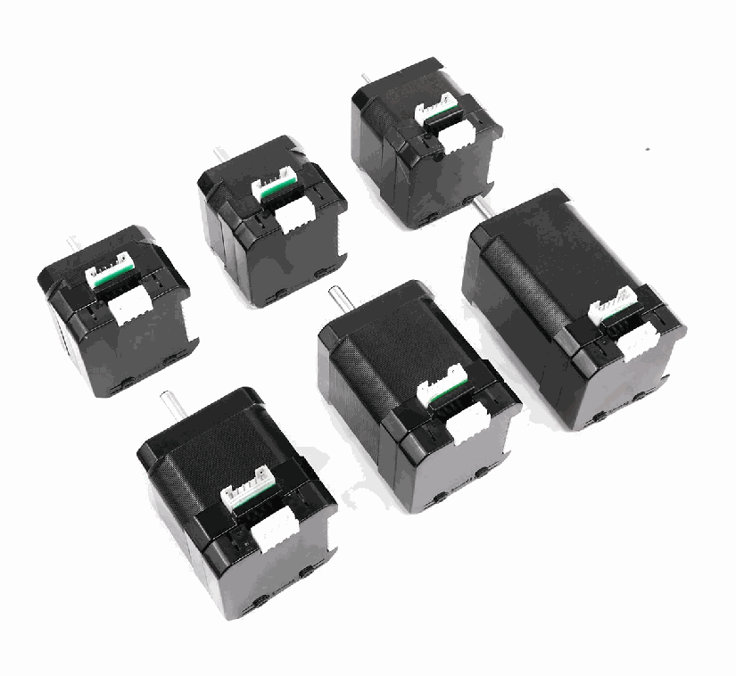


**更新记录**

| 日期 | 版本 | 内容 |
| --- | --- | --- |
| 2025.11.5 | V1.0 | 初版。 |
| 2025.11.7 | V1.0.1 | 更正到位输出和报警输出的电平输出状态。 |
| 2025.11.18 | V1.0.2 | 增加触发回零返回0x12的说明；补充读取实时转速符号位； |
| 2025.12.24 | V1.0.3 | 增加狂暴模式说明；增加一键启停说明；补充一些细节说明； |
| 2026.04.01 | V1.0.4 | 增加快速位置模式指令说明；增加多电机命令CAN发送示例； |
| 2026.05.27 | V1.0.5 | 新增2.0板卡升级编码器/供电电压等描述，更正一些内容； |
|  |  |  |


---

<a id="page-2"></a>

<!-- 原 PDF 第 2 页 -->

**原文第 2 页**


## 目录

- 注意事项（必读）（[第 6 页](#page-6)）
- 常见问题（[第 6 页](#page-6)）
- 第1章 产品概述（[第 7 页](#page-7)）
- 1.1 产品介绍（[第 7 页](#page-7)）
- 1.2 不同板卡选型对比（[第 7 页](#page-7)）
- 1.3 两种闭环固件Emm5.0和X固件对比（[第 8 页](#page-8)）
- 1.4 产品特点（[第 9 页](#page-9)）
- 1.5 产品参数（[第 9 页](#page-9)）
- 1.6 板卡安装教程（[第 11 页](#page-11)）
- 1.7 接口说明（[第 12 页](#page-12)）
- 1.8 按键操作说明（[第 12 页](#page-12)）
- 1.9 小屏幕数据显示说明（[第 13 页](#page-13)）
- 1.10 参数设置菜单介绍（[第 14 页](#page-14)）
- 第2章 接线方法（[第 23 页](#page-23)）
- 2.1 脉冲控制接线（[第 23 页](#page-23)）
- 2.1.1 STM32脉冲控制接线（[第 23 页](#page-23)）
- 2.1.2 Arduino脉冲控制接线（[第 23 页](#page-23)）
- 2.1.3 51单片机脉冲控制接线（[第 24 页](#page-24)）
- 2.1.4 PLC脉冲控制接线（[第 24 页](#page-24)）
- 2.1.5 EN+/EN-/PUL+/PUL-/DIR+/DIR-差分脉冲控制接线（[第 25 页](#page-25)）
- 2.1.6 3D打印主板/雕刻机/写字机脉冲控制接线（[第 25 页](#page-25)）
- 2.2 通讯控制接线（[第 26 页](#page-26)）
- 2.2.1 串口TTL通讯控制接线（[第 26 页](#page-26)）
- 2.2.2 RS485通讯控制接线（[第 27 页](#page-27)）
- 2.2.3 CAN通讯控制接线（[第 28 页](#page-28)）
- 第3章 高级控制功能说明（[第 29 页](#page-29)）
- 3.1 力位混合控制介绍（[第 29 页](#page-29)）
- 3.2 原点回零（[第 29 页](#page-29)）
- 3.2.1 原点回零参数说明（[第 29 页](#page-29)）
- 3.2.2 单圈回零操作说明（[第 30 页](#page-30)）
- 3.2.3 多圈无限位碰撞回零操作说明（[第 31 页](#page-31)）
- 3.2.4 多圈限位开关回零操作说明（[第 32 页](#page-32)）
- 3.2.5 回到坐标原点操作说明（[第 33 页](#page-33)）
- 3.3 左右限位开关输入（[第 34 页](#page-34)）
- 3.3.1 脉冲控制-左右限位（[第 34 页](#page-34)）
- 3.3.2 通讯控制-左右限位（[第 35 页](#page-35)）
- 3.4 到位输出功能（[第 35 页](#page-35)）
- 3.4.1 电机到位说明（[第 35 页](#page-35)）
- 3.4.2 到位引脚输出（[第 36 页](#page-36)）
- 3.4.3 到位返回命令（[第 36 页](#page-36)）
- 3.5 多机通讯及同步运动（[第 36 页](#page-36)）

---

<a id="page-3"></a>

<!-- 原 PDF 第 3 页 -->

**原文第 3 页**

- 3.5.1 多机通讯（[第 36 页](#page-36)）
- 3.5.2 同步运动（[第 37 页](#page-37)）
- 3.6 多电机命令和定时返回信息命令（[第 37 页](#page-37)）
- 3.7 DMX512协议（[第 38 页](#page-38)）
- 3.7.1 接线说明（[第 38 页](#page-38)）
- 3.7.2 操作说明（[第 38 页](#page-38)）
- 3.8 心跳保护功能（[第 38 页](#page-38)）
- 3.9 在线更新固件（[第 38 页](#page-38)）
- 3.10 一键控制加减速启停（[第 39 页](#page-39)）
- 3.11 Emm固件狂暴模式（[第 39 页](#page-39)）
- 第4章 通讯命令格式说明（[第 40 页](#page-40)）
- 4.1串口TTL/RS485通讯（[第 40 页](#page-40)）
- 4.1.1 主机发送命令格式说明（[第 40 页](#page-40)）
- 4.1.2 电机返回命令格式说明（[第 40 页](#page-40)）
- 4.1.3 串口助手和上位机示例（[第 41 页](#page-41)）
- 4.2 CAN通讯（[第 42 页](#page-42)）
- 4.2.1 主机发送命令格式说明（[第 42 页](#page-42)）
- 4.2.2 电机返回命令格式说明（[第 43 页](#page-43)）
- 4.2.3 cangaroo和上位机示例（[第 43 页](#page-43)）
- 第5章 通讯命令（[第 46 页](#page-46)）
- 5.1 通讯命令说明（[第 46 页](#page-46)）
- 5.1.1 命令后缀说明（[第 46 页](#page-46)）
- 5.1.2 两种固件部分命令差异（[第 46 页](#page-46)）
- 5.1.3 位置模式命令打断说明（[第 46 页](#page-46)）
- 5.2 触发动作命令（[第 47 页](#page-47)）
- 5.2.1 触发编码器校准（[第 47 页](#page-47)）
- 5.2.2 重启电机（X42S/Y42）（[第 47 页](#page-47)）
- 5.2.3 将当前位置角度清零（[第 48 页](#page-48)）
- 5.2.4 解除堵转/过热/过流保护（[第 48 页](#page-48)）
- 5.2.5 恢复出厂设置（[第 48 页](#page-48)）
- 5.3 运动控制命令（[第 49 页](#page-49)）
- 5.3.1 多电机命令（X42S/Y42）（[第 49 页](#page-49)）
- 5.3.2 电机使能控制（[第 50 页](#page-50)）
- 5.3.3 力矩模式控制（X）（[第 51 页](#page-51)）
- 5.3.4 力矩模式限速控制（X）（[第 51 页](#page-51)）
- 5.3.5 速度模式控制（X）（[第 52 页](#page-52)）
- 5.3.6 速度模式限电流控制（X）（[第 52 页](#page-52)）
- 5.3.7 速度模式控制（Emm）（[第 53 页](#page-53)）
- 5.3.8 直通限速位置模式控制（X）（[第 54 页](#page-54)）
- 5.3.9 直通限速位置模式限电流控制（X）（[第 54 页](#page-54)）
- 5.3.10 梯形曲线加减速位置模式控制（X）（[第 55 页](#page-55)）
- 5.3.11 梯形曲线加减速位置模式限电流控制（X）（[第 55 页](#page-55)）
- 5.3.12 位置模式控制（Emm）（[第 57 页](#page-57)）
- 5.3.13 快速位置模式控制(Emm)（[第 58 页](#page-58)）

---

<a id="page-4"></a>

<!-- 原 PDF 第 4 页 -->

**原文第 4 页**

- 5.3.14 快速梯形曲线位置模式控制(X)（[第 59 页](#page-59)）
- 5.3.15 立即停止（[第 60 页](#page-60)）
- 5.3.16 触发多机同步运动（[第 60 页](#page-60)）
- 5.4 原点回零命令（[第 61 页](#page-61)）
- 5.4.1 设置单圈回零的零点位置（[第 61 页](#page-61)）
- 5.4.2 触发回零（[第 61 页](#page-61)）
- 5.4.3 强制中断并退出回零操作（[第 62 页](#page-62)）
- 5.4.4 读取回零状态标志（[第 62 页](#page-62)）
- 5.4.5 读取回零参数（[第 63 页](#page-63)）
- 5.4.6 修改回零参数（[第 64 页](#page-64)）
- 5.5 读取系统参数命令（[第 66 页](#page-66)）
- 5.5.1 定时返回信息命令（X42S/Y42）（[第 66 页](#page-66)）
- 5.5.2 读取固件版本和硬件版本（[第 67 页](#page-67)）
- 5.5.3 读取相电阻和相电感（[第 67 页](#page-67)）
- 5.5.4 读取总线电压（[第 68 页](#page-68)）
- 5.5.5 读取总线电流（X42S/Y42）（[第 68 页](#page-68)）
- 5.5.6 读取相电流（[第 69 页](#page-69)）
- 5.5.7 读取经过线性化校准后的编码器值（[第 69 页](#page-69)）
- 5.5.8 读取输入脉冲数（[第 70 页](#page-70)）
- 5.5.9 读取电机目标位置（[第 70 页](#page-70)）
- 5.5.10 读取电机实时设定的目标位置（[第 71 页](#page-71)）
- 5.5.11 读取电机实时转速（[第 71 页](#page-71)）
- 5.5.12 读取驱动温度（X42S/Y42）（[第 72 页](#page-72)）
- 5.5.13 读取电机实时位置（[第 72 页](#page-72)）
- 5.5.14 读取电机位置误差（[第 73 页](#page-73)）
- 5.5.15 读取电机状态标志（[第 73 页](#page-73)）
- 5.5.16 读取回零状态标志 + 电机状态标志（X42S/Y42）（[第 74 页](#page-74)）
- 5.5.17 读取引脚IO电平状态（X42S/Y42）（[第 75 页](#page-75)）
- 5.5.18 读取电池电压（Y42）（[第 75 页](#page-75)）
- 5.6 读写驱动参数命令（[第 76 页](#page-76)）
- 5.6.1 修改电机ID/地址（[第 76 页](#page-76)）
- 5.6.2 修改细分值（[第 76 页](#page-76)）
- 5.6.3 修改掉电标志（[第 77 页](#page-77)）
- 5.6.4 读取选项参数状态（X42S/Y42）（[第 77 页](#page-77)）
- 5.6.5 修改电机类型（[第 78 页](#page-78)）
- 5.6.6 修改固件类型（[第 78 页](#page-78)）
- 5.6.7 修改开环/闭环控制模式（[第 79 页](#page-79)）
- 5.6.8 修改电机运动正方向（[第 79 页](#page-79)）
- 5.6.9 修改锁定按键功能（[第 80 页](#page-80)）
- 5.6.10 修改命令位置角度是否继续缩小10倍输入（X）（[第 80 页](#page-80)）
- 5.6.11 修改命令速度值是否缩小10倍输入（Emm）（[第 81 页](#page-81)）
- 5.6.12 修改开环模式工作电流（[第 81 页](#page-81)）
- 5.6.13 修改闭环模式最大电流（[第 82 页](#page-82)）
- 5.6.14 读取PID参数（X）（[第 82 页](#page-82)）

---

<a id="page-5"></a>

<!-- 原 PDF 第 5 页 -->

**原文第 5 页**

- 5.6.15 修改PID参数（X）（[第 83 页](#page-83)）
- 5.6.16 读取PID参数（Emm）（[第 83 页](#page-83)）
- 5.6.17 修改PID参数（Emm）（[第 84 页](#page-84)）
- 5.6.18 读取DMX512协议参数（X42S/Y42）（[第 85 页](#page-85)）
- 5.6.19 修改DMX512协议参数（X42S/Y42）（[第 85 页](#page-85)）
- 5.6.20 读取位置到达窗口（X42S/Y42）（[第 87 页](#page-87)）
- 5.6.21 修改位置到达窗口（X42S/Y42）（[第 87 页](#page-87)）
- 5.6.22 读取过热过流保护检测阈值（X42S/Y42）（[第 88 页](#page-88)）
- 5.6.23 修改过热过流保护检测阈值（X42S/Y42）（[第 88 页](#page-88)）
- 5.6.24 读取心跳保护功能时间（X42S/Y42）（[第 89 页](#page-89)）
- 5.6.25 修改心跳保护功能时间（X42S/Y42）（[第 89 页](#page-89)）
- 5.6.26 读取积分限幅/刚性系数（X42S/Y42）（[第 90 页](#page-90)）
- 5.6.27 修改积分限幅/刚性系数（X42S/Y42）（[第 90 页](#page-90)）
- 5.6.28 读取碰撞回零返回角度（X42S/Y42）（[第 91 页](#page-91)）
- 5.6.29 修改碰撞回零返回角度（X42S/Y42）（[第 91 页](#page-91)）
- 5.6.30 广播读取ID地址（X42S/Y42）（[第 92 页](#page-92)）
- 5.6.31 修改锁定修改参数功能（X42S/Y42）（[第 92 页](#page-92)）
- 5.7 上电自动运行命令（[第 93 页](#page-93)）
- 5.7.1 存储一组速度参数，上电自动运行（X）（[第 93 页](#page-93)）
- 5.7.2 存储一组速度参数，上电自动运行（Emm）（[第 94 页](#page-94)）
- 5.8 读取所有驱动参数命令（[第 95 页](#page-95)）
- 5.8.1 读取系统状态参数（X）（[第 95 页](#page-95)）
- 5.8.2 读取系统状态参数（Emm）（[第 97 页](#page-97)）
- 5.8.3 读取驱动配置参数（X）（[第 98 页](#page-98)）
- 5.8.4 修改驱动配置参数（X）（[第 99 页](#page-99)）
- 5.8.5 读取驱动配置参数（Emm）（[第 103 页](#page-103)）
- 5.8.6 修改驱动配置参数（Emm）（[第 104 页](#page-104)）
- 第6章 售后和技术支持（[第 107 页](#page-107)）
- 第7章 附录（[第 109 页](#page-109)）
- 7.1校验码计算方式（[第 109 页](#page-109)）

---

<a id="page-6"></a>

<!-- 原 PDF 第 6 页 -->

**原文第 6 页**

感谢您购买此产品，为了让您更充分的了解产品特性和操作  
方法，我们建议您在使用前先仔细阅读本手册。  
注意事项（必读）  
1.供电电压：常规版10-29V，高压版10-48V(10-60V)，推荐使用3A以上电源；  
2.请勿带电拔插供电源通讯线以及电机线，以免造成电气损坏；  
3.建议搭配本店磁柱步进电机，到店一起购买电机，会安装并校准好整套发货；  
4.单独购买驱动板，按“板卡安装教程”安装后，先执行一次空载校准(Cal_MFL);  
5.松动/拆卸过驱动板、更换过电机等，需要重新执行一次空载校准；  
6.板卡支持串口TTL/RS232/RS485/CAN通讯，2.0版本可以拔插通讯小板来更换  
通讯类型，同时42/57/86也有集成通讯芯片版本，根据自己需求选择对应版本。  
7.脉冲信号不管PLC还是光耦版本都支持3.3-24V无需串联电阻，光耦版本带隔  
离，更适合工业使用，但仅支持共阳(NPN)输入。  
8.使用Modbus协议/CANopen协议请搭配相关配套资料的说明书进行使用。  
常见问题  


| 序号 | 电机状态 | 小屏幕显示内容 | 处理方法 |
| --- | --- | --- | --- |
| 1 | 电流采样异常 | Sample Current Error! | 联系客服售后处理 |
| 2 | 编码器出错 | Encoder Error! | 检查磁铁是否安装好 |
| 3 | 参考电压错误 | Ref Voltage Error! |  |
| 4 | 电机线序错误 | Phase A+A- Error! | 检查电机线序是否接对 |
| 5 | 电机未校准 | Not Cal | 按Enter键或发送触发校准命令校准 |
| 6 | 触发低压警告 | UnderVol Warning | 检查供电电压是否过低 |
| 7 | 触发堵转保护 | Clogging Protect! | 按Enter键或发送解除堵转保护命令 |
| 8 | 触发过热保护 | OverTemp Warning |  |
| 9 | 触发过流保护 | OverCur Warning |  |
| 10 | 触发过压警告 | OverVol Warning |  |
| 11 | 触发固件更新 | 屏幕不显示，蓝灯常亮 | 重新更新固件，等待更新完毕 |
| 12 | 恢复出厂设置 | Restore Done Reboot | 重新上电空载校准 |


---

<a id="page-7"></a>

<!-- 原 PDF 第 7 页 -->

**原文第 7 页**


## 第 1 章 产品概述


### 1.1 产品介绍

ZDT_X42S是张大头闭环伺服全新自研的第二代闭环步进电机，采用工业级高  
精度编码器，具备脉冲接口和串口TTL/RS485/CAN通讯接口，内置两种高效自研  
FOC闭环算法，具有声音小、发热小、转速高、震动低、力矩大、防丢步等优点，  
内置支持自由协议、Modbus-RTU、DMX512 等多种通讯协议，具有力矩控制、速  
度控制、位置控制、力位混合控制，支持超快速多电机命令同步运动，适合 3D  
打印/写字机/雕刻机、PLC、机械臂、电动夹爪、小车比赛、工业场合等应用。  

### 1.2 不同板卡选型对比


**板卡外观**

| 板卡型号 | X42_V1.3(停产) | X42S_V1.0 | Y42_V2.0 |
| --- | --- | --- | --- |
| 上线时间 | 2023年8月 | 2025年10月 | 2025年5月 |
| 485/CAN电路 | 分体拔插，方便切换 | 有分体拔插版本，也有集成到板上，更加稳定可靠 |  |
| 带显示屏 | √ | √ | × |
| 掉电记录 | × | × | √(超低功耗8uA) |
| 多机同步 | √(耗时长，多条发送) | √(无需延时，一条发完) | √(无需延时，一条发完) |
| 定时返回 | × | √ | √ |
| 力位混合控制 | × | √ | √ |
| 回零完成返回 | × | √ | √ |
| 内置闭环固件 | Emm5.0或X，需重刷 | 集成了Emm5.0和X两种固件，可以一键切换 |  |
| 固件更新 | 重刷固件，需重新校准 | 通过USB转485/CAN在线更新固件，无需拆装 |  |


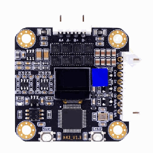


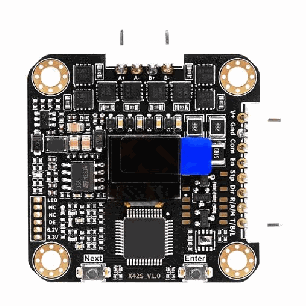


---

<a id="page-8"></a>

<!-- 原 PDF 第 8 页 -->

**原文第 8 页**


### 1.3 两种闭环固件 Emm5.0 和 X 固件对比


**板卡外观**

| 板卡型号 | X42_V1.3(停产) |  | X42S_V1.0 |  | Y42_V2.0 |
| --- | --- | --- | --- | --- | --- |
| 固件辨别方法 | Emm固件：板卡小屏幕第二行显示角度误差0.00err |  |  |  | 绿灯常亮为Emm固件，绿<br>灯1秒闪烁1次为X固件 |
|  | X固件 ：板卡小屏幕第二行显示实时角度0.0° |  |  |  |  |
| 出厂默认固件 | Emm5.0固件 |  |  |  | X固件 |
| 固件切换方式 | 用STLink/DAPLink刷固件 |  | 在FWType菜单中更改 |  | 长按Next按键3秒切换 |
| 校准差异 | X固件首次上电校准会高速旋转几圈测量电机磁链，Emm固件可选择不高速旋转 |  |  |  |  |
| 指令差异 | 两种固件大部分命令相同，见“5.1.2 两种固件部分命令差异” |  |  |  |  |
|  |  |  |  |  |  |
| 两种闭环固件特性对比 |  |  |  |  |  |
| 固件类型 | Emm5.0固件 |  |  | X固件 |  |
|  | 普通模式(默认) | 狂暴模式 |  |  |  |
| 闭环方式 | 电压模式力矩环、<br>位置闭环 | 力矩位置双闭环 |  | 力矩-速度-位置完整FOC三闭环控制 |  |
| 优点 | 1.刚性强；<br>2.动态响应快；<br>3.电机适应性强；<br>4.低速超静音；<br>5.高速运行平稳； | 1.动态响应快；<br>2.位置跟随极好；<br>3.高速力矩增大；<br>4.专为 3D 打印机/<br>雕刻机/写字机/贴<br>片机等优化； |  | 1.支持力矩模式、力位混合控制模式；<br>2.高速力矩比较大(24V以上供电)；<br>3.丢步补偿不会超速运行；<br>4.支持标准的梯形曲线加减速位置模<br>式，平滑切换；<br>5.电机全过程可以设定电机力矩电流； |  |
| 缺点 | 无力矩模式； | 不能限制最高转速 |  | 刚性一般，大转盘类结构导致晃动； |  |
| 应用推荐 | 3D打印、写字机、雕刻机、小车比赛 |  |  | 大负载结构、减速齿轮，机械臂、PLC<br>控制、运动控制比较复杂的场景 |  |


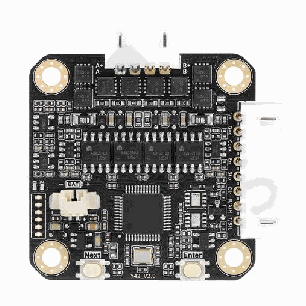


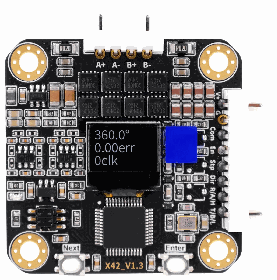


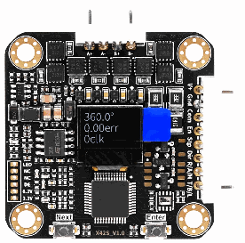


---

<a id="page-9"></a>

<!-- 原 PDF 第 9 页 -->

**原文第 9 页**


### 1.4 产品特点


| 序号 | 产品特点 |
| --- | --- |
| 1 | 完全兼容上一代X42版本，包含其所有的软硬件功能； |
| 2 | 大幅减少板卡上电初始化时间，上电即可进行通讯； |
| 3 | 优化算法程序，大幅提升电机运动丝滑性和速度稳定性，电机运动更静音； |
| 4 | 提升最大工作电流X42S/5A，最大转速6000RPM+，最大输入脉冲频率300KHz； |
| 5 | 内置Emm固件和X固件两种自研FOC矢量闭环算法，支持快速切换； |
| 6 | 新增一键在线更新固件，更新固件无需拆装电机、无需重新校准； |
| 7 | 新增多电机命令，一次性可发完多个电机命令，支持超快速多机同步控制； |
| 8 | 新增定时返回命令，可设置定时返回电流/速度/位置/状态等，无需频繁读取； |
| 9 | 新增Emm固件位置模式命令打断功能，新位置命令实时更新、平滑过渡； |
| 10 | 采用15MHz高速RS485芯片，支持自由协议、Modbus协议、DMX512协议等； |
| 11 | 支持接入左、右限位开关限制电机运动范围； |
| 12 | 新增回零完成返回命令、力矩模式夹爪夹紧返回命令、（到位返回命令）； |
| 13 | 新增无限位碰撞回零返回角度设定，可设置碰撞回零完成后返回固定角度； |
| 14 | 新增力位混合控制命令（限速力矩模式、限流速度模式、限流限速位置模式）； |
| 15 | 新增支持2种相对位置(相对当前位置/上一次输入位置)和绝对位置模式运动； |
| 16 | 增加读取引脚IO电平状态命令； |
| 17 | 增加重启电机命令； |
| 18 | 新增心跳保护功能； |
| 19 | 新增锁定按键功能； |
| 20 | 新增过热保护、过流保护； |
| 21 | 提供CAN/485上位机、说明书、Arduino和STM32F103/F407例程、Modbus调试； |

注：上述最大转速6000RPM+为Emm固件模式空载下的最大转速，X固件模式最大转速限制3000RPM。  

---

<a id="page-10"></a>

<!-- 原 PDF 第 10 页 -->

**原文第 10 页**


### 1.5 产品参数


**产品参数**

| 主板型号 | X28S | X35S | X42S | X57S | X86S |
| --- | --- | --- | --- | --- | --- |
| MOSFET | 8颗大功率MOSFET |  |  |  |  |
| 磁编码器 | 工业级超高精度AMR磁编，V1.0为14位，V2.0升级优先采用 16 位编码器 |  |  |  |  |
| RS485收发器 | 10MHz及以上高速RS485芯片 |  |  |  |  |
| 工作电压 | X28/X35(停产) ：10-29V<br>X28S/X35S_V2.0：10-48V |  | 常规版10-29V<br>高压版10-48V<br>(红色端子) | V1.0：10-29V<br>V2.0：10-60V | 10-60V |
| 工作电流 | 0-3000mA | 0-4000mA | 0-5000mA | 0-6000mA |  |
| 电机转速 | 空载下，Emm固件：0.1RPM-6000RPM+、X固件：0.1RPM-3000RPM |  |  |  |  |
| 脉冲信号输入 | PLC和光耦版本都支持3.3-24V无需串联电阻，光耦版仅支持共阳输入 |  |  |  |  |
| 脉冲信号频率 | 最高300KHz |  |  |  |  |
| 控制精度 | 小于0.08° |  |  |  |  |
| 细分 | 1-256任意细分，内置细分插补功能 |  |  |  |  |
| 通讯方式 | 支持脉冲控制、串口TTL/RS485/CAN通讯控制，支持二者混合控制 |  |  |  |  |
| 控制模式 | 力矩模式(X)、速度模式、标准梯形曲线加减速位置模式(X) |  |  |  |  |
| 电机类型 | 0.9°/ 1.8°步进电机 |  |  |  |  |
| 闭环算法类型 | 内置Emm固件和X固件，X固件支持力矩模式、力位混合控制 |  |  |  |  |
| 闭环更新频率 | 力矩环20KHz、速度环20KHz、位置环20KHz |  |  |  |  |
| 静音/震动 | 低速超静音、超低震动，高速运行平稳，不抖动 |  |  |  |  |
| 保护措施 | 反接保护、堵转保护、过流保护、过热失能、低压提示 |  |  |  |  |
| 其他功能 | 编码器自校准、电机线序错误识别、一键恢复出厂设置等 |  |  |  |  |
| 制动/换向 | 支持高速6000RPM+立即停止、立即切换方向 |  |  |  |  |
| 回零模式支持 | 单圈就近回零、单圈方向回零、多圈限位回零、多圈无限位碰撞回零 |  |  |  |  |
| 输出信号 | 到位输出(返回命令)、回零完成输出、力矩夹爪夹紧输出、报警输出 |  |  |  |  |
| 供电电源 | 推荐使用12/24V 3A以上供电电源 |  |  |  |  |
| 使用环境温度 | 推荐0-40℃ |  |  |  |  |
| 存储环境温度 | 推荐-20-65℃ |  |  |  |  |


---

<a id="page-11"></a>

<!-- 原 PDF 第 11 页 -->

**原文第 11 页**

板卡安装教程  
1.6  
注1：如果带电机一起下单会装好整套发货，到手即用，此步骤可略过；  
注2：带磁柱孔的电机也要滴胶水粘紧，防止磁铁打滑松动；  
注3：板卡视频安装在线教程：https://b23.tv/8ClYRKZ  
板卡通过磁铁反馈电机位置进行闭环控制，配套的磁铁需要用胶水粘在电机  
背后轴上，磁铁和板卡之间要留有1-2mm间距，磁铁不能顶着编码器，安装教程  
如下图所示：  


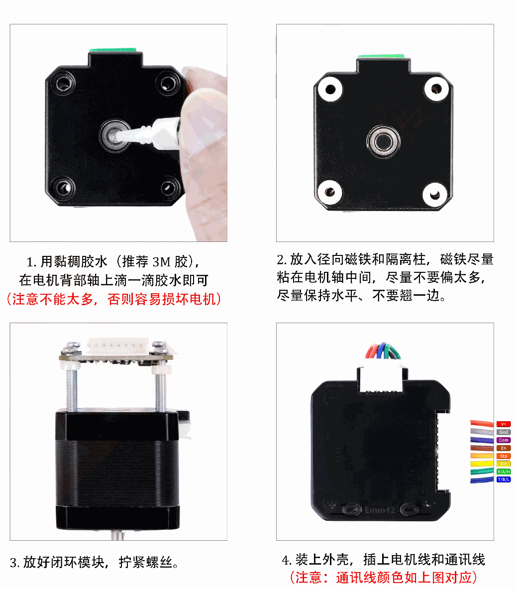


---

<a id="page-12"></a>

<!-- 原 PDF 第 12 页 -->

**原文第 12 页**

接口说明  
1.7  


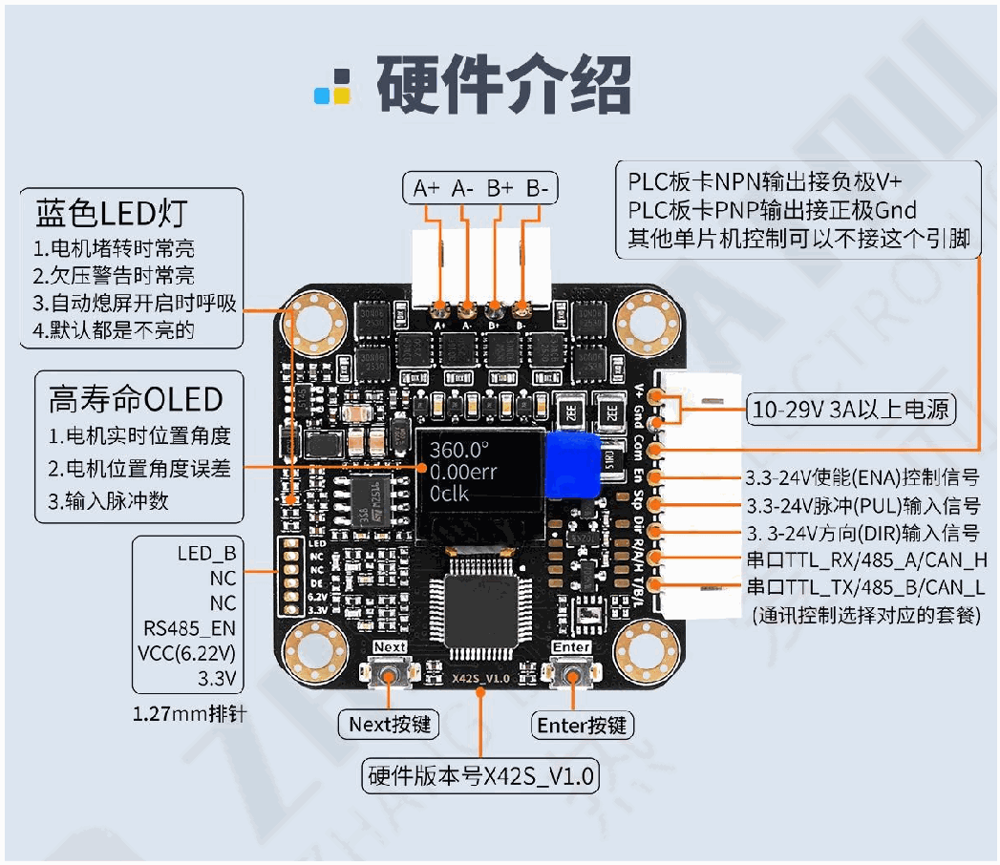


### 1.8 按键操作说明


##### 在角度显示界面，按Next按键可以切换显示不同的信息：角度、电流、电机

相电阻/电感等，见“1.9 小屏幕数据显示说明”。  

##### 按Enter按键进入参数设置菜单，然后按Next按键向下选择，按Enter按键

进入菜单选项或确认选择。  

##### 在参数设置菜单/选项界面，长按Next按键1秒可以返回到角度显示界面


##### 按住Next和Enter两个按键再上电，持续5秒，可以快速恢复出厂设置。


---

<a id="page-13"></a>

<!-- 原 PDF 第 13 页 -->

**原文第 13 页**

小屏幕数据显示说明  
1.9  


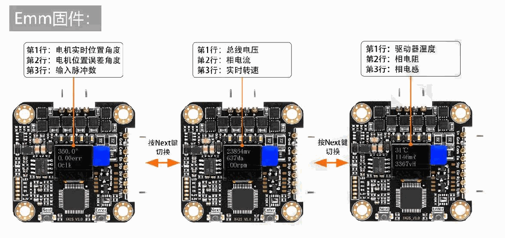


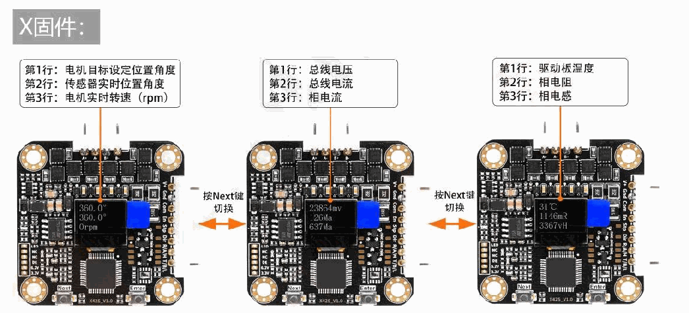


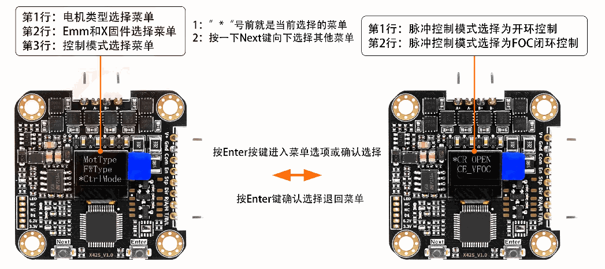


---

<a id="page-14"></a>

<!-- 原 PDF 第 14 页 -->

**原文第 14 页**


### 1.10 参数设置菜单介绍


##### Hide

功能：设置是否隐藏显示开机LOGO  
选项：Disable、Enable  
作用：修改为Enable后，电机开机时将不显示LOGO直接进入数据显示界面；  

##### Lock

功能：设置是否锁定进入菜单按键  
选项：Disable、Enable  
作用：默认为Disable，短按一下Enter按键进入菜单，修改为Enable后，  
需要长按Enter按键3秒以上才能进入参数设置菜单；  

##### Cal

功能：校准编码器  
选项：Cal_MFL、Cal_NHS  
作用：校准编码器：测量电机参数，并对磁编码器进行线性化校准  
Cal_MFL：无论哪个固件，首次校准完成后会高速旋转几圈测量电机磁链  
Cal_NHS：当前如果是Emm固件，将不会测量电机磁链（不会高速旋转）  

##### MotType

功能：设置步进电机的步距角类型  
选项：0.9°、1.8°  
作用：驱动支持0.9°和1.8°两种步距角类型步进电机，默认1.8°，参数  
由电机厂家提供，一般都是1.8度，无需更改，更改后，要重新校准编码器；  

##### FWType

功能：设置使用的闭环固件类型  
选项：FW_X、FW_Emm  
作用：FW_X为X固件，FW_Emm为Emm5.0固件，默认为FW_Emm；  

---

<a id="page-15"></a>

<!-- 原 PDF 第 15 页 -->

**原文第 15 页**


##### EmmTurbo

功能：设置是否开启Emm固件狂暴模式  
选项：Disable、Enable  
作用：仅Emm固件有效，狂暴模式采用 FOC力矩位置双闭环控制，高速力矩  
增强，超快响应，超快位置跟随，专为3D打印机/雕刻机/贴片机/写字机等优化。  
开启后，3000RPM+高速位置跟随误差接近 0.00err，可以改善 3D 打印机：1)圆  
打印椭圆和直角打印圆角问题；2)解决长条形表面有轻微波浪纹问题；3)高速打  
印力矩不足打印速度上不去的问题；4)位置跟随不足导致响应性不够的问题；  
注意1：用到狂暴模式，校准的时候选第一项：Cal_MFL，要测量电机磁链；  
注意2：狂暴模式不一定能适配所有的步进电机，请尽可能选用本店电机；  

##### CtrlMode

功能：控制模式选择  
选项：CR_OPEN、CR_VFOC  
作用：CR_OPEN为开环模式，CR_VFOC为FOC矢量闭环模式，默认为CR_VFOC，  
开环模式一般最高转速只有200-400RPM，电流固定，电流在Ma菜单设置，闭环  
模式最高转速可达3000RPM+，电流自动调节，最大电流在Ma_Limit菜单设置，  
X固件的最大转速在Vm_Limit菜单设置；  

##### P_Pul

功能：脉冲端口复用功能选择  
选项：PUL_OFF、PUL_ENA(默认)、ESI_RCO、pLR_ESI  
作用：设置脉冲端口(En、Stp、Dir三个引脚)复用为何种功能：  
PUL_OFF：关闭脉冲端口，脉冲端口不起任何作用；  
PUL_ENA：使能脉冲端口，脉冲端口可以输入脉冲进行脉冲控制；  
ESI_RCO：复用为回零限位输入功能：将 En引脚作为多圈限位开关回零  
的限位开关输入引脚，将Dir引脚作为电机到位输出引脚（电机运动完到位后输  
出高电平3.3V，电机没到位时输出低电平0V）；  
pLR_ESI：复用为左右限位功能：将 En 引脚和 Stp引脚分别作为电机正  
反转的限位(回零)开关，限制电机在这两个限位开关行程范围内进行运动，将  
Dir引脚作为电机到位输出引脚（电机运动完到位后输出高电平3.3V）；  

---

<a id="page-16"></a>

<!-- 原 PDF 第 16 页 -->

**原文第 16 页**


##### P_Serial

功能：通讯端口复用功能选择  
选项：RxTx_OFF、ESI_ALO、UART_FUN(默认)、CAN1_MAP  
作用：设置通讯端口(R/A/H、T/B/L引脚)复用为何种功能：  
RxTx_OFF：关闭通讯端口，通讯端口不起任何作用；  
ESI_ALO ：复用为回零限位输入功能：将 R/A/H 引脚作为上电自动触发  
多圈限位开关回零的限位开关输入引脚，以及上电后可以给R/A/H引脚输入低电  
平(0V)可以复位堵转保护，将T/B/L端口复用为报警输出功能，发生堵转等异常  
时输出低电平0V，默认电机没堵转时输出高电平3.3V；  
UART_FUN：将通讯端口复用为串口TTL/RS232/RS485通讯引脚；  
CAN1_MAP：将通讯端口复用为CAN通讯引脚；  
uLR_ESI：复用为左右限位功能：将R/A/H引脚和T/B/L引脚分别作为电  
机正反转的限位(回零)开关，限制电机在这两个限位开关行程范围内进行运动；  

##### En

功能：设置En引脚的有效电平  
选项：L、H、Hold(默认)  
作用：设置脉冲控制使能引脚的有效电平：  
L ：低电平有效，即控制En引脚低电平使能，高电平失能；  
H ：高电平有效，即控制En引脚高电平使能，低电平失能；  
Hold：一直有效，即控制En引脚不论是高电平还是低电平，电机一直使能；  

##### Dir

功能：设置Dir引脚的有效电平  
选项：CW、CCW  
作用：设置脉冲控制方向引脚的有效电平，即电机旋转正方向的有效电平；  

##### MStep

功能：设置脉冲控制的细分步数  
选项：1、2、4、8、16、32、64、128、256  
作用：默认16细分对应3200个脉冲电机旋转一圈，32细分则对应6400；  

---

<a id="page-17"></a>

<!-- 原 PDF 第 17 页 -->

**原文第 17 页**


##### MPlyer

功能：设置是否开启脉冲控制下内部的细分插补功能  
选项：Disable、Enable(默认)  
作用：内部插值到高细分运行，有效减少电机低速运动时的震动和噪音；  

##### AutoSDD

功能：设置自动熄屏功能  
选项：Disable、Enable  
作用：使能(Enable)该选项后，在7秒内无任何按键操作时，小屏幕会自动  
关闭显示，可以按任意按键重新点亮屏幕。  

##### Ma

功能：设置开环模式电机工作的相电流  
选项：200、400、...、5000（单位：Ma）  
作用：设置开环模式电机工作的相电流。  

##### Ma_Limit

功能：设置FOC矢量闭环控制模式下电机的最大相电流  
选项：200、400、...、5000（单位：Ma）  
作用：设置FOC矢量闭环控制模式下电机的最大相电流。  

##### Vm_Limit

功能：设置X固件FOC矢量闭环控制模式下的最大转速  
选项：200、400、...、3000（单位：RPM，即转/每分钟）  
作用：设置X固件FOC矢量闭环控制模式下的最大转速，默认3000RPM。  

##### Op_Limit

功能：设置Emm固件FOC矢量闭环模式下的最大输出电压  
选项：200、400、...、5000（单位：mV）  
作用：设置Emm固件闭环控制模式下的最大输出电压，默认是(4000*3)mV，  
通过限制最大输出电压，可粗略的限制电机堵转的最大电流和运行的最高转速。  

---

<a id="page-18"></a>

<!-- 原 PDF 第 18 页 -->

**原文第 18 页**


##### UartBaud

功能：设置串口TTL/RS232/RS485通讯的波特率  
选项：9600、19200、25000、38400、57600、115200、256000、512000、921600  
作用：设置串口TTL/RS232/RS485通讯的波特率，默认是115200；  

##### CAN_Baud

功能：设置CAN通讯的速率  
选项：10000、20000、50000、83333、100000、125000、250000、500000、  
800000、1000000  
作用：设置CAN通讯的速率，默认是500000，即500KHz；  

##### ID_Addr

功能：设置串口TTL/RS232/RS485/CAN通讯的电机地址  
选项：1、2、...、32  
作用：设置电机地址，范围为1-255，0为广播地址，其他可上位机修改；  

##### Checksum

功能：设置通讯校验方式或通讯协议  
选项：0x6B、XOR、CRC-8、Modbus、DMX512  
作用：默认为固定0x6B校验,即通讯指令中最后的字节都固定为0x6B；XOR  
和CRC-8 校验计算方式见文末附录；Modbus协议查看“Modbus-RTU 指令说明”  
文档；DMX512 协议波特率为250000，停止位为2，通讯协议与0x6B相同，但需  
要先持续发送完512个数据缓冲区后才能进行0x6B的通讯。  

##### Response

功能：设置串口TTL/RS232/RS485/CAN总线通讯时，控制动作命令是否回复  
选项：None、Receive(默认)、Reached、Both、Other  
作用：设置串口TTL/RS232/RS485/CAN通讯时，主机发送控制动作命令，从  
机收到命令后，是否返回确认收到命令，以及是否返回到位命令或回零完成命令；  
None： 既不返回确认收到命令，也不返回到位命令或回零完成命令；  
Receive：只返回确认收到命令（默认值）；  
Reached：只返回到位命令或回零完成命令（地址 + FD/9A + 9F + 6B）；  

---

<a id="page-19"></a>

<!-- 原 PDF 第 19 页 -->

**原文第 19 页**

Both： 既返回确认收到命令，也返回到位命令和回零完成命令；  
Other： 只返回到位命令，其他控制动作命令返回确认收到命令；  
注：Response菜单针对的是控制动作命令，读取参数/修改参数命令不起作用  

##### S_Vel_IS

功能：设置Emm固件通讯控制速度值是否缩小10倍输入(精确到0.1RPM)  
选项：Disable(默认)、Enable  
作用：仅Emm固件有效，默认Emm固件通讯控制最低输入转速为1RPM，使能  
后，输入转速会缩小 10倍，比如，发送1RPM，但电机实际是0.1RPM转速运行；  

##### S_PosTDP

功能：设置X固件通讯控制位置角度放大100倍进行发送，即精确到0.01°。  
选项：Disable(默认)、Enable  
作用：仅X固件有效，使能后，X固件通讯控制位置模式的位置角度将放大  
100倍（精确到0.01度）发送，比如，发送36000，但电机实际是运行360.00°。  

##### Clog_Pro

功能：设置电机的堵转保护功能  
选项：Disable、Enable(默认)、AutoZero  
作用：电机发生堵转LED会点亮指示，如果使能(Enable)该选项后，电机发  
生堵转时会自动关闭驱动器，保护电机，小屏幕将提示 Clogging Protect，此  
时可以按两下Enter按键解除堵转保护，或者串口发送解除堵转命令进行解除；  
如果P_Serial菜单设置为ESI_ALM，则在触发了堵转保护后，T/B/L端口将  
输出低电平0V，可以将R/A/H引脚短接Gnd解除堵转保护，无需重新上电；  
AutoZero：触发堵转保护后，不会关闭驱动器，而是会将当前的位置角度作  
为0点位置重新使能电机，类似于完成了一次无限位碰撞回零的效果。  
（堵转保护触发条件：电机实际转速 < 设置的堵转检测转速阈值 + 电机实际相  
电流 > 设置的堵转检测相电流阈值 + 持续时间 > 设置的堵转检测时间阈值）  

##### Clog_Rpm

功能：设置堵转检测的转速阈值  
选项：2、4、...、30（单位：RPM，即转/每分钟）  

---

<a id="page-20"></a>

<!-- 原 PDF 第 20 页 -->

**原文第 20 页**

作用：堵转检测判定条件之一：电机实际转速 < 堵转检测转速阈值。  

##### Clog_Ma

功能：设置堵转检测的相电流阈值  
选项：1800、3000、...、3600（单位：Ma）  
作用：堵转检测判定条件之二：电机实际相电流 > 堵转检测相电流阈值。  

##### Clog_Ms

功能：设置堵转保护检测的时间阈值  
选项：400、800、...、6000（单位：Ms）  
作用：堵转保护检测判定条件之三：持续时间 > 堵转检测时间阈值。  

##### O_Set

功能：设置单圈就近/方向回零的零点位置  
选项：Set O、Clear O、Exit  
作用：设置单圈就近/方向回零的零点位置。  

##### O_Mode

功能：设置回零模式  
选项：Nearest、Dir、Senless、EndStop、AbsZero  
作用：设置上电自动触发的回零模式，分别是单圈就近回零、单圈方向回零、  
多圈无限位碰撞回零、多圈有限位开关回零、回到坐标原点(刚上电时的位置)。  
原点回零操作说明请参考“3.2 原点回零”；  

##### O_Dir

功能：设置回零方向  
选项：CW、CCW  
作用：设置单圈方向回零、多圈无限位碰撞回零、多圈限位开关回零的回零  
方向。  

##### O_Vel

功能：设置回零转速  

---

<a id="page-21"></a>

<!-- 原 PDF 第 21 页 -->

**原文第 21 页**

选项：30、60、...、300（单位：RPM）  
作用：设置回零的速度。  

##### O_Tmo_Ms

功能：设置回零的超时时间  
选项：10000、20000、...、180000（单位：毫秒）  
作用：回零超过这个时间就自动中断并退出回零，并置位回零失败标志位。  
（碰撞回零触发条件：电机实际转速 < 设置的碰撞回零转速阈值 + 电机实际相  
电流 > 设置的碰撞回零相电流阈值 + 持续时间 > 设置的碰撞回零时间阈值）  

##### O_SL_Rpm

功能：设置无限位碰撞回零的检测转速  
选项：30、60、...、300（单位：RPM）  
作用：碰撞回零检测判定条件之一：电机实际转速 < 碰撞回零检测转速。  

##### O_SL_Ma

功能：设置无限位碰撞回零的检测电流  
选项：200、400、...、3000（单位：Ma）  
作用：碰撞回零检测判定条件之二：电机实际电流 > 碰撞回零检测电流。  

##### O_SL_Ms

功能：设置无限位碰撞回零的检测时间  
选项：20、40、...、300（单位：毫秒）  
作用：碰撞回零检测判定条件之三：持续时间 > 碰撞回零检测时间。  

##### O_SL_RP

功能：设置无限位碰撞回零完成后的返回角度  
选项：BaseOnMa、2.0°、4.0°、...、50.0°（单位：度）  
作用：因为碰撞瞬间电流较大，所以碰撞完成后需要返回一定角度位置，防  
止电机堵转。BaseOnMa 是基于电流检测返回，即返回到(电机实际电流 < 碰撞  
回零检测电流)的位置，其余为固定值，如2.0°为碰撞完成后固定返回2.0度。  

---

<a id="page-22"></a>

<!-- 原 PDF 第 22 页 -->

**原文第 22 页**


##### O_POT_En

功能：设置上电自动触发回零功能  
选项：Disable、Enable  
作用：设置上电自动触发回零功能，结合“3.2 原点回零”章节操作。  

##### PRWindow

功能：设置位置到达窗口角度  
选项：0.2°、0.4°、0.6°、0.8°(默认)、...、3.0°  
作用：当位置角度误差 = 目标位置 - 实时位置 < 位置到达窗口(0.8°)，  
认为电机已经到达设定的位置，将置位Prf_TF(到位标志)，如果Response菜单  
设置为Reached/Both/Other，则到位后主动返回：地址 + 功能码 + 9F + 6B。  
更详细说明参考“3.4.1 电机到位说明”小节。  

##### Restore

功能：恢复出厂设置  
选项：Yes、No  
作用：恢复出厂设置，点击 Yes后蓝灯常亮恢复成功，此时需要断电重新上  
电，重新空载校准编码器。  

##### Exit

功能：退出菜单，返回到角度显示界面  
选项：无  
作用：退出菜单，返回到小屏幕数据显示界面。  

---

<a id="page-23"></a>

<!-- 原 PDF 第 23 页 -->

**原文第 23 页**


## 第 2 章 接线方法


### 2.1 脉冲控制接线


#### 2.1.1 STM32 脉冲控制接线


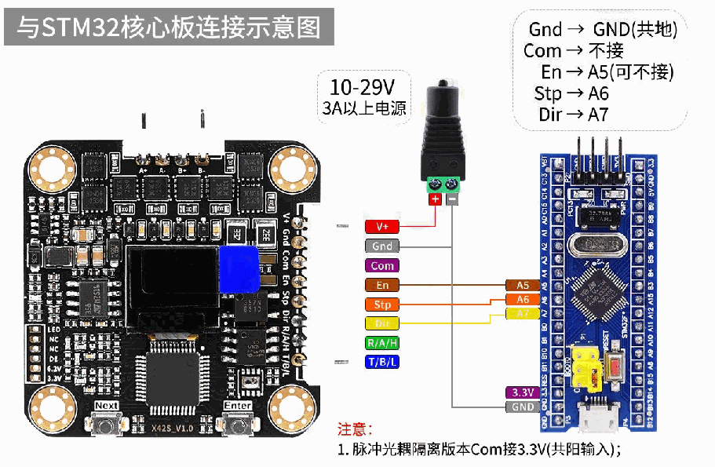


#### 2.1.2 Arduino 脉冲控制接线


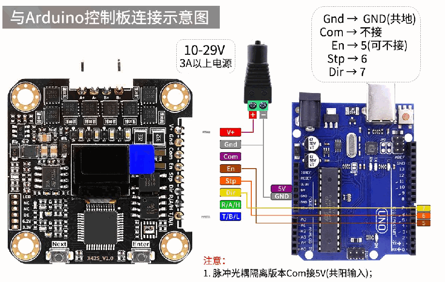


---

<a id="page-24"></a>

<!-- 原 PDF 第 24 页 -->

**原文第 24 页**

单片机脉冲控制接线  
2.1.3 51  


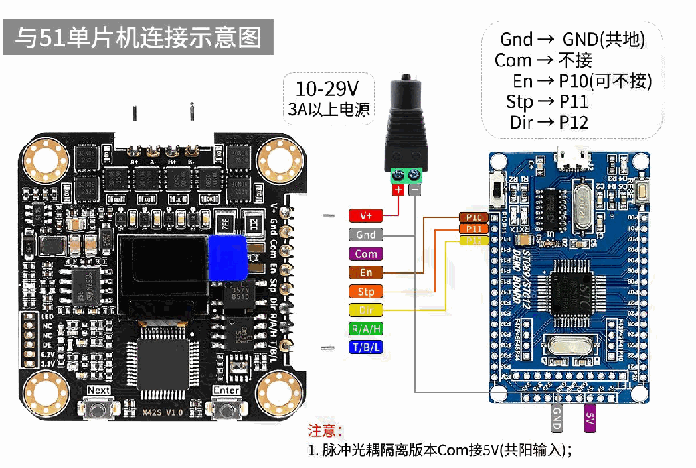


#### 2.1.4 PLC 脉冲控制接线


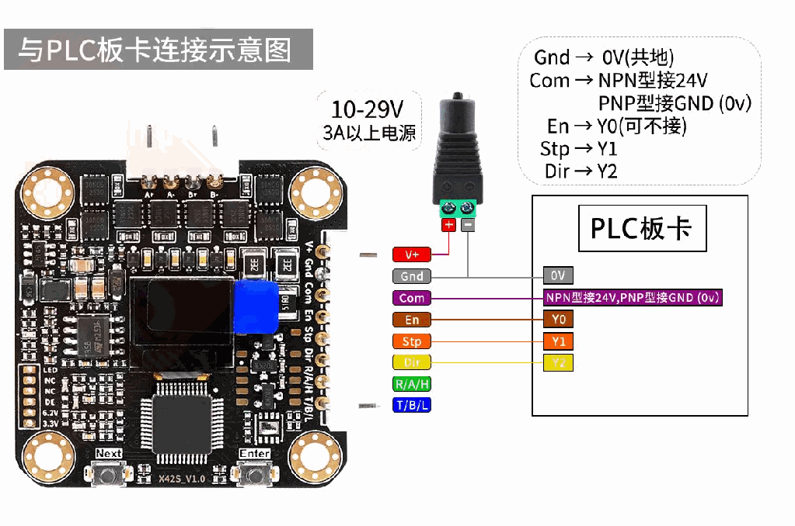


---

<a id="page-25"></a>

<!-- 原 PDF 第 25 页 -->

**原文第 25 页**

差分脉冲控制接线  

#### 2.1.5 EN+/EN-/PUL+/PUL-/DIR+/DIR-


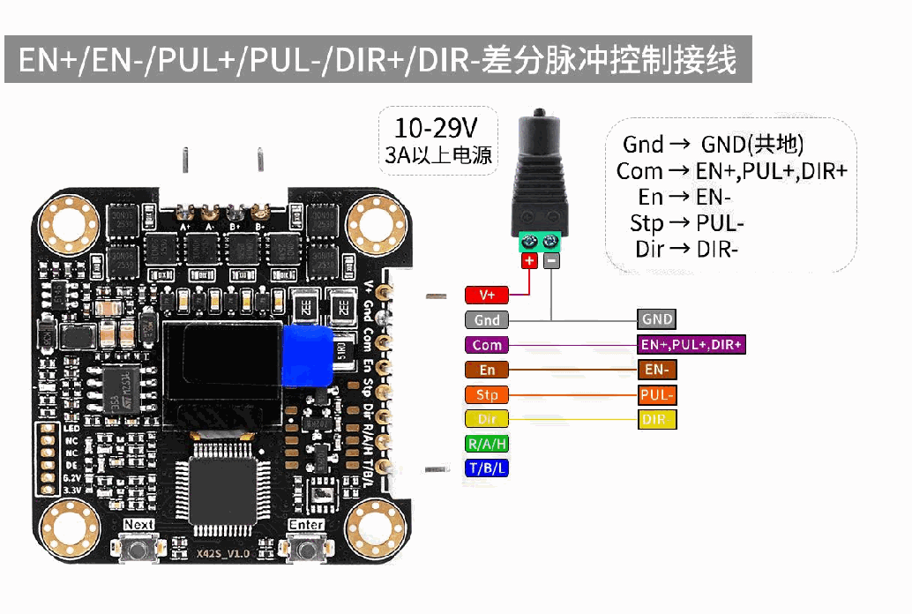

2.1.6 3D 打印主板/雕刻机/写字机脉冲控制接线  


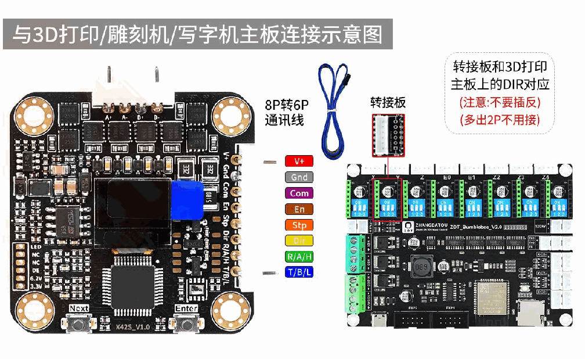

注：3D打印机建议使用Emm固件的狂暴模式，专为3D打印机/雕刻机/写字机/贴片机等优  
化。设置方法：将Emm_Turbe菜单设置为Enable；  

---

<a id="page-26"></a>

<!-- 原 PDF 第 26 页 -->

**原文第 26 页**

通讯控制接线  
2.2  

#### 2.2.1 串口 TTL 通讯控制接线


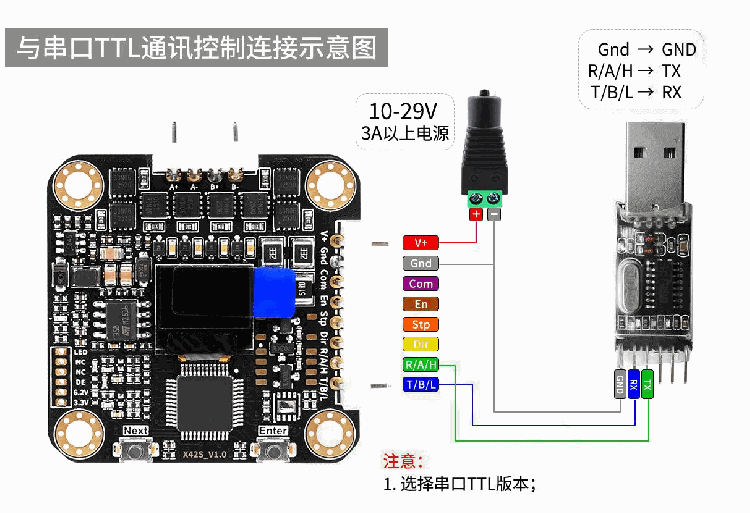


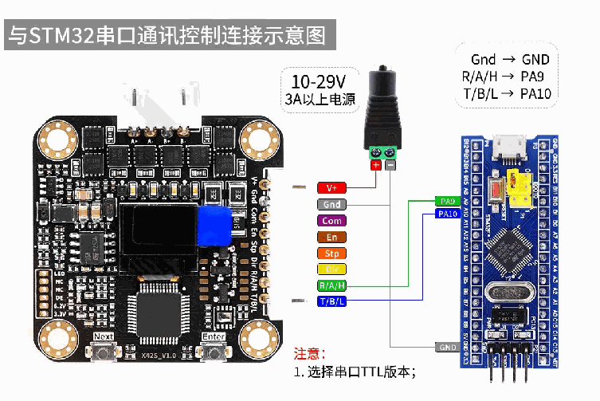

串口TTL 多机通讯接线：  


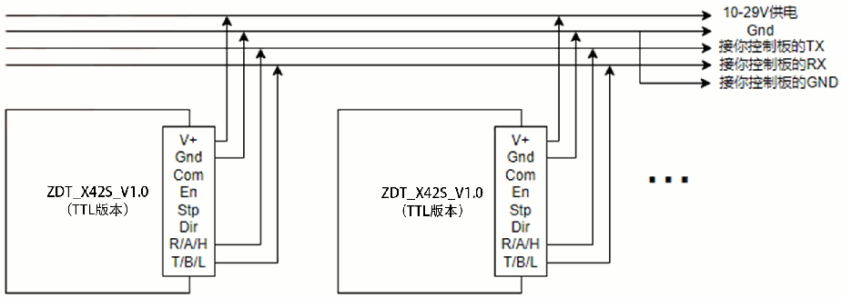


---

<a id="page-27"></a>

<!-- 原 PDF 第 27 页 -->

**原文第 27 页**

通讯控制接线  

#### 2.2.2 RS485


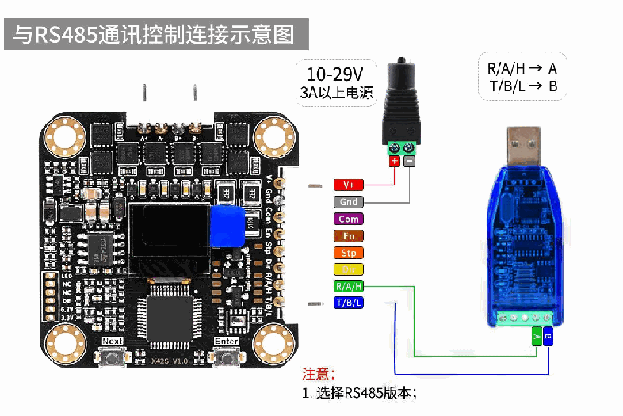


RS485 多机通讯接线：  


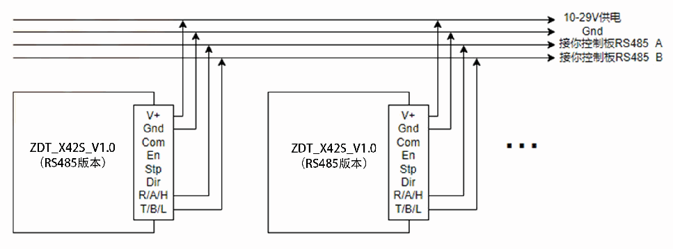


---

<a id="page-28"></a>

<!-- 原 PDF 第 28 页 -->

**原文第 28 页**

通讯控制接线  

#### 2.2.3 CAN


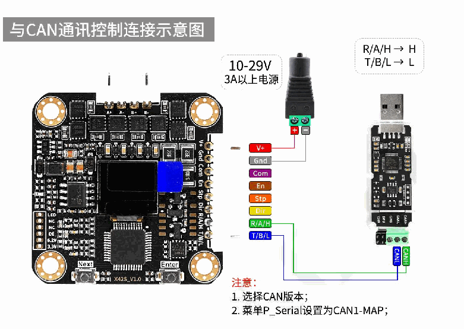


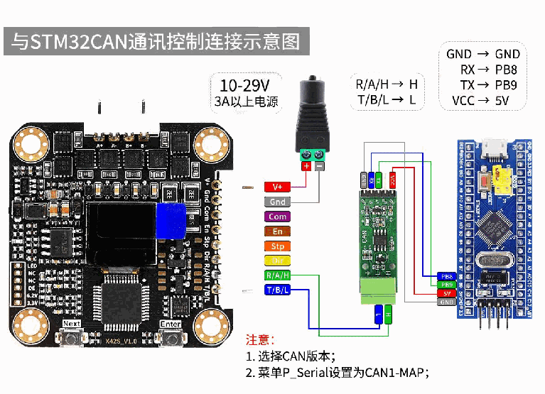

CAN 多机通讯接线：  


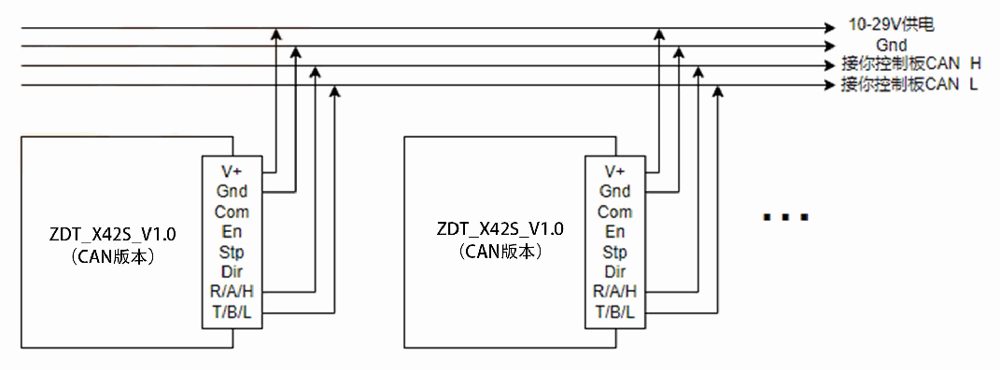


---

<a id="page-29"></a>

<!-- 原 PDF 第 29 页 -->

**原文第 29 页**


## 第 3 章 高级控制功能说明


### 3.1 力位混合控制介绍

力位混合控制仅X42S/Y42的X固件有，包括：  
“5.3.4 力矩模式限速控制（X）”  
“5.3.6 速度模式限电流控制（X）”  
“5.3.9 直通限速位置模式限电流控制（X）”  
“5.3.11 梯形曲线加减速位置模式限电流控制（X）”  
它可以对电机的整个运动周期进行力矩电流、速度、位置进行限制和设定。  
比如，直通限速位置模式限电流控制（X）、梯形曲线加减速位置模式限电流控  
制（X），设定了最大电流、最大转速、目标位置角度后，电机运行过程中，不  
论是否发生了丢步补偿，都不会超过设定的最大电流(力矩)和最大转速。  


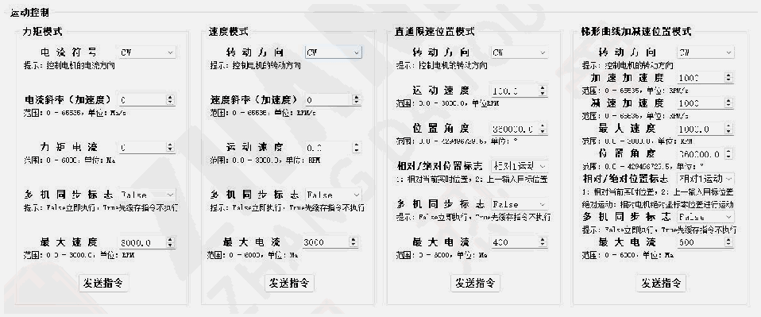


### 3.2 原点回零


#### 3.2.1 原点回零参数说明


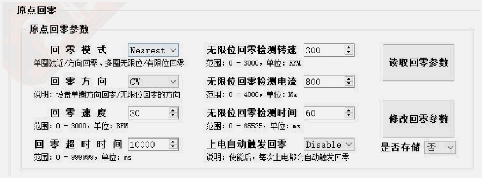


---

<a id="page-30"></a>

<!-- 原 PDF 第 30 页 -->

**原文第 30 页**

回零模式：设置的是上电自动触发回零的回零模式；  
回零方向：设置单圈方向回零/多圈限位回零/无限位碰撞回零的回零方向；  
回零速度：设置回零的速度，单位：RPM（转每分钟）；  
回零超时时间：超过这个时间将自动退出回零，并置位回零失败标志位，防止电  
机回零异常时，一直卡在回零过程中；  
无限位回零检测转速/电流/时间：  
无限位碰撞回零检测的原理与堵转检测原理一样，就是将电机堵转的位置作  
为零点，电机堵转原理为：电机运动过程中，撞到物体或结构边缘时，电流会瞬  
间增大，转速瞬间减少。利用这个特点，简而言之，就是让电机碰撞一下回零。  
应用实例，比如，丝杆滑台：触发无限位碰撞回零后，电机朝着某个方向一直转，  
直到撞到丝杆滑台边缘后停止，把这个位置设置为零点。  
电机碰撞过程中需要满足下列三个条件，即完成碰撞回零的检测，如下：  
(1)电机实时转速 < 碰撞回零检测转速  
(2)电机实时相电流 > 碰撞回零检测电流  
(3)满足(1)和(2)持续的时间 > 碰撞回零检测时间  
上电自动触发回零：使能后，每次上电的时候都会先触发一次回零；  
是否存储：存储后掉电不丢失参数，不存储重新上电会恢复修改前的参数；  

#### 3.2.2 单圈回零操作说明

单圈回零模式有两种：单圈就近回零和单圈方向回零，顾名思义，单圈就近  
回零就是往靠近零点位置的方向进行回零，而单圈方向回零就是根据回零参数  
中的回零方向进行回零，两种单圈回零的操作步骤如下：  
1. 断电状态/关闭电机使能，将电机轴拧到指定位置；  
2. 上电连接上位机/串口助手，点击“设置单圈回零的零点位置”（选择存储）  
或串口助手发送命令 01 93 88 01 6B；  
3. 设置完成单圈回零的零点位置后，可以根据自身需求，在上位机中修改原点  
回零参数：上电自动回零的回零模式、回零方向、回零速度、回零超时时间、  
是否使能上电自动触发回零等；  
4. 上电后，可以上位机点击“触发回零”，或发送“触发回零”命令进行回零；  

---

<a id="page-31"></a>

<!-- 原 PDF 第 31 页 -->

**原文第 31 页**


#### 3.2.3 多圈无限位碰撞回零操作说明

1. 电机装上实际结构，连接上位机读取一次“回零参数”，先不修改、使用默  
认的原点回零参数，回零模式选择Senless，点击“触发回零”；  
2. 触发后，观察电机是否一直转动，直到碰撞到物体或结构边缘后停止，如果  
是这样，则可以不需要修改参数，按默认的原点回零参数。  
3. 如果电机刚触发不久，还未撞到物体或结构边缘就停止，则可以根据以下方  
法去修改原点回零参数中无限位碰撞回零检测的电流/转速/时间：  
(1)先用“位置模式”，让电机以“回零速度”、加速度0转动，接着在转  
动过程中读取系统状态参数查看相电流是多少，比如，读取到713mA；  
(2)将“无限位回零检测电流”修改为比713mA大一些，比如，设置1000mA，  
检测转速和时间可以保持不变；  
4. 可以根据自身需求，在上位机中修改原点回零参数：上电自动回零的回零模  
式、回零方向、回零速度、回零超时时间、无限位回零检测转速/电流/时间、  
是否使能上电自动触发回零；  


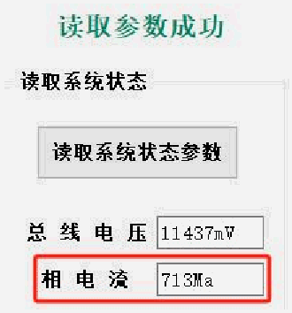


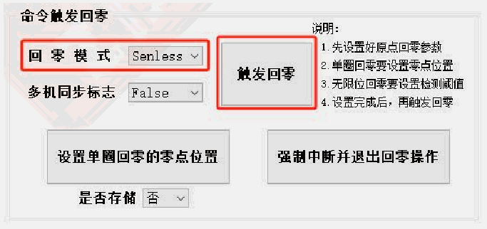


---

<a id="page-32"></a>

<!-- 原 PDF 第 32 页 -->

**原文第 32 页**


#### 3.2.4 多圈限位开关回零操作说明

多圈限位开关回零，需要先按照以下方式进行设置，设置完成后，可以点击  
发送触发EndStop回零模式(多圈限位开关回零)，电机将一直转动，直到回零超  
时(默认超时时间为10秒)或者限位开关被按下(En引脚检测到0V)才停止。  


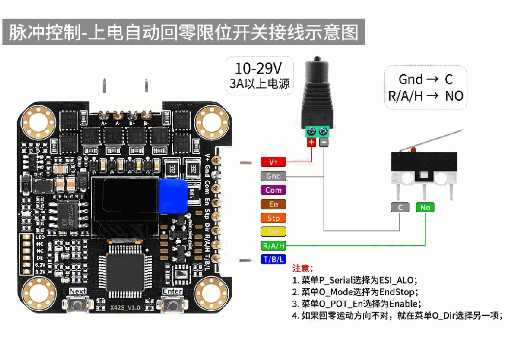


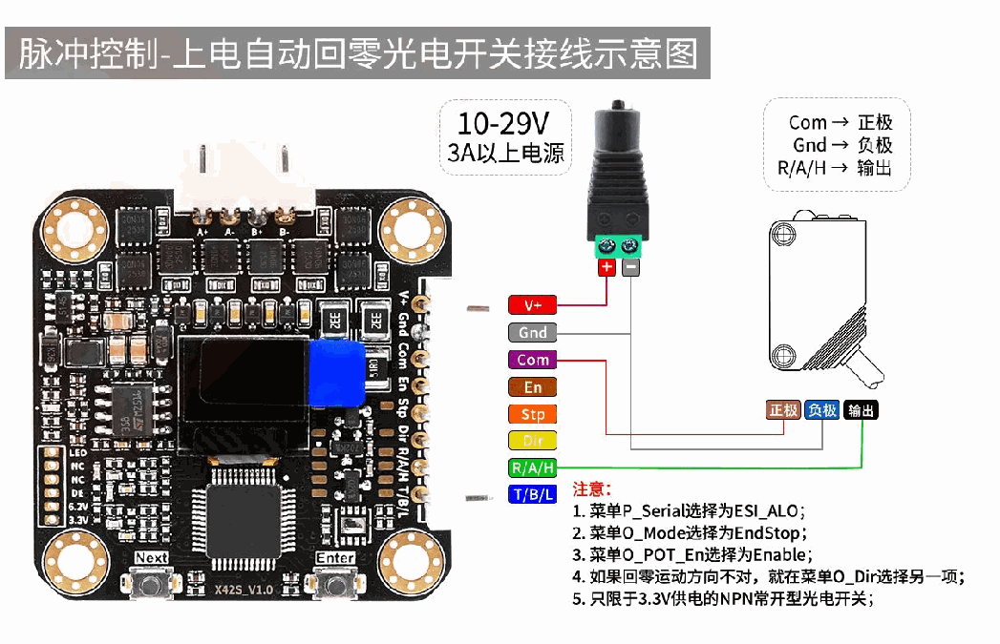


---

<a id="page-33"></a>

<!-- 原 PDF 第 33 页 -->

**原文第 33 页**


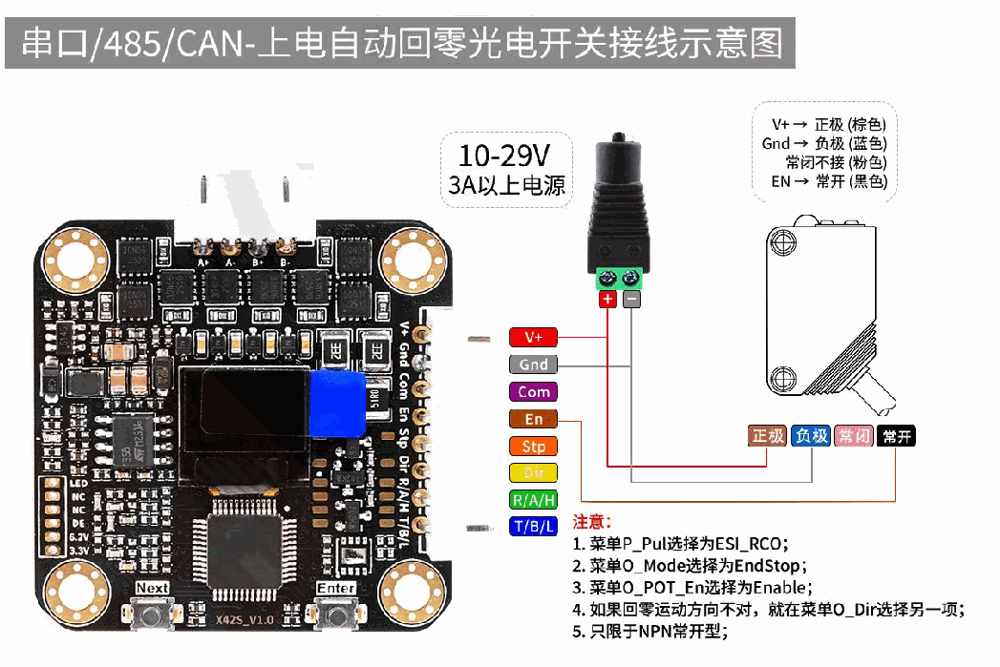


#### 3.2.5 回到坐标原点操作说明

回到坐标的零点(AbsZero)，即电机刚上电/“将当前位置角度清零”的位置；  

---

<a id="page-34"></a>

<!-- 原 PDF 第 34 页 -->

**原文第 34 页**


### 3.3 左右限位开关输入

En 或 R/A/H 引脚为左限位，Stp 或 T/B/L 引脚为右限位；将脉冲或通讯端口  
复用为左右限位后，两个限位都可以用做限位回零的输入，取决于回零方向；  

#### 3.3.1 脉冲控制-左右限位


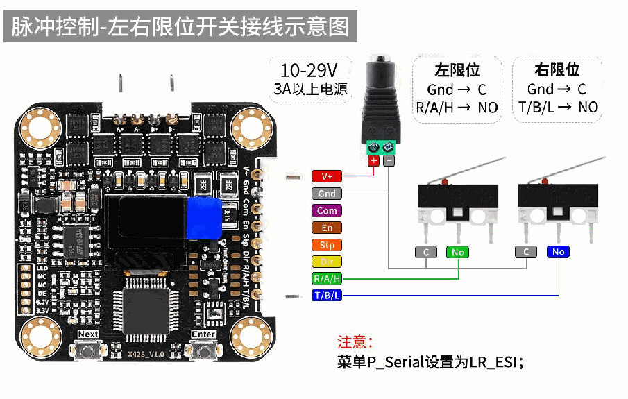


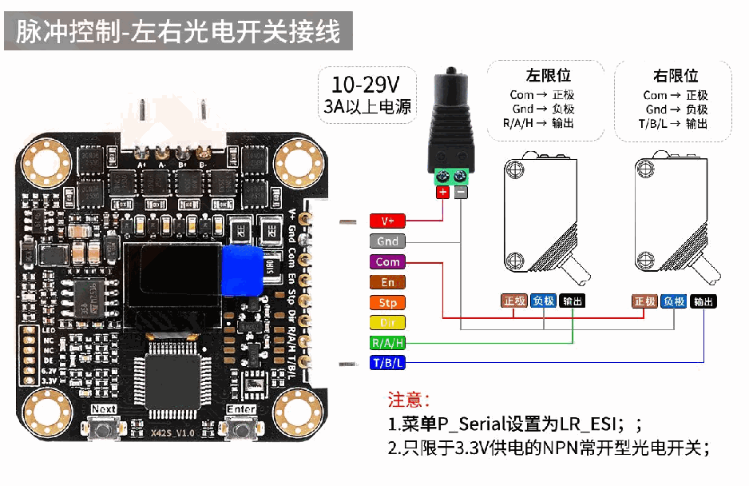


---

<a id="page-35"></a>

<!-- 原 PDF 第 35 页 -->

**原文第 35 页**


#### 3.3.2 通讯控制-左右限位


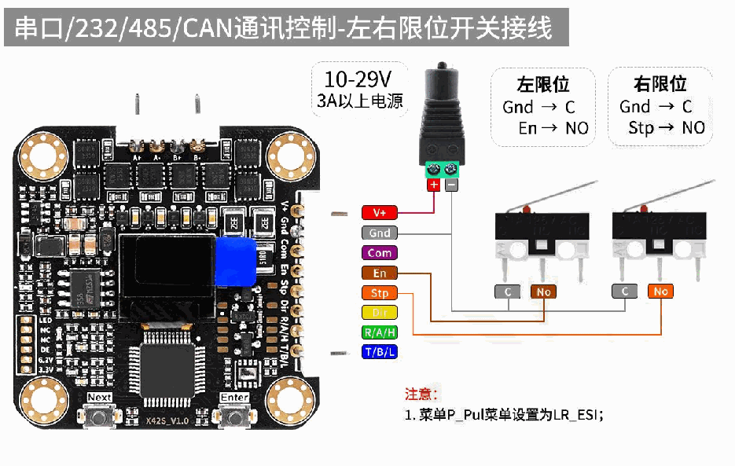


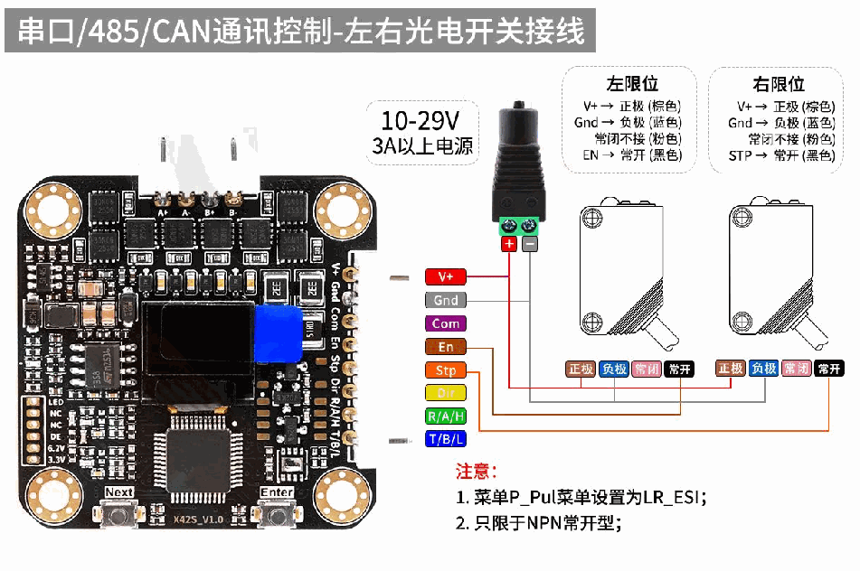


### 3.4 到位输出功能


#### 3.4.1 电机到位说明

电机到位是指，电机执行完位置模式发送的脉冲或位置，到达指定位置角度。  

---

<a id="page-36"></a>

<!-- 原 PDF 第 36 页 -->

**原文第 36 页**

电机到位的条件为：  
输入目标位置角度 - 电机实时位置角度 < 位置到达窗口(默认 0.8°)  
输入目标位置角度：就是位置模式发送的脉冲数或位置角度；  
电机实时位置角度：就是电机实际运行的位置角度；  
位置到达窗口 ：可以在上位机中修改，默认值为0.8°；  

#### 3.4.2 到位引脚输出

可以在上位机中设置“脉冲端口复用”参数为 ESI_RCO，则电机到达位置后  
就会让 Dir 引脚输出一个高电平 3.3V。Dir 引脚到位输出的高电平电压为：  
1.电机没到位时，Dir引脚输出0V；  
2.如果Com引脚不接或者接3.3V，则电机到位后Dir引脚输出3.3V；  
3.如果Com接5V，则电机到位后Dir引脚默认输出5V；  
4.如果Com接24V，则电机到位后Dir引脚默认输出24V；  
特别注意：到位输出仅适用于脉冲端口不带光耦隔离的版本；  

#### 3.4.3 到位返回命令

可以在上位机中设置“控制命令应答”参数为 Reached/Both/Other，则电  
机到达位置后会主动返回一个到位命令：地址 + 功能码 + 9F + 6B。  
“脉冲端口复用”和“控制命令应答”说明见“5.8.4 修改驱动配置参数（X）”  
特别注意：开启到位返回后，读取和修改参数等非控制命令仍可以正常返回；  
多机通讯及同步运动  
3.5  

#### 3.5.1 多机通讯

多机通讯是指，用一个串口TTL/RS485/CAN接口去连接多个电机进行通讯，  
即将多个电机连接在一个通讯总线上。多机通讯的接线见“2.2 通讯控制接线”；  

---

<a id="page-37"></a>

<!-- 原 PDF 第 37 页 -->

**原文第 37 页**


#### 3.5.2 同步运动

同步运动是指，让连接在一个总线上的多个电机同时开始运动，总共有三种  
方式实现，见如下说明：  
第一种方式，使用广播地址 0 发送命令，则总线上的所有电机都会执行，且  
同时开始，同时结束，适用于总线上所有电机执行同一条命令。  
第二种方式，使用多电机命令功能，一次性发完多个电机的不同控制命令，  
同时开始，适用于总线上不同电机执行不同的运动命令，见“3.6 多电机命令”；  
第三种方式，使用多机同步标志功能，适用于总线上不同电机执行不同的运  
动命令，比如总线上有地址1、2、3、4四个电机，假设需要：  
◆ 地址1电机：速度1500RPM，加速度为8，相对位置运动-3600.0°；  
◆ 地址2电机：速度1000RPM，加速度为10，绝对位置运动7200.0°；  
◆ 地址1和2电机要同时开始运动（同步运动）；  
◆ 地址3和4电机不动作；  
以Emm 固件位置模式为例，操作方法为：  
1. 先发送地址 1电机运动命令 01 FD 01 05 DC 08 00 00 7D 00 00 01 6B，  
正确返回01 FD 02 6B，此时地址1电机先不会运动，因为多机同步标志为01；  
2. 再发送地址 2电机运动命令 02 FD 00 03 E8 0A 00 00 FA 00 01 01 6B，  
正确返回02 FD 02 6B，此时地址2电机先不会运动，因为多机同步标志为01；  
3. 最后用广播地址发送“触发多机同步运动命令”00 FF 66 6B，正确返回  
01 FF 02 6B，此时地址1和2电机开始同步运动，地址3和4电机不会动作；  
注意：每条命令发送完后，要延时几毫秒，防止命令之间粘包失效  

### 3.6 多电机命令和定时返回信息命令

多电机命令，允许用户一次性发完总线上多个电机的不同控制命令，可以大  
幅提升多电机控制时的通讯响应速度，格式见“5.3.1 多电机命令（X42S/Y42）”；  
定时返回信息命令，允许用户设置Y42闭环电机定时连续的返回电流/速度/  
位置/状态等参数，无需频繁读取，可以大幅提升获取电机参数的通讯响应速度，  
命令格式见“5.5.1 定时返回信息命令（X42S/Y42）”；  

---

<a id="page-38"></a>

<!-- 原 PDF 第 38 页 -->

**原文第 38 页**


### 3.7 DMX512 协议


#### 3.7.1 接线说明

DMX512协议采用RS485通讯，波特率固定为250000，停止位为2，DMX512  
控制台与X42S/Y42闭环电机的接线方式为：Data+接R/A/H、Data-接T/B/L:  
注：对应的 X42S/Y42 闭环电机要购买 485 套餐  


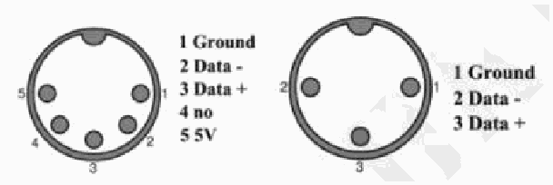


#### 3.7.2 操作说明

1.每个电机单独USB转485连接上位机，修改为不同ID/地址，并贴好标签；  
2.按3.8.1接线，然后上位机用广播地址0将“通讯校验方式”改为DMX512；  
3.拔掉USB转485模块，开机DMX512控制台进行测试(默认总通道数为192)；  
4.修改参数用串口助手，参考“5.6.19 修改 DMX512协议参数（X42S/Y42）”；  
注：串口助手波特率要设为 250000，停止位为 2  

### 3.8 心跳保护功能

心跳保护功能是指，在设定时间内，电机如果没有接收到正确命令，则会控  
制电机急停下来，可以预防实时控制的场景，不会因中途通讯异常导致事故。详  
见“5.6.25 修改心跳保护功能时间（X42S/Y42）”进行设置；  

### 3.9 在线更新固件

X42S/Y42新增一键在线更新固件功能，更新固件无需拆装电机、无需重新校  
准。固件更新教程参考另一份文档“ZDT_X42S固件更新使用说明”的操作说明；  

---

<a id="page-39"></a>

<!-- 原 PDF 第 39 页 -->

**原文第 39 页**


### 3.10 一键控制加减速启停

1.先用usb转ttl/RS485工具连接串口助手，接线方式按照“2.2 通讯控制  
接线”接线图进行接线；  
2.按照“5.7 上电自动运行命令”的说明，通过串口助手发送配置指令，配  
置上电自动运行速度模式的速度、加速度等参数，配置完成后选择存储参数；  
3.如果使能了En引脚一键控制加减速启停，可以在小屏幕En菜单设置En  
引脚的有效电平，En引脚默认是3.3V高电平，配置为L即为低电平使能，即低  
电平启动，高电平停止。  


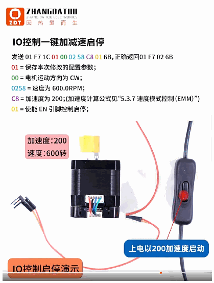


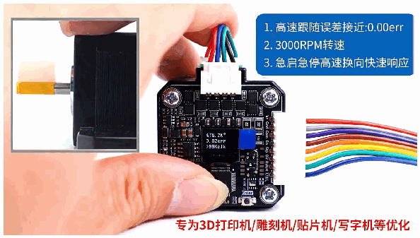


### 3.11 Emm 固件狂暴模式

菜单EmmTurbo设置为Enable开启Emm固件狂暴模式。狂暴模式采用FOC力  
矩位置双闭环控制，高速力矩增强，超快响应，超快位置跟随，专为3D打印机/  
雕刻机/贴片机/写字机等优化。开启后，3000RPM+高速位置跟随误差接近0err，  
可以改善3D打印机：1)圆打印椭圆和直角打印圆角问题；2)解决长条形表面有  
轻微波浪纹问题；3)高速打印力矩不足打印速度上不去的问题；4)位置跟随不足  
导致响应性不够的问题；  
注意1：用到狂暴模式，校准的时候选第一项：Cal_MFL，要测量电机磁链；  
注意2：狂暴模式不一定能适配所有的步进电机，请尽可能选用本店电机；  

---

<a id="page-40"></a>

<!-- 原 PDF 第 40 页 -->

**原文第 40 页**


## 第 4 章 通讯命令格式说明


### 4.1 串口 TTL/RS485 通讯


#### 4.1.1 主机发送命令格式说明


**主机发送（主机→电机）**

| 电机地址 | 功能码 | 命令数据 |  |  | 校验码 |
| --- | --- | --- | --- | --- | --- |
| Addr | Code |  |  |  | 0x6B/XOR/CRC8/Modbus |

1. 电机地址(Addr)出厂默认为1，可设置范围为1-255，0为广播地址；  
2. 功能码(Code)对应执行相应功能命令，例如0x36是执行读取实时位置命令；  
3. 命令数据，不同命令对应不同的数据内容；  
4. 校验码出厂默认为0x6B，即校验码为固定字节0x6b，根据自身需求，也可设  
置为XOR校验/CRC8校验/Modbus-RTU协议，计算方式将文末附录；  

#### 4.1.2 电机返回命令格式说明


**电机返回（电机→主机）**

| 电机地址 | 功能码 | 返回数据 | 校验码 |
| --- | --- | --- | --- |
| Addr | Code | 02/12/22/E2/EE/9F | 0x6B/XOR/CRC8/Modbus |

(1)02：表示接收的命令正确；  
(2)12/22：表示触发回零时，当前就在零点处或左/右限位已经触发，电机不动；  
(2)E2：表示接收的命令参数错误，数据范围不满足或者条件不满足；  
(触发低压警告、堵转保护、过流过热保护等)  
(3)EE：表示接收的命令格式错误；  
(4)9F：表示接收动作执行完成命令:（电机主动返回）  
1) 力矩模式夹爪夹紧返回命令 ：地址 + F5 + 9F + 校验码  
2) 到位返回命令 ：地址 + FB/FD + 9F + 校验码  
3) 回零完成命令 ：地址 + 9A + 9F + 校验码  
说明：动作执行完成命令，可在上位机中的“控制命令应答”参数进行修改；  

---

<a id="page-41"></a>

<!-- 原 PDF 第 41 页 -->

**原文第 41 页**


#### 4.1.3 串口助手和上位机示例

串口助手JCom示例：  
波特率默认 115200，勾选HXE 显示和HEX 发送，勾选显示时间、显示发送数据；  


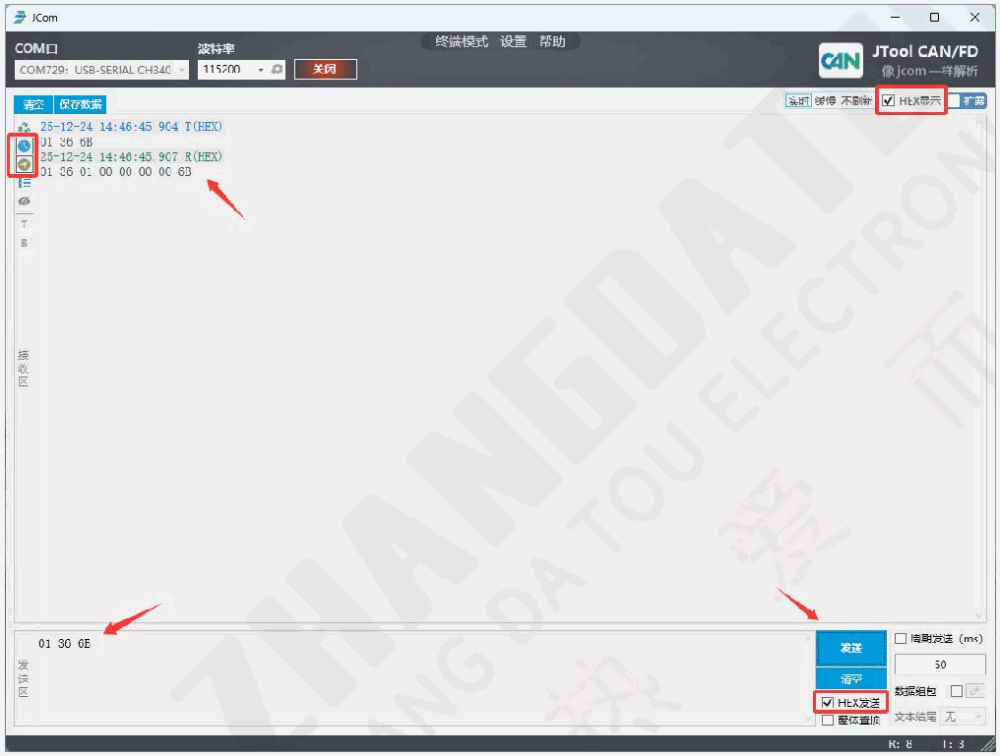

X固件TTL上位机示例：  
选择通讯端口，与电机对应波特率、电机地址、校验字节，点击打开串口；  


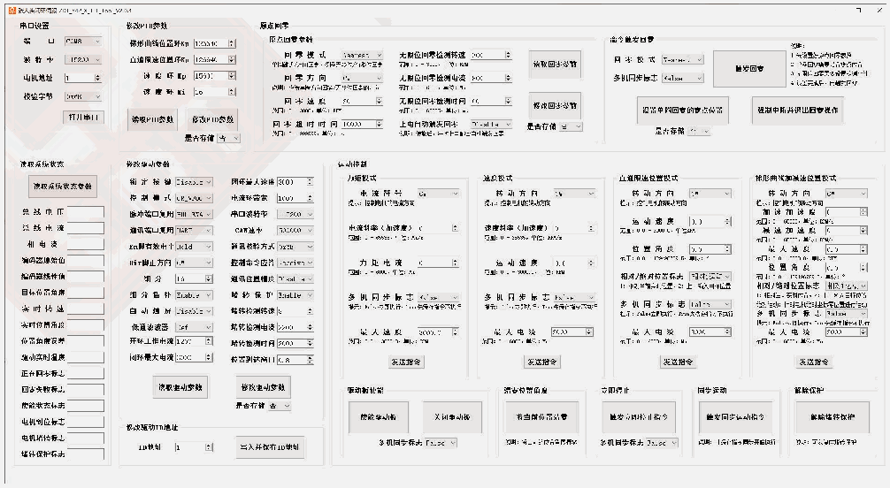


---

<a id="page-42"></a>

<!-- 原 PDF 第 42 页 -->

**原文第 42 页**

Emm固件TTL上位机示例：  
选择通讯端口，与电机对应波特率、电机地址、校验字节，点击打开串口；  


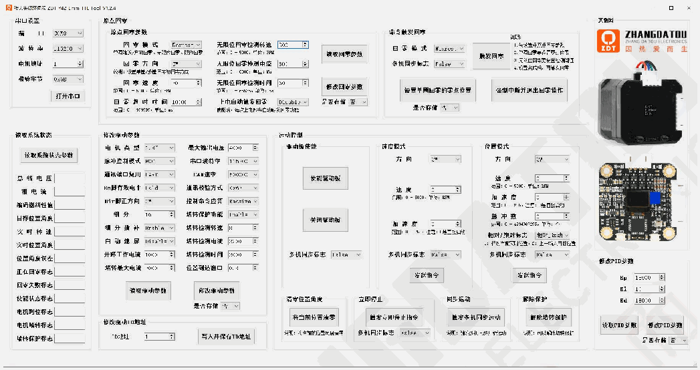


### 4.2 CAN 通讯


#### 4.2.1 主机发送命令格式说明


**主机发送（主机→电机）**

| 扩展帧ID | 功能码 | 命令数据 |  |  |  | 校验码 |
| --- | --- | --- | --- | --- | --- | --- |
| (Addr<<8)\|Packet | Code |  |  |  |  | 0x6B/XOR/CRC8 |

1. CAN通讯帧类型固定为扩展帧格式；  
2. Addr为电机地址，Packet为第几包数据，从0开始计数。对于小于 8 字节数  
据的命令，Packet 为0，例如，命令“01366B”，则将扩展帧ID设置为0100，  
发送数据内容为366B；对于大于 8字节命令，需要进行拆包发送，Packet 从0  
开始计数，例如，命令“01 FD 01 0F A0 00 00 01 FA 00 00 00 6B”，拆分为：  
第一条发送：扩展帧 ID 设置为 0100，数据内容为 FD 01 0F A0 00 00 01 FA，  
第二条发送：扩展帧ID设置为0101，数据内容为FD 00 00 00 6B；  
3. 每包数据的第一个字节为功能码，如上面的FD（电机地址后面的字节）；  
4. 命令数据或返回数据，不同命令对应不同的数据内容；  
5. 校验码出厂默认为0x6B，即校验码为固定字节0x6b，根据自身需求，也可设  
置为XOR校验/CRC8校验/Modbus-RTU协议，计算方式将文末附录；  

---

<a id="page-43"></a>

<!-- 原 PDF 第 43 页 -->

**原文第 43 页**


#### 4.2.2 电机返回命令格式说明


**电机返回（电机→主机）**

| 扩展帧ID | 功能码 | 返回数据 | 校验码 |
| --- | --- | --- | --- |
| (Addr<<8)\|Packet | Code | 02/E2/EE/9F | 0x6B/XOR/CRC8 |

(1)02：表示接收的命令正确；  
(2)E2：表示接收的命令参数错误，数据范围不满足或者条件不满足；  
(触发低压警告、堵转保护、过流过热保护等)  
(3)EE：表示接收的命令格式错误；  
(4)9F：表示接收动作执行完成命令:（电机主动返回）  
1) 力矩模式夹爪夹紧返回命令 ：F5 + 9F + 校验码  
2) 到位返回命令 ：FD + 9F + 校验码  
3) 回零完成命令 ：9A + 9F + 校验码  
说明：动作执行完成命令，可在上位机中的“控制命令应答”参数进行修改；  

#### 4.2.3 cangaroo 和上位机示例

小于8字节命令（Emm固件速度模式：01 F6 01 05 DC 01 00 6B）  


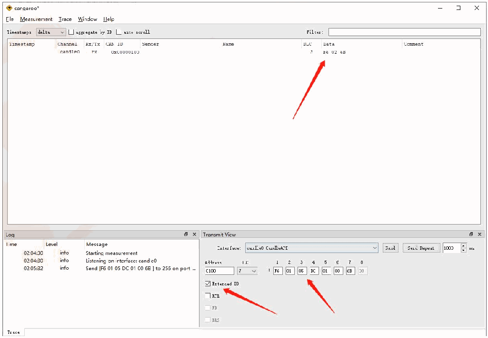


---

<a id="page-44"></a>

<!-- 原 PDF 第 44 页 -->

**原文第 44 页**

大于8字节命令（Emm固件位置模式：01 FD 01 0F A0 00 00 01 FA 00 00 00 6B）  
1.先发送FD 01 0F A0 00 00 01 FA（注意：帧ID为0100，表示第0包数据）  


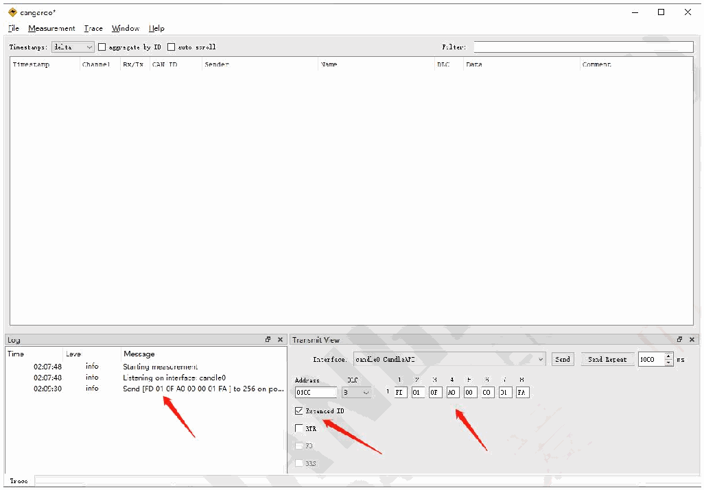

2.再发送FD 00 00 00 6B（注意：帧ID为0101，表示第1包数据）  


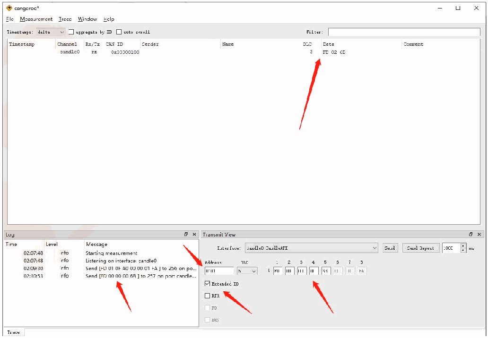


---

<a id="page-45"></a>

<!-- 原 PDF 第 45 页 -->

**原文第 45 页**

特别注意：CAN上位机使用的是 ZDT_CANable，1.0(pro)和 2.0(pro)都支持，接  
线按照“2.2.3 CAN通讯控制接线”进行接线；  
X固件CAN上位机示例：  
选择通讯端口，与电机对应 CAN 速率、电机地址、校验字节，点击连接 CAN；  


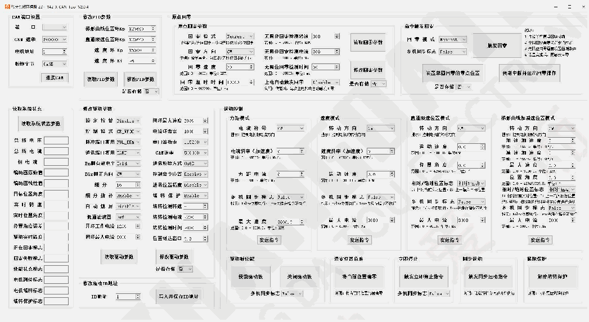

Emm固件CAN上位机示例：  
选择通讯端口，与电机对应 CAN 速率、电机地址、校验字节，点击连接 CAN；  


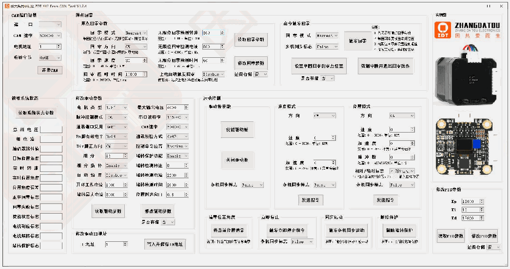


---

<a id="page-46"></a>

<!-- 原 PDF 第 46 页 -->

**原文第 46 页**


## 第 5 章 通讯命令


### 5.1 通讯命令说明


#### 5.1.1 命令后缀说明

命令后缀带有（X）为 X固件命令，带有（E）为Emm 固件命令，无后缀以及  
带有（X42S/Y42）都是两种固件通用命令。  

#### 5.1.2 两种固件部分命令差异


**两种固件部分命令差异**

| 命令 | 差异说明 |
| --- | --- |
| 1.力矩模式 | Emm固件无力矩模式，X固件有 |
| 2.速度模式 | 命令格式不同 |
| 3.位置模式 | 命令格式不同，X固件有两种位置模式 |
| 4.读取系统状态参数 | 命令格式不同 |
| 5.修改系统状态参数 | 命令格式不同 |
| 6.读取驱动配置参数 | 主机发送的命令格式一样，电机返回格式不同 |
| 7.修改驱动配置参数 | 命令格式不同 |
| 8.存储一组速度参数，上电自动运行 | 命令格式不同 |
| 两种固件的命令中电机位置角度/误差的格式不同 |  |
| 除上述命令外，两种固件其他命令格式相同 |  |


#### 5.1.3 位置模式命令打断说明

不管是X固件还是Emm固件，X42S/Y42都支持位置模式命令打断功能，即在  
上一条位置模式命令还在运行过程中，可以发送新的位置模式命令去改变速度、  
加速度和位置等，并且新命令参数实时更新、平滑过渡；  

---

<a id="page-47"></a>

<!-- 原 PDF 第 47 页 -->

**原文第 47 页**


### 5.2 触发动作命令


#### 5.2.1 触发编码器校准


**主机发送（主机→电机）**

| 地址 | 功能码 | 辅助码 | 校验码 |
| --- | --- | --- | --- |
| Addr | 06 | 45 | 6B |


**电机返回（电机→主机）**

| 地址 | 功能码 | 返回数据 | 校验码 |
| --- | --- | --- | --- |
| Addr | 06 | 02/E2/EE(参考第4章节说明) | 6B |

例如，发送 01 06 45 6B，正确返回 01 06 02 6B，闭环模式触发校准编码器，  
电机将缓慢正转一圈然后反转一圈对编码器进行线性化校准，提高精度（不校准  
编码器将会有±0.75度 ~ ±1.5度的误差），开环模式校准将返回E2错误码；  

#### 5.2.2 重启电机（X42S/Y42）


**主机发送（主机→电机）**

| 地址 | 功能码 | 辅助码 | 校验码 |
| --- | --- | --- | --- |
| Addr | 08 | 97 | 6B |


**电机返回（电机→主机）**

| 地址 | 功能码 | 返回数据 | 校验码 |
| --- | --- | --- | --- |
| Addr | 08 | 02/E2/EE(参考第4章节说明) | 6B |

例如，发送01 08 97 6B，正确返回01 08 02 6B，闭环电机将复位重启；  
注意：如果有接入“掉电记录”电池，复位重启电机位置不丢失；  

---

<a id="page-48"></a>

<!-- 原 PDF 第 48 页 -->

**原文第 48 页**

将当前位置角度清零  
5.2.3  


**主机发送（主机→电机）**

| 地址 | 功能码 | 辅助码 | 校验码 |
| --- | --- | --- | --- |
| Addr | 0A | 6D | 6B |


**电机返回（电机→主机）**

| 地址 | 功能码 | 返回数据 | 校验码 |
| --- | --- | --- | --- |
| Addr | 0A | 02/E2/EE(参考第4章节说明) | 6B |

例如，发送01 0A 6D 6B，正确返回01 0A 02 6B，将清零当前位置角度；  

#### 5.2.4 解除堵转/过热/过流保护


**主机发送（主机→电机）**

| 地址 | 功能码 | 辅助码 | 校验码 |
| --- | --- | --- | --- |
| Addr | 0E | 52 | 6B |


**电机返回（电机→主机）**

| 地址 | 功能码 | 返回数据 | 校验码 |
| --- | --- | --- | --- |
| Addr | 0E | 02/E2/EE(参考第4章节说明) | 6B |

例如，发送01 0E 52 6B，正确返回01 0E 02 6B，将解除堵转/过热/过流保护；  

#### 5.2.5 恢复出厂设置


**主机发送（主机→电机）**

| 地址 | 功能码 | 辅助码 | 校验码 |
| --- | --- | --- | --- |
| Addr | 0F | 5F | 6B |


---

<a id="page-49"></a>

<!-- 原 PDF 第 49 页 -->

**原文第 49 页**


**电机返回（电机→主机）**

| 地址 | 功能码 | 返回数据 | 校验码 |
| --- | --- | --- | --- |
| Addr | 0F | 02/E2/EE(参考第4章节说明) | 6B |

例如，发送 01 0F 5F 6B，正确返回 01 0F 02 6B，将恢复出厂设置，绿灯和蓝  
灯交替闪烁，此时需要断电重新上电，再空载校准电机编码器；  

### 5.3 运动控制命令


#### 5.3.1 多电机命令（X42S/Y42）


**主机发送（主机→电机）**

| 字节1 | 字节2 | 字节3 | 字节4 |  |  |  |  | 字节n |
| --- | --- | --- | --- | --- | --- | --- | --- | --- |
| 地址 | 功能码 | 字节长度 |  | 命令1 | 命令2 | 命令3 | ... | 校验码 |
| 00 | AA | 总字节数 |  | 01 36 6B | 02 36 6B | 03 36 6B | ... | 6B |


**电机返回（电机→主机）**

| 地址 | 功能码 | 返回数据 | 校验码 |
| --- | --- | --- | --- |
| Addr | 根据不同命令返回相应的数据 |  | 6B |

1. 所有的运动命令只有地址1电机会回复确认收到命令，避免造成总线冲突；  
2. 多电机命令中，位置模式运动命令中的多机同步标志用于控制是否返回到位  
命令：地址 + 功能码 + 9F + 校验码，0为到位不返回，1为到位返回；  
3. 多电机命令中含有读取参数命令的，要避开地址1返回的确认收到命令；  
（方法：可设置Response菜单为None/Reached，或者改为其他地址等）  
4. Modbus-RTU协议暂不支持多电机命令；  
以Emm 固件为示例：假设总线上分别有地址1、2、3、4四个电机，假设需要：  
◆ 电机2：速度1500RPM，加速度为8，相对位置运动-3600.0°，到位不返回；  
◆ 电机3：速度1000RPM，加速度为10，绝对位置运动7200.0°，到位返回；  

---

<a id="page-50"></a>

<!-- 原 PDF 第 50 页 -->

**原文第 50 页**

◆ 电机4：读取实时位置角度；  
发送多电机命令为：00 AA 00 22 02 FD 01 05 DC 08 00 00 7D 00 00 00 6B  
03 FD 00 03 E8 0A 00 00 FA 00 01 01 6B 04 36 6B 6B  
00 = 广播地址； AA = 功能码； 0022 = 总字节数为34； 6B = 校验码；  
02 FD 01 05 DC 08 00 00 7D 00 00 00 6B = 电机2执行位置模式运动命令；  
03 FD 00 03 E8 0A 00 00 FA 00 01 01 6B = 电机3执行位置模式运动命令；  
04 36 6B = 电机4执行读取实时位置命令，返回实时位置信息；  
（注：电机2到位后不返回命令，电机3到位后返回命令）  
CAN 分包发送示例如下：（CAN 通讯格式参考“4.2 CAN 通讯”章节的说明）  
第1条发送：扩展帧ID 设置为 0000，数据内容为 AA 00 22 02 FD 01 05 DC，  
第2条发送：扩展帧ID设置为0001，数据内容为AA 08 00 00 7D 00 00 00，  
第3条发送：扩展帧ID设置为0002，数据内容为AA 6B 03 FD 00 03 E8 0A，  
第4条发送：扩展帧ID设置为0003，数据内容为AA 00 00 FA 00 01 01 6B，  
第5条发送：扩展帧ID设置为0004，数据内容为AA 04 36 6B 6B  

#### 5.3.2 电机使能控制


**主机发送（主机→电机）**

| 地址 | 功能码 | 辅助码 | 使能状态 | 同步标志 | 校验码 |
| --- | --- | --- | --- | --- | --- |
| Addr | F3 | AB | 00/01 | 00/01 | 6B |


**电机返回（电机→主机）**

| 地址 | 功能码 | 返回数据 | 校验码 |
| --- | --- | --- | --- |
| Addr | F3 | 02/E2/EE(参考第4章节说明) | 6B |

使能状态：00/01分别表示不使能/使能(注：不使能电机会松轴，轴能拧动)；  
同步标志：00/01分别表示立即执行/先缓存当前命令，参考3.5.2小节说明；  
例如，发送01 F3 AB 01 00 6B，正确返回01 F3 02 6B，使能电机（锁轴）；  

---

<a id="page-51"></a>

<!-- 原 PDF 第 51 页 -->

**原文第 51 页**


#### 5.3.3 力矩模式控制（X）


**主机发送（主机→电机）**

| 字节1 | 字节2 | 字节3 | 字节4 | 字节5 | 字节6 | 字节7 | 字节8 | 字节9 |
| --- | --- | --- | --- | --- | --- | --- | --- | --- |
| 地址 | 功能码 | 符号 | 斜率（mA/S） |  | 电流(mA) |  | 同步标志 | 校验码 |
| Addr | F5 | 00/01 | 0000-FFFF |  | 0000-1388 |  | 00/01 | 6B |


**电机返回（电机→主机）**

| 地址 | 功能码 | 返回数据 | 校验码 |
| --- | --- | --- | --- |
| Addr | F5 | 02/12/22/9F/E2/EE(参考第4章说明) | 6B |

参数解析见下面的“5.3.4 力矩模式限速控制（X）”命令说明；  

#### 5.3.4 力矩模式限速控制（X）


**主机发送（主机→电机）**

| 字节1 | 字节2 | 字节3 | 字节4 | 字节5 | 字节6 | 字节7 | 字节8 | 字节9 | 字节10 | 字节11 |
| --- | --- | --- | --- | --- | --- | --- | --- | --- | --- | --- |
| 地址 | 功能码 | 符号 | 斜率（mA/S） |  | 电流(mA) |  | 同步标志 | 最大速度(0.1RPM) |  | 校验码 |
| Addr | C5 | 00/01 | 0000-FFFF |  | 0000-1388 |  | 00/01 | 0000-7E30 |  | 6B |


**电机返回（电机→主机）**

| 地址 | 功能码 | 返回数据 | 校验码 |
| --- | --- | --- | --- |
| Addr | C5 | 02/12/22/9F/E2/EE(参考第4章说明) | 6B |

此命令是在“5.3.3 力矩模式控制（X）”命令基础上增加了最大速度限制。  
符号：00/01分别表示CW/CCW，即分别表示电流值的正数/负数；  
斜率（加速度）：范围为0000-FFFF，即0-65535mA/S（毫安每秒）；  
电流：范围为0000-1388，即0-5000mA（毫安）；  
同步标志：00/01分别表示立即执行/先缓存当前命令，参考3.5.2小节说明；  
最大速度：范围为0000-7E30，即0-30000，保留一位小数，即0-3000.0RPM；  
例如，发送01 C5 01 00 C8 02 58 00 0F A0 6B，命令正确返回01 C5 02 6B，  

---

<a id="page-52"></a>

<!-- 原 PDF 第 52 页 -->

**原文第 52 页**

电机以符号CCW，斜率200mA/S，电流600mA，最大速度400.0RPM，进行运动；  

#### 5.3.5 速度模式控制（X）


**主机发送（主机→电机）**

| 字节1 | 字节2 | 字节3 | 字节4 | 字节5 | 字节6 | 字节7 | 字节8 | 字节9 |
| --- | --- | --- | --- | --- | --- | --- | --- | --- |
| 地址 | 功能码 | 方向 | 加速度(RPM/S) |  | 速度(0.1RPM) |  | 同步标志 | 校验码 |
| Addr | F6 | 00/01 | 0000-FFFF |  | 0000-7E30 |  | 00/01 | 6B |


**电机返回（电机→主机）**

| 地址 | 功能码 | 返回数据 | 校验码 |
| --- | --- | --- | --- |
| Addr | F6 | 02/12/22/E2/EE(参考第4章说明) | 6B |

参数解析见下面的“5.3.6 速度模式限电流控制（X）”命令说明；  

#### 5.3.6 速度模式限电流控制（X）


**主机发送（主机→电机）**

| 字节1 | 字节2 | 字节3 | 字节4 | 字节5 | 字节6 | 字节7 | 字节8 | 字节9 | 字节10 | 字节11 |
| --- | --- | --- | --- | --- | --- | --- | --- | --- | --- | --- |
| 地址 | 功能码 | 符号 | 加速度(RPM/S) |  | 速度(0.1RPM) |  | 同步标志 | 最大电流(mA) |  | 校验码 |
| Addr | C6 | 00/01 | 0000-FFFF |  | 0000-7E30 |  | 00/01 | 0000-1388 |  | 6B |


**电机返回（电机→主机）**

| 地址 | 功能码 | 返回数据 | 校验码 |
| --- | --- | --- | --- |
| Addr | C6 | 02/12/22/E2/EE(参考第4章说明) | 6B |

此命令是在“5.3.5 速度模式控制（X）”基础上增加了最大电流限制。  
方向：00/01分别表示CW/CCW；  
加速度：范围为0000-FFFF，即0-65535RPM/S（转每分钟每秒）；  
速度：范围为0000-7E30，即0-30000，保留一位小数，即0-3000.0RPM；  
同步标志：00/01分别表示立即执行/先缓存当前命令，参考3.5.2小节说明；  
最大电流：范围为0000-1388，即0-5000mA（毫安）；  

---

<a id="page-53"></a>

<!-- 原 PDF 第 53 页 -->

**原文第 53 页**

例如，发送01 C6 01 03 E8 4E 20 00 07 D0 6B，命令正确返回01 C6 02 6B，  
电机以方向CCW，加速度1000RPM/S，速度2000.0RPM，最大电流限制为2000mA，  
进行运动；  

#### 5.3.7 速度模式控制（Emm）


**主机发送（主机→电机）**

| 字节1 | 字节2 | 字节3 | 字节4 | 字节5 | 字节6 | 字节7 | 字节8 |
| --- | --- | --- | --- | --- | --- | --- | --- |
| 地址 | 功能码 | 方向 | 速度(RPM) |  | 加速度 | 同步标志 | 校验码 |
| Addr | F6 | 00/01 | 0000-0BB8 |  | 00-FF | 00/01 | 6B |


**电机返回（电机→主机）**

| 地址 | 功能码 | 返回数据 | 校验码 |
| --- | --- | --- | --- |
| Addr | F6 | 02/12/22/E2/EE(参考第4章说明) | 6B |

方向：00/01分别表示CW/CCW；  
速度：范围为0000-0BB8，即0-3000RPM；  
加速度：范围为00-FF，即0-255档位，加速度的计算公式如下；  
(1)加速度为0表示不使用曲线加减速，直接按照设定的速度启动和运行。  
(2)加速度不为0，则曲线加减速时间计算公式为：  
t2 - t1 = (256 - acc) * 50(us)，Vt2 = Vt1 + 1(RPM);  
(acc为加速度，Vt1 为t1 时刻的转速，Vt2 为 t2时刻的转速)  
说明：公式表示每隔(256 - acc)个 50us 增加/减少 1RPM(转每分钟)，  
比如，当设定加速度为 100 时，就是每隔((256 - 100) * 50us) = 7800us  
的时间增加/减少1RPM；  
特别注意：加速度 acc＝0 时是直接启动，acc≠0 时，根据上述公式计  
算加减速时间，此时acc值越大，加速时间越短，则加速越快；  
同步标志：00/01分别表示立即执行/先缓存当前命令，参考3.5.2小节说明；  
例如，发送 01 F6 01 05 DC 0A 00 6B，命令正确返回 01 F6 02 6B，电机以方  
向CCW，速度1500RPM，加速度10档位，进行运动；  

---

<a id="page-54"></a>

<!-- 原 PDF 第 54 页 -->

**原文第 54 页**


#### 5.3.8 直通限速位置模式控制（X）


**主机发送（主机→电机）**

| 字节1 | 字节2 | 字节3 | 字节4 | 字节5 | 字节6 | 字节7 | 字节8 | 字节9 | 字节10 | 字节11 | 字节12 |
| --- | --- | --- | --- | --- | --- | --- | --- | --- | --- | --- | --- |
| 地址 | 功能码 | 方向 | 速度(0.1RPM) |  | 位置角度(0.1°) |  |  |  | 运动模式 | 同步标志 | 校验码 |
| Addr | FB | 00/01 | 0000-7E30 |  | 00000000-FFFFFFFF |  |  |  | 00/01/02 | 00/01 | 6B |


**电机返回（电机→主机）**

| 地址 | 功能码 | 返回数据 | 校验码 |
| --- | --- | --- | --- |
| Addr | FB | 02/12/22/9F/E2/EE(参考第4章节说明) | 6B |

参数解析见下面的“5.3.9 直通限速位置模式限电流控制（X）”命令说明；  

#### 5.3.9 直通限速位置模式限电流控制（X）


**主机发送（主机→电机）**

| 字节1 | 字节2 | 字节3 | 字节4 | 字节5 | 字节6 | 字节7 | 字节8 | 字节9 | 字节10 | 字节11 | 字节12 | 字节13 | 字节14 |
| --- | --- | --- | --- | --- | --- | --- | --- | --- | --- | --- | --- | --- | --- |
| 地址 | 功能码 | 方向 | 速度(0.1RPM) |  | 位置角度(0.1°) |  |  |  | 运动模式 | 同步标志 | 最大电流(mA) |  | 校验码 |
| Addr | CB | 00/01 | 0000-7530 |  | 00000000-FFFFFFFF |  |  |  | 00/01/02 | 00/01 | 0000-1388 |  | 6B |


**电机返回（电机→主机）**

| 地址 | 功能码 | 返回数据 | 校验码 |
| --- | --- | --- | --- |
| Addr | CB | 02/12/22/9F/E2/EE(参考第4章节说明) | 6B |

此命令是在“5.3.8 直通限速位置模式控制（X）”基础上增加了最大电流限制。  
方向：00/01分别表示CW/CCW；  
速度：范围为0000-7E30，即0-30000，保留一位小数，即0-3000.0RPM；  
位置角度：范围为00000000-FFFFFFFF，即0-4294967295，保留一位小数，值为  
1表示0.1°，值为10表示1°，以此类推；  
运动模式：00/01/02分别表示相对上一输入目标位置进行相对位置运动/相对坐  
标零点进行绝对位置运动/相对当前实时位置进行相对位置运动；  

---

<a id="page-55"></a>

<!-- 原 PDF 第 55 页 -->

**原文第 55 页**

同步标志：00/01分别表示立即执行/先缓存当前命令，参考3.5.2小节说明；  
最大电流：范围为0000-1388，即0-5000mA（毫安）；  
例如，发送01 CB 01 4E 20 00 00 8C A0 00 00 07 D0 6B，正确返回01 CB 02  
6B，电机以方向CCW，速度2000.0RPM，相对上一输入目标位置相对运动3600.0°，  
最大电流限制为2000mA，进行运动；  

#### 5.3.10 梯形曲线加减速位置模式控制（X）


**主机发送（主机→电机）**

| 字节1 | 字节2 | 字节3 | 字节4 | 字节5 | 字节6 | 字节7 | 字节8 | 字节9 |
| --- | --- | --- | --- | --- | --- | --- | --- | --- |
| 地址 | 功能码 | 方向 | 加速加速度(RPM/S) |  | 减速加速度(RPM/S) |  | 最大速度(0.1RPM) |  |
| Addr | FD | 00/01 | 0000-FFFF |  | 0000-FFFF |  | 0000-7530 |  |
| 字节10 | 字节11 | 字节12 | 字节13 | 字节14 | 字节15 | 字节16 |  |  |
| 位置角度(0.1°) |  |  |  | 运动模式 | 同步标志 | 校验码 |  |  |
| 00000000-FFFFFFFF |  |  |  | 00/01/02 | 00/01 | 6B |  |  |


**电机返回（电机→主机）**

| 地址 | 功能码 | 返回数据 | 校验码 |
| --- | --- | --- | --- |
| Addr | FD | 02/12/22/9F/E2/EE(参考第4章节说明) | 6B |

参数解析见下面的“5.3.11 梯形曲线加减速位置模式限电流控制（X）”说明；  

#### 5.3.11 梯形曲线加减速位置模式限电流控制（X）


**主机发送（主机→电机）**

| 字节1 | 字节2 | 字节3 | 字节4 | 字节5 | 字节6 | 字节7 | 字节8 | 字节9 |
| --- | --- | --- | --- | --- | --- | --- | --- | --- |
| 地址 | 功能码 | 方向 | 加速加速度(RPM/S) |  | 减速加速度(RPM/S) |  | 最大速度(0.1RPM) |  |
| Addr | CD | 00/01 | 0000-FFFF |  | 0000-FFFF |  | 0000-7530 |  |
| 字节10 | 字节11 | 字节12 | 字节13 | 字节14 | 字节15 | 字节16 | 字节17 | 字节18 |
| 位置角度(0.1°) |  |  |  | 运动模式 | 同步标志 | 最大电流(mA) |  | 校验码 |
| 00000000-FFFFFFFF |  |  |  | 00/01/02 | 00/01 | 0000-1388 |  | 6B |


---

<a id="page-56"></a>

<!-- 原 PDF 第 56 页 -->

**原文第 56 页**


**电机返回（电机→主机）**

| 地址 | 功能码 | 返回数据 | 校验码 |
| --- | --- | --- | --- |
| Addr | CD | 02/12/22/9F/E2/EE(参考第4章节说明) | 6B |

此命令是在“5.3.10 梯形曲线加减速位置模式控制（X）”基础上增加了最大  
电流限制。  
方向：00/01分别表示CW/CCW；  
加速加速度：范围为0000-FFFF，即0-65535RPM/S（转每分钟每秒）；  
减速加速度：范围为0000-FFFF，即0-65535RPM/S（转每分钟每秒）；  
最大速度：范围为0000-7E30，即0-30000，保留一位小数，即0-3000.0RPM；  
位置角度：范围为00000000-FFFFFFFF，即0-4294967295，保留一位小数，值为  
1表示0.1°，值为10表示1°，以此类推；  
运动模式：00/01/02分别表示相对上一输入目标位置进行相对位置运动/相对坐  
标零点进行绝对位置运动/相对当前实时位置进行相对位置运动；  
同步标志：00/01分别表示立即执行/先缓存当前命令，参考3.5.2小节说明；  
最大电流：范围为0000-1388，即0-5000mA（毫安）；  
例如，发送01 CD 01 01 FF 01 FA 27 10 00 00 8C A0 00 00 07 D0 6B，正确  
返回01CD026B，电机以方向CCW，加速加速度511RPM/S，减速加速度506RPM/S，  
速度 1000.0RPM，相对上一输入目标位置相对运动 3600.0°，最大电流限制为  
2000mA，进行运动。  


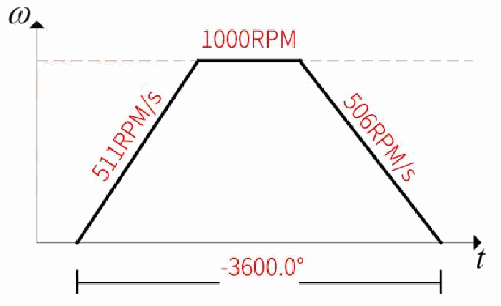


---

<a id="page-57"></a>

<!-- 原 PDF 第 57 页 -->

**原文第 57 页**


#### 5.3.12 位置模式控制（Emm）


**主机发送（主机→电机）**

| 字节1 | 字节2 | 字节3 | 字节4 | 字节5 | 字节6 | 字节7 | 字节8 | 字节9 | 字节10 | 字节11 | 字节12 | 字节13 |
| --- | --- | --- | --- | --- | --- | --- | --- | --- | --- | --- | --- | --- |
| 地址 | 功能码 | 方向 | 速度(RPM) |  | 加速度 | 脉冲数 |  |  |  | 运动模式 | 同步标志 | 校验码 |
| Addr | FD | 00/01 | 0000-0BB8 |  | 00-FF | 00000000-FFFFFFFF |  |  |  | 00/01/02 | 00/01 | 6B |


**电机返回（电机→主机）**

| 地址 | 功能码 | 返回数据 | 校验码 |
| --- | --- | --- | --- |
| Addr | FD | 02/12/22/9F/E2/EE(参考第4章节说明) | 6B |

方向：00/01分别表示CW/CCW；  
速度：范围为0000-0BB8，即0-3000RPM；  
加速度：范围为00-FF，即0-255档位，加速度的计算公式如下；  
(1)加速度为0表示不使用曲线加减速，直接按照设定的速度启动和运行。  
(2)加速度不为0，则曲线加减速时间计算公式为：  
t2 - t1 = (256 - acc) * 50(us)，Vt2 = Vt1 + 1(RPM);  
(acc为加速度，Vt1 为t1 时刻的转速，Vt2 为 t2时刻的转速)  
说明：公式表示每隔(256 - acc)个 50us 增加/减少 1RPM(转每分钟)，  
比如，当设定加速度为 100 时，就是每隔((256 - 100) * 50us) = 7800us  
的时间增加/减少1RPM；  
特别注意：加速度 acc＝0 时是直接启动，acc≠0 时，根据上述公式计  
算加减速时间，此时acc值越大，加速时间越短，则加速越快；  
脉冲数：默认1.8°步进电机，细分 16，每个脉冲电机转1.8°/16=0.1125°，  
即发送3200个脉冲电机转一圈360°，以此进行计算；  
运动模式：00/01/02分别表示相对上一输入目标位置进行相对位置运动/相对坐  
标零点进行绝对位置运动/相对当前实时位置进行相对位置运动；  
同步标志：00/01分别表示立即执行/先缓存当前命令，参考3.5.2小节说明；  
例如，发送01 FD 01 05 DC 00 00 00 7D 00 00 00 6B，正确返回01 FD 02 6B，  
电机以方向CCW，速度1500RPM，加速度0档位，相对运动32000个脉冲(10圈)；  

---

<a id="page-58"></a>

<!-- 原 PDF 第 58 页 -->

**原文第 58 页**


#### 5.3.13 快速位置模式控制(Emm)

快速位置模式控制是指将位置模式控制指令的方向和脉冲数与其他参数拆  
分开来，即先设定好参数，后面只需要单独给位置即可运动，可以加快通讯速率  
和提高效率，适用于二维云台、快速更新位置、固定速度加速度参数等应用。  
（注：新增功能，使用该功能需要更新到 V2.0.0 以上固件）  
1.先发送指令设定一次速度、加速度、运动模式、同步标志等参数  


**主机发送（主机→电机）**

| 字节1 | 字节2 | 字节3 | 字节4 | 字节5 | 字节6 | 字节7 | 字节8 |
| --- | --- | --- | --- | --- | --- | --- | --- |
| 地址 | 功能码 | 速度(RPM) |  | 加速度 | 运动模式 | 同步标志 | 校验码 |
| Addr | F1 | 0000-0BB8 |  | 00-FF | 00/01/02 | 00/01 | 6B |


**电机返回（电机→主机）**

| 地址 | 功能码 | 返回数据 | 校验码 |
| --- | --- | --- | --- |
| Addr | F1 | 02/12/22/9F/E2/EE(参考第4章说明) | 6B |

2.后面只需要发送有符号int32_t类型脉冲数即可进行位置运动  


**主机发送（主机→电机）**

| 字节1 | 字节2 | 字节3 | 字节4 | 字节5 | 字节6 | 字节7 |
| --- | --- | --- | --- | --- | --- | --- |
| 地址 | 功能码 | 脉冲数 |  |  |  | 校验码 |
| Addr | FC | 00000000-FFFFFFFF(有符号int32_t类型) |  |  |  | 6B |


**电机返回（电机→主机）**

| 地址 | 功能码 | 返回数据 | 校验码 |
| --- | --- | --- | --- |
| Addr | FC | 02/12/22/9F/E2/EE(参考第4章说明) | 6B |

参数解析见上面的“5.3.12 位置模式控制（Emm）”说明，示例：  
1）发01 F1 03 20 64 00 00 6B，设定速度800RPM，加速度100，相对1运动。  
2）发01 FC 00 00 0C 80 6B，相对1运动0x0C80 = 3200个脉冲。  
3）发01 FC 00 00 03 20 6B，继续相对1运动0x0320 = 800个脉冲。  
可见，设定好参数后，每条指令相比原来减少了6个字节的通讯时间。  

---

<a id="page-59"></a>

<!-- 原 PDF 第 59 页 -->

**原文第 59 页**


#### 5.3.14 快速梯形曲线位置模式控制(X)

快速位置模式控制的含义参考“5.3.13 快速位置模式控制(Emm)”解析说明。  
（注：新增功能，使用该功能需要更新到 V2.0.0 以上固件）  
1.先发送指令设定一次加速度、速度、运动模式、同步标志、最大电流等参数  


**主机发送（主机→电机）**

| 字节1 | 字节2 | 字节3 | 字节4 | 字节5 | 字节6 | 字节7 | 字节8 |
| --- | --- | --- | --- | --- | --- | --- | --- |
| 地址 | 功能码 | 加速加速度(RPM/S) |  | 减速加速度(RPM/S) |  | 最大速度(0.1RPM) |  |
| Addr | F1 | 0000-FFFF |  | 0000-FFFF |  | 0000-7530 |  |
| 字节9 | 字节10 | 字节11 | 字节12 | 字节13 |  |  |  |
| 运动模式 | 同步标志 | 最大电流(mA) |  | 校验码 |  |  |  |
| 00/01/02 | 00/01 | 0000-1388 |  | 6B |  |  |  |


**电机返回（电机→主机）**

| 地址 | 功能码 | 返回数据 | 校验码 |
| --- | --- | --- | --- |
| Addr | F1 | 02/12/22/9F/E2/EE(参考第4章说明) | 6B |

2.后面只需要发送有符号int32_t类型位置角度即可进行梯形位置运动  


**主机发送（主机→电机）**

| 字节1 | 字节2 | 字节3 | 字节4 | 字节5 | 字节6 | 字节7 |
| --- | --- | --- | --- | --- | --- | --- |
| 地址 | 功能码 | 位置角度(0.1°) |  |  |  | 校验码 |
| Addr | FC | 00000000-FFFFFFFF(有符号int32_t类型) |  |  |  | 6B |


**电机返回（电机→主机）**

| 地址 | 功能码 | 返回数据 | 校验码 |
| --- | --- | --- | --- |
| Addr | FC | 02/12/22/9F/E2/EE(参考第4章说明) | 6B |

参数解析见“5.3.11 梯形曲线加减速位置模式限电流控制（X）”说明：  
可见，设定好参数后，每条指令相比原来减少了11个字节的通讯时间。  

---

<a id="page-60"></a>

<!-- 原 PDF 第 60 页 -->

**原文第 60 页**


#### 5.3.15 立即停止


**主机发送（主机→电机）**

| 地址 | 功能码 | 辅助码 | 同步标志 | 校验码 |
| --- | --- | --- | --- | --- |
| Addr | FE | 98 | 00/01 | 6B |


**电机返回（电机→主机）**

| 地址 | 功能码 | 返回数据 | 校验码 |
| --- | --- | --- | --- |
| Addr | FE | 02/E2/EE(参考第4章节说明) | 6B |

同步标志：00/01分别表示立即执行/先缓存当前命令，参考3.5.2小节说明；  
例如，发送01 FE 98 00 6B，正确返回01 FE 02 6B，立即停止电机；  

#### 5.3.16 触发多机同步运动


**主机发送（主机→电机）**

| 地址 | 功能码 | 辅助码 | 校验码 |
| --- | --- | --- | --- |
| Addr | FF | 66 | 6B |


**电机返回（电机→主机）**

| 地址 | 功能码 | 返回数据 | 校验码 |
| --- | --- | --- | --- |
| Addr | FF | 02/E2/EE(参考第4章节说明) | 6B |

例如，发送 00 FF 66 6B，正确返回 01 FF 02 6B，以广播地址0 发送多机同步  
运动命令，将使缓存了命令的电机(发送过同步标志为 01 的命令)同步开始执行  
缓存的命令，无缓存命令的电机不会动作；  

---

<a id="page-61"></a>

<!-- 原 PDF 第 61 页 -->

**原文第 61 页**


### 5.4 原点回零命令


#### 5.4.1 设置单圈回零的零点位置


**主机发送（主机→电机）**

| 地址 | 功能码 | 辅助码 | 是否存储 | 校验码 |
| --- | --- | --- | --- | --- |
| Addr | 93 | 88 | 00/01 | 6B |


**电机返回（电机→主机）**

| 地址 | 功能码 | 返回数据 | 校验码 |
| --- | --- | --- | --- |
| Addr | 93 | 02/E2/EE(参考第4章节说明) | 6B |

是否存储：00/01分别表示不存储/存储，存储后数据掉电不丢失；  
例如，发送01 93 88 01 6B，正确返回01 93 02 6B，将当前位置设置为单圈回  
零的零点位置，且存储在电机上；注意，该零点位置是单圈的范围内；  

#### 5.4.2 触发回零


**主机发送（主机→电机）**

| 地址 | 功能码 | 回零模式 | 同步标志 | 校验码 |
| --- | --- | --- | --- | --- |
| Addr | 9A | 00-05 | 00/01 | 6B |


**电机返回（电机→主机）**

| 地址 | 功能码 | 返回数据 | 校验码 |
| --- | --- | --- | --- |
| Addr | 9A | 02/12/9F/E2/EE(参考第4章) | 6B |

回零模式：默认值为00，即单圈就近回零模式  
00：单圈就近回零  
01：单圈方向回零  
02：无限位碰撞回零  

---

<a id="page-62"></a>

<!-- 原 PDF 第 62 页 -->

**原文第 62 页**

03：限位回零  
04：回到绝对位置坐标零点  
05：回到上次掉电位置角度；  
同步标志：00/01分别表示立即执行/先缓存当前命令，参考3.5.2小节说明；  
例如，发送01 9A 02 00 6B，正确返回01 9A 02 6B，触发无限位碰撞回零。  
特别注意：接线和设置参考“3.2 原点回零”小节相应回零模式的说明操作；  

#### 5.4.3 强制中断并退出回零操作


**主机发送（主机→电机）**

| 地址 | 功能码 | 辅助码 | 校验码 |
| --- | --- | --- | --- |
| Addr | 9C | 48 | 6B |


**电机返回（电机→主机）**

| 地址 | 功能码 | 返回数据 | 校验码 |
| --- | --- | --- | --- |
| Addr | 9C | 02/E2/EE(参考第4章节说明) | 6B |

例如，发送01 9C 48 6B，正确返回01 9C 02 6B，在回零过程中可中断回零；  

#### 5.4.4 读取回零状态标志


**主机发送（主机→电机）**

| 地址 | 功能码 | 校验码 |
| --- | --- | --- |
| Addr | 3B | 6B |


**电机返回（电机→主机）**

| 地址 | 功能<br>码 | 回零状态标志 |  |  |  |  |  |  |  | 校验<br>码 |
| --- | --- | --- | --- | --- | --- | --- | --- | --- | --- | --- |
|  |  | bit7 | bit6 | bit5 | bit4 | bit3 | bit2 | bit1 | bit0 |  |
| Addr | 3B | 保留 | 保留 | Ocp_TF | Otp_TF | Org_CF | Org_SF | Cal_Rdy | Enc_Rdy | 6B |


---

<a id="page-63"></a>

<!-- 原 PDF 第 63 页 -->

**原文第 63 页**

Ocp_TF：过流保护标志，0/1分别表示没触发/触发了过流保护；  
Otp_TF：过热保护标志，0/1分别表示没触发/触发了过热保护；  
Org_CF/Org_SF：回零失败标志/正在回零标志；  
默认状态：回零失败标志Org_CF为0，正在回零标志Org_SF为0；  
正在回零：回零失败标志Org_CF为0，正在回零标志Org_SF为1；  
回零失败：回零失败标志Org_CF为1，正在回零标志Org_SF为0；  
回零成功：回零失败标志Org_CF为0，正在回零标志Org_SF为0；  
Cal_Rdy：校准表就绪标志，0/1分别表示未校准/已校准；  
Enc_Rdy：编码器就绪标志，0/1分别表示编码器异常/编码器正常；  
例如，发送01 3B 6B读取回零状态标志，假设返回01 3B 03 6B，其中03为回  
零状态标志，03二进制数为00000011，即Cal_Rdy和Enc_Rdy为1，其余为0。  
在程序中，可以通过以下方式进行判断每个标志位的状态：  
if(回零状态标志 & 0x01) { Enc_Rdy = true; } else { Enc_Rdy = false; }  
if(回零状态标志 & 0x02) { Cal_Rdy = true; } else { Cal_Rdy = false; }  
if(回零状态标志 & 0x04) { Org_SF = true; } else { Org_SF = false; }  
if(回零状态标志 & 0x08) { Org_CF = true; } else { Org_CF = false; }  
if(回零状态标志 & 0x10) { Otp_TF = true; } else { Otp_TF = false; }  
if(回零状态标志 & 0x20) { Ocp_TF = true; } else { Ocp_TF = false; }  
在程序中，可以通过以下方式进行判断回零的状态：  
int org_state = 回零状态标志 & 0x0C;  
if(org_state == 0x04) { 正在回零 }  
if(org_state == 0x08) { 回零失败 }  
if(org_state == 0x00) { 回零成功 }  

#### 5.4.5 读取回零参数


**主机发送（主机→电机）**

| 地址 | 功能码 | 校验码 |
| --- | --- | --- |
| Addr | 22 | 6B |


---

<a id="page-64"></a>

<!-- 原 PDF 第 64 页 -->

**原文第 64 页**


**电机返回（电机→主机）**

| 字节1 | 字节2 | 字节3 | 字节4 | 字节5 | 字节6 | 字节7 | 字节8 | 字节9 | 字节10 |
| --- | --- | --- | --- | --- | --- | --- | --- | --- | --- |
| 地址 | 功能码 | 回零模式 | 回零方向 | 回零速度 |  | 回零超时时间 |  |  |  |
| Addr | 22 | 00-05 | 00/01 | 0000-0BB8 |  | 00000000-FFFFFFFF |  |  |  |
| 字节11 | 字节12 | 字节13 | 字节14 | 字节15 | 字节16 | 字节17 | 字节18 |  |  |
| 碰撞回零检测转速 |  | 碰撞回零检测电流 |  | 碰撞回零检测时间 |  | O_POT_En | 校验码 |  |  |
| 0000-0BB8 |  | 0000-1388 |  | 0000-FFFF |  | 00/01 | 6B |  |  |

参数解析见下面的“5.4.6 修改回零参数”命令说明；  

#### 5.4.6 修改回零参数


**主机发送（主机→电机）**

| 字节1 | 字节2 | 字节3 | 字节4 | 字节5 | 字节6 | 字节7 | 字节8 | 字节9 | 字节10 |
| --- | --- | --- | --- | --- | --- | --- | --- | --- | --- |
| 地址 | 功能码 | 辅助码 | 是否存储 | 回零模式 | 回零方向 | 回零速度 |  | 回零超时时间(Hi) |  |
| Addr | 4C | AE | 00/01 | 00-05 | 00/01 | 0000-0BB8 |  | 0000-FFFF |  |
| 字节11 | 字节12 | 字节13 | 字节14 | 字节15 | 字节16 | 字节17 | 字节18 | 字节19 | 字节20 |
| 回零超时时间(Lo) |  | 碰撞回零检测转速 |  | 碰撞回零检测电流 |  | 碰撞回零检测时间 |  | O_POT_En | 校验码 |
| 0000-FFFF |  | 0000-0BB8 |  | 0000-1388 |  | 0000-FFFF |  | 00/01 | 6B |


**电机返回（电机→主机）**

| 地址 | 功能码 | 返回数据 | 校验码 |
| --- | --- | --- | --- |
| Addr | 4C | 02/E2/EE(参考第4章节说明) | 6B |

回零模式：默认值为00，即单圈就近回零模式  
00：单圈就近回零  
01：单圈方向回零  
02：无限位碰撞回零  
03：限位回零  
04：回到绝对位置坐标零点  
05：回到上次掉电位置角度；  
回零方向：00/01分别表示CW/CCW，默认为CW；  

---

<a id="page-65"></a>

<!-- 原 PDF 第 65 页 -->

**原文第 65 页**

回零速度：范围为0000-0BB8，即0-3000RPM，默认为30RPM；  
回零超时时间：超时将自动退出回零，单位为毫秒，默认为10000毫秒；  
碰撞回零检测转速/电流/时间：默认值分别为300RPM/800mA/60ms；  
原理：将电机堵转位置作为零点，同时满足下列(1)(2)(3)即完成碰撞检测：  
(1) 电机实时转速 < 碰撞回零检测转速  
(2) 电机实时相电流 > 碰撞回零检测电流  
(3) 满足(1)和(2)持续的时间 > 碰撞回零检测时间  
O_POT_En：是否使能上电自动触发回零功能，00/01分别表示不使能/使能；  
例如，发送01 4C AE 01 00 00 00 1E 00 00 27 10 01 2C 03 20 00 3C 00 6B  
修改回零参数，正确返回01 4C 02 6B  
01 = 保存本次修改的配置参数；  
00 = 回零模式为Nearest（单圈就近回零模式）；  
00 = 回零方向为CW；  
001E = 回零速度为30(RPM)；  
00002710 = 回零超时时间为10000(ms)；  
012C = 碰撞回零检测转速为300(RPM)；  
0320 = 碰撞回零检测电流为800(Ma)；  
003C = 碰撞回零检测时间为60(ms)；  
00 = 不使能上电自动触发回零功能；  
例如，发送01 22 6B读取回零参数，假设返回 01 22 00 00 00 1E 00 00 27 10  
01 2C 03 20 00 3C 00 6B  
回零模式 = 00 = Nearest = 单圈就近回零模式  
回零方向 = 00 = CW  
回零转速 = 001E = 30(RPM)  
回零超时时间 = 00002710 = 10000(ms)  
碰撞回零检测转速 = 012C = 300(RPM)  
碰撞回零检测电流 = 0320 = 800(Ma)  
碰撞回零检测时间 = 003C = 60(ms)  
上电自动回零使能 = 00 = 不使能  

---

<a id="page-66"></a>

<!-- 原 PDF 第 66 页 -->

**原文第 66 页**


### 5.5 读取系统参数命令


#### 5.5.1 定时返回信息命令（X42S/Y42）


**主机发送（主机→电机）**

| 字节1 | 字节2 | 字节3 | 字节4 | 字节5 | 字节6 | 字节7 |
| --- | --- | --- | --- | --- | --- | --- |
| 地址 | 功能码 | 辅助码 | 信息功能码 | 定时时间(毫秒) |  | 校验码 |
| Addr | 11 | 18 | 36/3A/... | 0-FFFF |  | 6B |


**电机返回（电机→主机）**

| 地址 | 功能码 | 返回数据 | 校验码 |
| --- | --- | --- | --- |
| Addr | 数据返回格式见“信息功能码”中对应的命令小节 |  | 6B |

1.使用定时返回信息命令，可以让电机定时连续返回信息，而不需要频繁读取；  
2.定时返回信息命令支持的命令为“5.5 读取系统参数命令”中的命令功能码；  
示例1：让电机1每隔1毫秒返回一次实时位置信息，发送定时返回信息命令为：  
01 11 18 36 00 01 6B，电机返回的格式见“读取电机实时位置”命令；  
36 = “5.5.13 读取电机实时位置”命令的功能码为36；  
0001 = 定时时间为1毫秒；  
示例2：让电机2每隔10毫秒返回一次电机状态标志，发送定时返回信息命令：  
02 11 18 3A 00 0A 6B，电机返回的格式见“读取电机状态标志”命令；  
3A = “5.5.15 读取电机状态标志”命令的功能码为3A；  
000A = 定时时间为10毫秒；  
示例3：让电机2停止返回电机状态标志，发送命令：02 11 18 3A 00 00 6B，  
电机将返回确认收到命令“02 11 6B”；  
3A = “5.5.15 读取电机状态标志”命令的功能码为3A；  
0000 = 定时时间为0毫秒，即停止返回；  

---

<a id="page-67"></a>

<!-- 原 PDF 第 67 页 -->

**原文第 67 页**


#### 5.5.2 读取固件版本和硬件版本


**主机发送（主机→电机）**

| 地址 | 功能码 | 校验码 |
| --- | --- | --- |
| Addr | 1F | 6B |


**电机返回（电机→主机）**

| 字节1 | 字节2 | 字节3 | 字节4 | 字节5 |  | 字节6 |  | 字节7 |
| --- | --- | --- | --- | --- | --- | --- | --- | --- |
| 地址 | 功能<br>码 | 固件版本 |  | 硬件版本 |  |  |  | 校验<br>码 |
|  |  | bit 15 - 0 |  | bit 15 - 12 | bit 11 - 8 |  | bit 7 - 0 |  |
| Addr | 1F | FW_Ver |  | HW_Series | HW_Type |  | HW_Ver | 6B |

FW_Ver：固件版本号，例如200表示固件版本为V2.0.0；  
HW_Series：硬件板卡系列，0/1分别表示X系列板卡和Y系列板卡；  
HW_Type：硬件板卡类型，0/1/2/3/4/5/6分别表示20/28/35/42/57/86；  
HW_Ver：固件版本号，例如14表示硬件版本为V2.0；  

#### 5.5.3 读取相电阻和相电感


**主机发送（主机→电机）**

| 地址 | 功能码 | 校验码 |
| --- | --- | --- |
| Addr | 20 | 6B |


**电机返回（电机→主机）**

| 字节1 | 字节2 | 字节3 | 字节4 | 字节5 | 字节6 | 字节7 |
| --- | --- | --- | --- | --- | --- | --- |
| 地址 | 功能码 | 相电阻 |  | 相电感 |  | 校验码 |
| Addr | 20 | Pha_R |  | Pha_L |  | 6B |

相电阻：单位：mΩ；  
相电感：单位：uH；  

---

<a id="page-68"></a>

<!-- 原 PDF 第 68 页 -->

**原文第 68 页**


#### 5.5.4 读取总线电压


**主机发送（主机→电机）**

| 地址 | 功能码 | 校验码 |
| --- | --- | --- |
| Addr | 24 | 6B |


**电机返回（电机→主机）**

| 字节1 | 字节2 | 字节3 | 字节4 | 字节5 |
| --- | --- | --- | --- | --- |
| 地址 | 功能码 | 总线电压 |  | 校验码 |
| Addr | 24 | VBus |  | 6B |

总线电压 VBus：单位：mV，即供电电压V+经过反接二极管后的电压值；  

#### 5.5.5 读取总线电流（X42S/Y42）


**主机发送（主机→电机）**

| 地址 | 功能码 | 校验码 |
| --- | --- | --- |
| Addr | 26 | 6B |


**电机返回（电机→主机）**

| 字节1 | 字节2 | 字节3 | 字节4 | 字节5 |
| --- | --- | --- | --- | --- |
| 地址 | 功能码 | 总线电流 |  | 校验码 |
| Addr | 26 | CBus |  | 6B |

总线电流 CBus：单位：mA，即V+引脚供电的电流；  
注意：总线电流为相电流和相电压换算得到，可能存在偏差，仅提供趋势参考；  

---

<a id="page-69"></a>

<!-- 原 PDF 第 69 页 -->

**原文第 69 页**


#### 5.5.6 读取相电流


**主机发送（主机→电机）**

| 地址 | 功能码 | 校验码 |
| --- | --- | --- |
| Addr | 27 | 6B |


**电机返回（电机→主机）**

| 字节1 | 字节2 | 字节3 | 字节4 | 字节5 |
| --- | --- | --- | --- | --- |
| 地址 | 功能码 | 相电流 |  | 校验码 |
| Addr | 27 | CPha |  | 6B |

相电流 CPha：单位：mA，即电机实际工作电流；  

#### 5.5.7 读取经过线性化校准后的编码器值


**主机发送（主机→电机）**

| 地址 | 功能码 | 校验码 |
| --- | --- | --- |
| Addr | 31 | 6B |


**电机返回（电机→主机）**

| 字节1 | 字节2 | 字节3 | 字节4 | 字节5 |
| --- | --- | --- | --- | --- |
| 地址 | 功能码 | 线性化编码器值 |  | 校验码 |
| Addr | 31 | 0-65535 |  | 6B |

线性化编码器值：范围为0-65535表示0-360度；  
注意：线性化编码器为单圈绝对值，即从0到65535后，又会重新从0开始；  

---

<a id="page-70"></a>

<!-- 原 PDF 第 70 页 -->

**原文第 70 页**


#### 5.5.8 读取输入脉冲数


**主机发送（主机→电机）**

| 地址 | 功能码 | 校验码 |
| --- | --- | --- |
| Addr | 32 | 6B |


**电机返回（电机→主机）**

| 字节1 | 字节2 | 字节3 | 字节4 | 字节5 | 字节6 | 字节7 | 字节8 |
| --- | --- | --- | --- | --- | --- | --- | --- |
| 地址 | 功能码 | 符号 | 输入脉冲数 |  |  |  | 校验码 |
| Addr | 32 | 00/01 | 00000000-FFFFFFFF |  |  |  | 6B |

符号：00/01分别表示输入脉冲数的正/负号；  
输入脉冲数：输入脉冲数个数，默认16细分下，3200个脉冲表示一圈360度；  

#### 5.5.9 读取电机目标位置


**主机发送（主机→电机）**

| 地址 | 功能码 | 校验码 |
| --- | --- | --- |
| Addr | 33 | 6B |


**电机返回（电机→主机）**

| 字节1 | 字节2 | 字节3 | 字节4 | 字节5 | 字节6 | 字节7 | 字节8 |
| --- | --- | --- | --- | --- | --- | --- | --- |
| 地址 | 功能码 | 符号 | 电机目标位置 |  |  |  | 校验码 |
| Addr | 33 | 00/01 | 00000000-FFFFFFFF |  |  |  | 6B |

符号：00/01分别表示目标位置的正/负号；  
电机目标位置：两种固件返回的含义不同，其含义及转换为角度单位如下：  
Emm 固件：0-65535表示一圈0-360°，角度值=(目标位置 * 360)/65536;  
X固件：角度值 = 目标位置/10，比如返回的目标位置为16，则为1.6°;  

---

<a id="page-71"></a>

<!-- 原 PDF 第 71 页 -->

**原文第 71 页**


#### 5.5.10 读取电机实时设定的目标位置


**主机发送（主机→电机）**

| 地址 | 功能码 | 校验码 |
| --- | --- | --- |
| Addr | 34 | 6B |


**电机返回（电机→主机）**

| 字节1 | 字节2 | 字节3 | 字节4 | 字节5 | 字节6 | 字节7 | 字节8 |
| --- | --- | --- | --- | --- | --- | --- | --- |
| 地址 | 功能码 | 符号 | 设定目标位置 |  |  |  | 校验码 |
| Addr | 34 | 00/01 | 00000000-FFFFFFFF |  |  |  | 6B |

符号：00/01分别表示开环模式实时位置的正/负号；  
设定目标位置：两种固件返回的含义不同，其含义及转换为角度单位如下：  
Emm 固件：0-65535表示一圈0-360°，角度值=(目标位置 * 360)/65536;  
X固件：角度值 = 目标位置/10，比如返回的目标位置为16，则为1.6°;  

#### 5.5.11 读取电机实时转速


**主机发送（主机→电机）**

| 地址 | 功能码 | 校验码 |
| --- | --- | --- |
| Addr | 35 | 6B |


**电机返回（电机→主机）**

| 字节1 | 字节2 | 字节3 | 字节4 | 字节5 | 字节6 |
| --- | --- | --- | --- | --- | --- |
| 地址 | 功能码 | 符号 | 电机实时转速 |  | 校验码 |
| Addr | 35 | 00/01 | 0000-1388 |  | 6B |

符号：00/01分别表示电机实时转速的正/负号；  
电机实时转速：Emm固件单位为RPM，X固件单位为0.1RPM，所以返回值需要/10；  

---

<a id="page-72"></a>

<!-- 原 PDF 第 72 页 -->

**原文第 72 页**


#### 5.5.12 读取驱动温度（X42S/Y42）


**主机发送（主机→电机）**

| 地址 | 功能码 | 校验码 |
| --- | --- | --- |
| Addr | 39 | 6B |


**电机返回（电机→主机）**

| 字节1 | 字节2 | 字节3 | 字节4 | 字节5 |
| --- | --- | --- | --- | --- |
| 地址 | 功能码 | 温度符号 | 温度 | 校验码 |
| Addr | 39 | 00/01 | Temp | 6B |

温度符号：00/01分别表示负数/正数；  
温度Temp：驱动实时温度，单位℃；  

#### 5.5.13 读取电机实时位置


**主机发送（主机→电机）**

| 地址 | 功能码 | 校验码 |
| --- | --- | --- |
| Addr | 36 | 6B |


**电机返回（电机→主机）**

| 字节1 | 字节2 | 字节3 | 字节4 | 字节5 | 字节6 | 字节7 | 字节8 |
| --- | --- | --- | --- | --- | --- | --- | --- |
| 地址 | 功能码 | 符号 | 电机实时位置 |  |  |  | 校验码 |
| Addr | 36 | 00/01 | 00000000-FFFFFFFF |  |  |  | 6B |

符号：00/01分别表示电机实时位置的正/负号；  
电机实时位置：两种固件返回的含义不同，其含义及转换为角度单位如下：  
Emm 固件：0-65535表示一圈0-360°，角度值=(实时位置 * 360)/65536;  
X固件：角度值 = 实时位置/10，比如返回的实时位置为16，则为1.6°;  

---

<a id="page-73"></a>

<!-- 原 PDF 第 73 页 -->

**原文第 73 页**


#### 5.5.14 读取电机位置误差


**主机发送（主机→电机）**

| 地址 | 功能码 | 校验码 |
| --- | --- | --- |
| Addr | 37 | 6B |


**电机返回（电机→主机）**

| 字节1 | 字节2 | 字节3 | 字节4 | 字节5 | 字节6 | 字节7 | 字节8 |
| --- | --- | --- | --- | --- | --- | --- | --- |
| 地址 | 功能码 | 符号 | 电机位置误差 |  |  |  | 校验码 |
| Addr | 37 | 00/01 | 00000000-FFFFFFFF |  |  |  | 6B |

符号：00/01分别表示电机位置误差的正/负号；  
电机位置误差：两种固件返回的含义不同，其含义及转换为角度单位如下：  
Emm 固件：0-65535表示一圈0-360°，角度值=(位置误差 * 360)/65536;  
X固件：角度值 = 位置误差/100，比如返回的位置误差为8，则为0.08°;  

#### 5.5.15 读取电机状态标志


**主机发送（主机→电机）**

| 地址 | 功能码 | 校验码 |
| --- | --- | --- |
| Addr | 3A | 6B |


**电机返回（电机→主机）**

| 地址 | 功能<br>码 | 电机状态标志 |  |  |  |  |  |  |  | 校验<br>码 |
| --- | --- | --- | --- | --- | --- | --- | --- | --- | --- | --- |
|  |  | bit7 | bit6 | bit5 | bit4 | bit3 | bit2 | bit1 | bit0 |  |
| Addr | 3A | Oac_TF | 保留 | Esi_RF | Esi_LF | Cgp_TF | Cgi_TF | Prf_TF | Ens_TF | 6B |

Oac_TF：掉电标志，默认0，可通过5.6.3命令改为1，如果掉电重启将恢复 0；  
Esi_RF：右限位开关的状态，0/1分别表示右限位输入引脚为低/高电平状态；  
Esi_LF：左限位开关的状态，0/1分别表示左限位输入引脚为低/高电平状态；  

---

<a id="page-74"></a>

<!-- 原 PDF 第 74 页 -->

**原文第 74 页**

Cgp_TF/Cgi_TF：堵转保护标志/堵转标志，0/1分别表示未触发/已触发；  
(1) 电机实时转速 < 电机堵转检测转速  
(2) 电机实时相电流 > 电机堵转检测电流  
(3) 满足(1)和(2)持续的时间 > 电机堵转检测时间  
满足(1)(2)置位堵转标志，满足(1)(2)(3)触发堵转保护；  
Prf_TF：位置到达标志，0/1分别表示电机运动未到达/已到达输入目标位置；  
Ens_TF：使能状态标志，0/1分别表示未使能/已使能电机；  
例如，发送01 3A 6B读取电机状态标志，假设返回01 3A 83 6B，其中83为电  
机状态标志，83 二进制数为 10000011，即 Oac_TF、Prf_TF 和 Ens_TF 为 1，其  
余为0。在程序中，可以通过以下方式进行判断每个标志位的状态：  
if(电机状态标志 & 0x01) { Ens_TF = true; } else { Ens_TF = false; }  
if(电机状态标志 & 0x02) { Prf_TF = true; } else { Prf_TF = false; }  
if(电机状态标志 & 0x04) { Cgi_TF = true; } else { Cgi_TF = false; }  
if(电机状态标志 & 0x08) { Cgp_TF = true; } else { Cgp_TF = false; }  
if(电机状态标志 & 0x10) { Esi_LF = true; } else { Esi_LF = false; }  
if(电机状态标志 & 0x20) { Esi_RF = true; } else { Esi_RF = false; }  
if(电机状态标志 & 0x80) { Oac_TF = true; } else { Oac_TF = false; }  

#### 5.5.16 读取回零状态标志 + 电机状态标志（X42S/Y42）


**主机发送（主机→电机）**

| 地址 | 功能码 | 校验码 |
| --- | --- | --- |
| Addr | 3C | 6B |


**电机返回（电机→主机）**

| 字节1 | 字节2 | 字节3 | 字节4 | 字节5 |
| --- | --- | --- | --- | --- |
| 地址 | 功能码 | 回零状态标志 | 电机状态标志 | 校验码 |
| Addr | 3C | 参考5.4.4小节 | 参考5.5.15小节 | 6B |

回零状态标志见“5.4.4 读取回零状态标志” 小节的参数说明；  
电机状态标志见“5.5.15 读取电机状态标志”小节的参数说明；  

---

<a id="page-75"></a>

<!-- 原 PDF 第 75 页 -->

**原文第 75 页**


#### 5.5.17 读取引脚 IO 电平状态（X42S/Y42）


**主机发送（主机→电机）**

| 地址 | 功能码 | 校验码 |
| --- | --- | --- |
| Addr | 3D | 6B |


**电机返回（电机→主机）**

| 地址 | 功能<br>码 | 引脚IO电平状态 |  |  |  |  |  |  |  | 校验<br>码 |
| --- | --- | --- | --- | --- | --- | --- | --- | --- | --- | --- |
|  |  | bit7 | bit6 | bit5 | bit4 | bit3 | bit2 | bit1 | bit0 |  |
| Addr | 3D | 保留 | 保留 | Dir_OM | Dir_Pin | 0 | Stp_Pin | 0 | En_Pin | 6B |

bit0：使能引脚电平状态En_Pin，0为低电平，1为高电平；  
bit1、bit3：保持为0；  
bit2：脉冲引脚电平状态Stp_Pin，0为低电平，1为高电平；  
bit4：方向引脚电平状态Dir_Pin，0为低电平，1为高电平；  
bit5：方向引脚输出模式Dir_OM，0为输入模式，1为输出模式；  
bit6、bit7：保留；  

#### 5.5.18 读取电池电压（Y42）


**主机发送（主机→电机）**

| 地址 | 功能码 | 校验码 |
| --- | --- | --- |
| Addr | 38 | 6B |


**电机返回（电机→主机）**

| 字节1 | 字节2 | 字节3 | 字节4 | 字节5 |
| --- | --- | --- | --- | --- |
| 地址 | 功能码 | 电池电压 |  | 校验码 |
| Addr | 38 | VBat |  | 6B |

电池电压 VBat：单位：mV，即低功耗掉电记录接入电池的电压值；  

---

<a id="page-76"></a>

<!-- 原 PDF 第 76 页 -->

**原文第 76 页**

读写驱动参数命令  
5.6  

#### 5.6.1 修改电机 ID/地址


**主机发送（主机→电机）**

| 地址 | 功能码 | 辅助码 | 是否存储 | ID/地址 | 校验码 |
| --- | --- | --- | --- | --- | --- |
| Addr | AE | 4B | 00/01 | 01-FF | 6B |


**电机返回（电机→主机）**

| 地址 | 功能码 | 返回数据 | 校验码 |
| --- | --- | --- | --- |
| Addr | AE | 02/E2/EE(参考第4章节说明) | 6B |

是否存储：00/01分别表示不存储/存储，存储后掉电不丢失参数；  
ID/地址：默认值为1，可修改范围为01-FF(1-255)，00为广播地址；  

#### 5.6.2 修改细分值


**主机发送（主机→电机）**

| 地址 | 功能码 | 辅助码 | 是否存储 | 细分值 | 校验码 |
| --- | --- | --- | --- | --- | --- |
| Addr | 84 | 8A | 00/01 | 00-FF | 6B |


**电机返回（电机→主机）**

| 地址 | 功能码 | 返回数据 | 校验码 |
| --- | --- | --- | --- |
| Addr | 84 | 02/E2/EE(参考第4章节说明) | 6B |

是否存储：00/01分别表示不存储/存储，存储后掉电不丢失参数；  
细分值：默认值为16，01-FF分别表示1-255细分，00表示256细分；  
注意：1.8°电机，默认16细分下，Emm固件发送3200个脉冲电机转一圈0-360°；  

---

<a id="page-77"></a>

<!-- 原 PDF 第 77 页 -->

**原文第 77 页**


#### 5.6.3 修改掉电标志


**主机发送（主机→电机）**

| 地址 | 功能码 | 掉电标志 | 校验码 |
| --- | --- | --- | --- |
| Addr | 50 | 00/01 | 6B |


**电机返回（电机→主机）**

| 地址 | 功能码 | 返回数据 | 校验码 |
| --- | --- | --- | --- |
| Addr | 50 | 02/E2/EE(参考第4章节说明) | 6B |

掉电标志：默认0，修改1后，如果掉电重启会变回为0，读取见5.5.15小节；  

#### 5.6.4 读取选项参数状态（X42S/Y42）


**主机发送（主机→电机）**

| 地址 | 功能码 | 校验码 |
| --- | --- | --- |
| Addr | 1A | 6B |


**电机返回（电机→主机）**

| 地址 | 功能<br>码 | 电机状态标志 |  |  |  |  |  |  |  | 校验<br>码 |
| --- | --- | --- | --- | --- | --- | --- | --- | --- | --- | --- |
|  |  | bit7 | bit6 | bit5 | bit4 | bit3 | bit2 | bit1 | bit0 |  |
| Addr | 1A | Scale | 保留 | BtLock | MotDir | 保留 | CtrMode | FwType | MotType | 6B |

bit0：电机类型，0表示当前为1.8°步进电机，1表示0.9度步进电机；  
bit1：固件类型，0表示当前为X固件，1表示Emm固件；  
bit2：控制模式，0表示当前为开环模式，1表示闭环模式；  
bit4：电机运动正方向，0表示当前为CW(顺时针方向)，1表示CCW(逆时针)；  
bit5：锁定按键功能，0表示当前为按键没上锁状态，1表示按键被锁定状态；  
bit7：是否缩小10倍输入功能，0表示当前为失能，1表示使能；  
bit8-bit9：锁定修改参数等级，见“5.6.31 修改锁定修改参数功能（X42S/Y42）”  

---

<a id="page-78"></a>

<!-- 原 PDF 第 78 页 -->

**原文第 78 页**


#### 5.6.5 修改电机类型


**主机发送（主机→电机）**

| 地址 | 功能码 | 辅助码 | 是否存储 | 电机类型 | 校验码 |
| --- | --- | --- | --- | --- | --- |
| Addr | D7 | 35 | 00/01 | 19/32 | 6B |


**电机返回（电机→主机）**

| 地址 | 功能码 | 返回数据 | 校验码 |
| --- | --- | --- | --- |
| Addr | D7 | 02/E2/EE(参考第4章节说明) | 6B |

是否存储：00/01分别表示不存储/存储，存储后掉电不丢失参数；  
电机类型：默认值为50，25/50分别表示0.9°/1.8°步进电机；  
注意：根据自身使用的电机类型进行修改，修改后要重新空载校准电机；  

#### 5.6.6 修改固件类型


**主机发送（主机→电机）**

| 地址 | 功能码 | 辅助码 | 是否存储 | 固件类型 | 校验码 |
| --- | --- | --- | --- | --- | --- |
| Addr | D5 | 69 | 00/01 | 00/01/02 | 6B |


**电机返回（电机→主机）**

| 地址 | 功能码 | 返回数据 | 校验码 |
| --- | --- | --- | --- |
| Addr | D5 | 02/E2/EE(参考第4章节说明) | 6B |

是否存储：00/01分别表示不存储/存储，存储后掉电不丢失参数；  
固件类型：默认值为01，00/01/02分别表示X固件/Emm固件/Emm固件狂暴模式；  
注意：修改固件类型，尽可能保持电机在停止状态下进行修改；  

---

<a id="page-79"></a>

<!-- 原 PDF 第 79 页 -->

**原文第 79 页**


#### 5.6.7 修改开环/闭环控制模式


**主机发送（主机→电机）**

| 地址 | 功能码 | 辅助码 | 是否存储 | 控制模式 | 校验码 |
| --- | --- | --- | --- | --- | --- |
| Addr | 46 | 69 | 00/01 | 00/01 | 6B |


**电机返回（电机→主机）**

| 地址 | 功能码 | 返回数据 | 校验码 |
| --- | --- | --- | --- |
| Addr | 46 | 02/E2/EE(参考第4章节说明) | 6B |

是否存储：00/01分别表示不存储/存储，存储后掉电不丢失参数；  
控制模式：默认值为01，00/01分别表示开环/闭环控制模式；  
注意：修改控制模式，尽可能保持电机在停止状态下进行修改；  

#### 5.6.8 修改电机运动正方向


**主机发送（主机→电机）**

| 地址 | 功能码 | 辅助码 | 是否存储 | 电机运动正方向 | 校验码 |
| --- | --- | --- | --- | --- | --- |
| Addr | D4 | 60 | 00/01 | 00/01 | 6B |


**电机返回（电机→主机）**

| 地址 | 功能码 | 返回数据 | 校验码 |
| --- | --- | --- | --- |
| Addr | D4 | 02/E2/EE(参考第4章节说明) | 6B |

是否存储：00/01分别表示不存储/存储，存储后掉电不丢失参数；  
电机运动正方向：默认值为00，00/01分别表示CW/CCW（顺时针/逆时针）；  
说明：修改的是电机运动的正方向，电机运动的正方向也跟电机线序有关，将  
A+A-或B+B-任一组线序对调，然后空载重新校准电机，也可以改变正方向；  

---

<a id="page-80"></a>

<!-- 原 PDF 第 80 页 -->

**原文第 80 页**


#### 5.6.9 修改锁定按键功能


**主机发送（主机→电机）**

| 地址 | 功能码 | 辅助码 | 是否存储 | 锁定按键功能 | 校验码 |
| --- | --- | --- | --- | --- | --- |
| Addr | D0 | B3 | 00/01 | 00/01 | 6B |


**电机返回（电机→主机）**

| 地址 | 功能码 | 返回数据 | 校验码 |
| --- | --- | --- | --- |
| Addr | D0 | 02/E2/EE(参考第4章节说明) | 6B |

是否存储：00/01分别表示不存储/存储，存储后掉电不丢失参数；  
锁定按键功能：默认值为00，00/01分别表示解锁/锁定按键；  
注意：锁定按键后，除恢复出厂设置功能外，其他按键功能不起作用，需要再次  
发送解锁按键命令，按键功能才能重新生效，防止误触发按键；  

#### 5.6.10 修改命令位置角度是否继续缩小 10 倍输入（X）


**主机发送（主机→电机）**

| 地址 | 功能码 | 辅助码 | 是否存储 | 是否继续缩小 | 校验码 |
| --- | --- | --- | --- | --- | --- |
| Addr | 4F | 71 | 00/01 | 00/01 | 6B |


**电机返回（电机→主机）**

| 地址 | 功能码 | 返回数据 | 校验码 |
| --- | --- | --- | --- |
| Addr | 4F | 02/E2/EE(参考第4章节说明) | 6B |

是否存储：00/01分别表示不存储/存储，存储后掉电不丢失参数；  
是否继续缩小：默认值为 00，00/01分别表示命令位置角度值关闭/使能继续缩  
小 10 倍输入，X 固件默认最小输入角度值为 0.1°，使能后，将精确到 0.01°  
输入，比如，发送1的位置角度值，电机实际运行0.01°，以此类推；  

---

<a id="page-81"></a>

<!-- 原 PDF 第 81 页 -->

**原文第 81 页**


#### 5.6.11 修改命令速度值是否缩小 10 倍输入（Emm）


**主机发送（主机→电机）**

| 地址 | 功能码 | 辅助码 | 是否存储 | 是否缩小 | 校验码 |
| --- | --- | --- | --- | --- | --- |
| Addr | 4F | 71 | 00/01 | 00/01 | 6B |


**电机返回（电机→主机）**

| 地址 | 功能码 | 返回数据 | 校验码 |
| --- | --- | --- | --- |
| Addr | 4F | 02/E2/EE(参考第4章节说明) | 6B |

是否存储：00/01分别表示不存储/存储，存储后掉电不丢失参数；  
是否缩小：默认值为 00，00/01分别表示通讯控制命令速度值关闭/使能速度值  
缩小10倍输入，Emm固件默认最小输入速度值为1RPM，使能后，将精确到0.1RPM  
输入，比如，发送1RPM速度值，电机实际以0.1RPM的速度运行；  

#### 5.6.12 修改开环模式工作电流


**主机发送（主机→电机）**

| 地址 | 功能码 | 辅助码 | 是否存储 | 开环模式工作电流 | 校验码 |
| --- | --- | --- | --- | --- | --- |
| Addr | 44 | 33 | 00/01 | 0000-1388 | 6B |


**电机返回（电机→主机）**

| 地址 | 功能码 | 返回数据 | 校验码 |
| --- | --- | --- | --- |
| Addr | 44 | 02/E2/EE(参考第4章节说明) | 6B |

是否存储：00/01分别表示不存储/存储，存储后掉电不丢失参数；  
开环模式工作电流：默认值为X42S/1200mA，范围0000-1388，即0-5000mA；  
注意：开环模式工作电流不要设置太大，太大电机发热会很严重；  

---

<a id="page-82"></a>

<!-- 原 PDF 第 82 页 -->

**原文第 82 页**


#### 5.6.13 修改闭环模式最大电流


**主机发送（主机→电机）**

| 地址 | 功能码 | 辅助码 | 是否存储 | 闭环模式最大电流 | 校验码 |
| --- | --- | --- | --- | --- | --- |
| Addr | 45 | 66 | 00/01 | 0000-1388 | 6B |


**电机返回（电机→主机）**

| 地址 | 功能码 | 返回数据 | 校验码 |
| --- | --- | --- | --- |
| Addr | 45 | 02/E2/EE(参考第4章节说明) | 6B |

是否存储：00/01分别表示不存储/存储，存储后掉电不丢失参数；  
闭环模式最大电流：默认值为X42S/3000mA，范围0000-1388，即0-5000mA；  
Emm固件：表示堵转最大电流，堵转时达到的电流值不超过此值；  
X固件：表示电机正常运行过程中，不管什么状态都不会超过此值；  

#### 5.6.14 读取 PID 参数（X）


**主机发送（主机→电机）**

| 地址 | 功能码 | 校验码 |
| --- | --- | --- |
| Addr | 21 | 6B |


**电机返回（电机→主机）**

| 字节1 | 字节2 | 字节3 | 字节4 | 字节5 | 字节6 | 字节7 | 字节8 | 字节9 | 字节10 |
| --- | --- | --- | --- | --- | --- | --- | --- | --- | --- |
| 地址 | 功能码 | 梯形曲线位置环Kp |  |  |  | 直通限速位置环Kp |  |  |  |
| Addr | 21 | pTkp |  |  |  | pBkp |  |  |  |
| 字节11 | 字节12 | 字节13 | 字节14 | 字节16 | 字节17 | 字节18 | 字节19 | 字节20 |  |
| 速度环Kp |  |  |  | 速度环Ki |  |  |  | 校验码 |  |
| vkp |  |  |  | vki |  |  |  | 6B |  |

参数解析见下面的“5.6.15 修改 PID参数（X）”命令说明；  

---

<a id="page-83"></a>

<!-- 原 PDF 第 83 页 -->

**原文第 83 页**


#### 5.6.15 修改 PID 参数（X）


**主机发送（主机→电机）**

| 字节1 | 字节2 | 字节3 | 字节4 | 字节5 | 字节6 | 字节7 | 字节8 | 字节9 | 字节10 | 字节11 | 字节12 |
| --- | --- | --- | --- | --- | --- | --- | --- | --- | --- | --- | --- |
| 地址 | 功能码 | 辅助码 | 是否存储 | 梯形曲线位置环Kp |  |  |  | 直通限速位置环Kp |  |  |  |
| Addr | 4A | C3 | 00/01 | pTkp |  |  |  | pBkp |  |  |  |
| 字节13 | 字节14 | 字节15 | 字节16 | 字节17 | 字节18 | 字节19 | 字节20 | 字节21 |  |  |  |
| 速度环Kp |  |  |  | 速度环Ki |  |  |  | 校验码 |  |  |  |
| vkp |  |  |  | vki |  |  |  | 6B |  |  |  |


**电机返回（电机→主机）**

| 地址 | 功能码 | 返回数据 | 校验码 |
| --- | --- | --- | --- |
| Addr | 4A | 02/E2/EE(参考第4章节说明) | 6B |

梯形曲线位置环 kp/直通限速位置环 kp：默认值为(X42S/X57S)/126640；  
速度环 kp：默认值为(X28S/X35S)/12600，X42S/15600，X57S/26000；  
速度环 ki：默认值为(X28S/X35S)/18，X42S/26，X57S/58；  
例如，修改PID参数发送01 4A C3 01 00 01 EE B0 00 01 EE B0 00 00 3C F0  
00 00 00 1A 6B，正确返回01 4A 02 6B  
01 = 保存本次修改的配置参数；  
0001EEB0 = 梯形曲线位置环kp为126640；  
0001EEB0 = 直通限速位置环kp为126640；  
00003CF0 = 速度环kp为15600；  
0000001A = 速度环ki为26；  

#### 5.6.16 读取 PID 参数（Emm）


**主机发送（主机→电机）**

| 地址 | 功能码 | 校验码 |
| --- | --- | --- |
| Addr | 21 | 6B |


---

<a id="page-84"></a>

<!-- 原 PDF 第 84 页 -->

**原文第 84 页**


**电机返回（电机→主机）**

| 字节1 | 字节2 | 字节3 | 字节4 | 字节5 | 字节6 | 字节7 | 字节8 | 字节9 | 字节10 |
| --- | --- | --- | --- | --- | --- | --- | --- | --- | --- |
| 地址 | 功能码 | 比例系数 |  |  |  | 积分系数 |  |  |  |
| Addr | 21 | Kp |  |  |  | Ki |  |  |  |
| 字节11 | 字节12 | 字节13 | 字节14 | 字节15 |  |  |  |  |  |
| 微分系数 |  |  |  | 校验码 |  |  |  |  |  |
| Kd |  |  |  | 6B |  |  |  |  |  |

参数解析见下面的“5.6.17 修改 PID参数（Emm）”命令说明；  

#### 5.6.17 修改 PID 参数（Emm）


**主机发送（主机→电机）**

| 字节1 | 字节2 | 字节3 | 字节4 | 字节5 | 字节6 | 字节7 | 字节8 | 字节9 | 字节10 |
| --- | --- | --- | --- | --- | --- | --- | --- | --- | --- |
| 地址 | 功能码 | 辅助码 | 是否存储 | 比例系数 |  |  |  |  |  |
| Addr | 4A | C3 | 00/01 | Kp |  |  |  |  |  |
| 字节11 | 字节12 | 字节13 | 字节14 | 字节15 | 字节16 | 字节17 |  |  |  |
| 积分系数 |  | 微分系数 |  |  |  | 校验码 |  |  |  |
| Ki |  | Kd |  |  |  | 6B |  |  |  |


**电机返回（电机→主机）**

| 地址 | 功能码 | 返回数据 | 校验码 |
| --- | --- | --- | --- |
| Addr | 4A | 02/E2/EE(参考第4章节说明) | 6B |

比例系数 Kp：默认值为(X28S/X35S/X42S)/18000，Y57/32000；  
积分系数 Ki：默认值为10；  
微分系数 Kd：默认值为(X28S/X35S/X42S)/18000，X57S/32000；  
例如修改PID参数发送01 4A C3 01 00 00 46 50 00 00 00 0A 00 00 46 50 6B  
01 = 保存本次修改的配置参数；  
00004650 = 比例系数Kp为18000；  

---

<a id="page-85"></a>

<!-- 原 PDF 第 85 页 -->

**原文第 85 页**

0000000A = 积分系数Ki为10；  
00004650 = 微分系数Kd为18000；  

#### 5.6.18 读取 DMX512 协议参数（X42S/Y42）


**主机发送（主机→电机）**

| 地址 | 功能码 | 辅助码 | 校验码 |
| --- | --- | --- | --- |
| Addr | 49 | 78 | 6B |


**电机返回（电机→主机）**

| 字节1 | 字节2 | 字节3 | 字节4 | 字节5 | 字节6 | 字节7 | 字节8 | 字节9 | 字节10 |
| --- | --- | --- | --- | --- | --- | --- | --- | --- | --- |
| 地址 | 功能码 | 总通道数 |  | 每个电机占<br>用的通道数 | 运动模式 | 单通道模式的运动速度 |  | 加速度 |  |
| Addr | 49 | 0001-0040 |  | 01/02 | 00/01 | 0001-0BB8 |  | 0001-FFFF |  |
| 字节11 | 字节12 | 字节13 | 字节14 | 字节15 | 字节15 | 字节17 |  |  |  |
| 双通道模式速度步长 |  | 双通道模式运动步长 |  |  |  | 校验码 |  |  |  |
| 0001-FFFF |  | 00000001-FFFFFFFF |  |  |  | 6B |  |  |  |

参数解析见下面的“5.6.19 修改 DMX512 协议参数（X42S/Y42）”命令说明；  

#### 5.6.19 修改 DMX512 协议参数（X42S/Y42）


**主机发送（主机→电机）**

| 字节1 | 字节2 | 字节3 | 字节4 | 字节5 | 字节6 | 字节7 | 字节8 | 字节9 | 字节10 |
| --- | --- | --- | --- | --- | --- | --- | --- | --- | --- |
| 地址 | 功能码 | 辅助码 | 是否存储 | 总通道数 |  | 每个电机占<br>用的通道数 | 运动模式 | 单通道模式的运动速度 |  |
| Addr | D9 | 90 | 00/01 | 0001-0040 |  | 01/02 | 00/01 | 0001-0BB8 |  |
| 字节11 | 字节12 | 字节13 | 字节14 | 字节15 | 字节16 | 字节17 | 字节18 | 字节19 |  |
| 加速度 |  | 双通道模式速度步长 |  | 双通道模式运动步长 |  |  |  | 校验码 |  |
| 0001-FFFF |  | 0001-FFFF |  | 00000001-FFFFFFFF |  |  |  | 6B |  |


---

<a id="page-86"></a>

<!-- 原 PDF 第 86 页 -->

**原文第 86 页**


**电机返回（电机→主机）**

| 地址 | 功能码 | 返回数据 | 校验码 |
| --- | --- | --- | --- |
| Addr | D9 | 02/E2/EE(参考第4章节说明) | 6B |

总通道数：控制台的总通道数，默认值为192，适配市面上的DMX512控制台(一  
般为192个通道)，该值要与自身DMX512控制器的总通道数一样；  
每个电机占用的通道数：  
(1) 默认值为 1，即单通道模式，一个电机占用 1个通道，即每个通道控制  
对应地址电机的位置角度，如通道1控制地址为1电机的位置角度。  
(2) 设置为2时，为双通道模式，则低通道表示位置，高通道表示速度，如  
通道1和2分别控制地址1电机的位置角度和速度，如此类推；  
运动模式：  
(1) 默认值为1，表示绝对坐标式位置运动（相对上电时零点进行绝对运动）;  
(2) 当设置为0，表示相对位置模式运动（相对当前位置进行增量运动）；  
单通道模式的运动速度：默认值为1000，单位RPM，即1000RPM；  
加速度：默认值为1000，值越大，加速越快，两种固件的加速度计算如下：  
Emm固件：acc=加速数值/8=125，加速时间见“5.3.12 位置模式控制（Emm）”；  
X固件：单位为RPM，即加速度为1000RPM/s；  
双通道模式速度步长：默认值为10，即电机运动速度为(通道值 * 10)RPM；  
双通道模式运动步长：默认值为100，即电机转动角度为(通道值 * 10.0)°；  
例如，修改DMX512协议参数发送01 D9 90 01 00 C0 01 01 03 E8 03 E8 00 0A  
00 00 00 64 6B，正确返回01 D9 02 6B  
01 = 保存本次修改的配置参数；  
00C0 = 总通道数为192个通道；  
01 = 每个电机占用的通道数为1，即单通道模式；  
01 = 运动模式为绝对坐标式位置运动；  
03E8 = 单通道模式的运动速度为1000RPM；  
03E8 = 加速值为1000，Emm固件加速度acc为125，X固件为1000RPM/s；  
000A = 双通道模式速度步长为10RPM；  
00000064 = 双通道模式运动步长值为100，缩小10倍处理，即10.0°；  

---

<a id="page-87"></a>

<!-- 原 PDF 第 87 页 -->

**原文第 87 页**


#### 5.6.20 读取位置到达窗口（X42S/Y42）


**主机发送（主机→电机）**

| 地址 | 功能码 | 校验码 |
| --- | --- | --- |
| Addr | 41 | 6B |


**电机返回（电机→主机）**

| 字节1 | 字节2 | 字节3 | 字节4 | 字节5 |
| --- | --- | --- | --- | --- |
| 地址 | 功能码 | 位置到达窗口 |  | 校验码 |
| Addr | 41 | Pos_Window |  | 6B |

参数解析见下面的“5.6.21 修改位置到达窗口（X42S/Y42）”命令说明；  

#### 5.6.21 修改位置到达窗口（X42S/Y42）


**主机发送（主机→电机）**

| 地址 | 功能码 | 辅助码 | 是否存储 | 位置到达窗口 | 校验码 |
| --- | --- | --- | --- | --- | --- |
| Addr | D1 | 07 | 00/01 | 0000-FFFF | 6B |


**电机返回（电机→主机）**

| 地址 | 功能码 | 返回数据 | 校验码 |
| --- | --- | --- | --- |
| Addr | D1 | 02/E2/EE(参考第4章节说明) | 6B |

位置到达窗口：默认值为8，缩小10倍处理，即位置到达窗口默认值为0.8°；  
当位置误差 = 目标位置 - 实时位置 < 位置到达窗口(0.8°)，认为电机已经  
到达设定的位置，将置位 Prf_TF（位置到达标志位），如果“控制命令应答”  
参数设置为Reached/Both/Other，则到位后返回：地址 + 功能码 + 9F + 6B；  
例如，修改位置到达窗口发送01 D1 07 01 00 08 6B，正确返回01 D1 02 6B  
01 = 保存本次修改的配置参数；  
0008 = 位置到达窗口值修改为0.8°（内部缩小了10倍处理）；  

---

<a id="page-88"></a>

<!-- 原 PDF 第 88 页 -->

**原文第 88 页**


#### 5.6.22 读取过热过流保护检测阈值（X42S/Y42）


**主机发送（主机→电机）**

| 地址 | 功能码 | 校验码 |
| --- | --- | --- |
| Addr | 13 | 6B |


**电机返回（电机→主机）**

| 字节1 | 字节2 | 字节3 | 字节4 | 字节5 | 字节6 | 字节7 | 字节8 | 字节9 |
| --- | --- | --- | --- | --- | --- | --- | --- | --- |
| 地址 | 功能码 | 过热保护检测阈值 |  | 过流保护检测阈值 |  | 过热过流检测时间 |  | 校验码 |
| Addr | 13 | 0000-FFFF |  | 0000-FFFF |  | 0000-FFFF |  | 6B |

参数解析见下面“5.6.23 修改过热过流保护检测阈值（X42S/Y42）”命令说明；  

#### 5.6.23 修改过热过流保护检测阈值（X42S/Y42）


**主机发送（主机→电机）**

| 字节1 | 字节2 | 字节3 | 字节4 | 字节5 | 字节6 | 字节7 | 字节8 | 字节9 | 字节10 | 字节11 |
| --- | --- | --- | --- | --- | --- | --- | --- | --- | --- | --- |
| 地址 | 功能码 | 辅助码 | 是否存储 | 过热保护检测阈值 |  | 过流保护检测阈值 |  | 过热过流检测时间 |  | 校验码 |
| 00 | D3 | 56 | 00/01 | 0000-FFFF |  | 0000-FFFF |  | 0000-FFFF |  | 6B |


**电机返回（电机→主机）**

| 地址 | 功能码 | 返回数据 | 校验码 |
| --- | --- | --- | --- |
| Addr | D3 | 02/E2/EE(参考第4章节说明) | 6B |

过热保护检测阈值：默认值为100℃；  
过流保护检测阈值：默认值为6600mA；  
过热过流检测阈值：默认值为1000ms；  
(1) 驱动实时温度/电流 >= 过热/过流保护检测阈值，持续的时间 >= 过热  
过流检测时间，将触发过热/过流保护；  
例如，修改过热过流保护检测阈值发送01 D3 56 01 00 64 19 C8 03 E8 6B  
01 = 保存本次修改的配置参数；  

---

<a id="page-89"></a>

<!-- 原 PDF 第 89 页 -->

**原文第 89 页**

0064 = 过热保护检测阈值修改为100℃；  
19C8 = 过流保护检测阈值修改为6600mA；  
03E8 = 过热过流检测时间改为1000ms；  

#### 5.6.24 读取心跳保护功能时间（X42S/Y42）


**主机发送（主机→电机）**

| 地址 | 功能码 | 校验码 |
| --- | --- | --- |
| Addr | 16 | 6B |


**电机返回（电机→主机）**

| 字节1 | 字节2 | 字节3 | 字节4 | 字节5 | 字节6 | 字节7 |
| --- | --- | --- | --- | --- | --- | --- |
| 地址 | 功能码 | 心跳保护时间 |  |  |  | 校验码 |
| Addr | 16 | 00000000-FFFFFFFF |  |  |  | 6B |

参数解析见下面的“5.6.25 修改心跳保护功能时间（X42S/Y42）”命令说明；  

#### 5.6.25 修改心跳保护功能时间（X42S/Y42）


**主机发送（主机→电机）**

| 字节1 | 字节2 | 字节3 | 字节4 | 字节5 | 字节6 | 字节7 | 字节8 | 字节9 |
| --- | --- | --- | --- | --- | --- | --- | --- | --- |
| 地址 | 功能码 | 辅助码 | 是否存储 | 心跳保护时间 |  |  |  | 校验码 |
| Addr | 68 | 38 | 00/01 | 00000000-FFFFFFFF |  |  |  | 6B |


**电机返回（电机→主机）**

| 地址 | 功能码 | 返回数据 | 校验码 |
| --- | --- | --- | --- |
| Addr | 68 | 02/E2/EE(参考第4章节说明) | 6B |

是否存储：00/01分别表示不存储/存储，存储后掉电不丢失参数；  
心跳保护时间：默认值为0，单位：ms；在设定时间内，电机如果没有接收到正  

---

<a id="page-90"></a>

<!-- 原 PDF 第 90 页 -->

**原文第 90 页**

确命令，则会控制电机急停下来，可以预防实时控制场景因通讯异常导致事故。  

#### 5.6.26 读取积分限幅/刚性系数（X42S/Y42）


**主机发送（主机→电机）**

| 地址 | 功能码 | 校验码 |
| --- | --- | --- |
| Addr | 23 | 6B |


**电机返回（电机→主机）**

| 字节1 | 字节2 | 字节3 | 字节4 | 字节5 | 字节6 | 字节7 |
| --- | --- | --- | --- | --- | --- | --- |
| 地址 | 功能码 | 积分限幅/刚性系数 |  |  |  | 校验码 |
| Addr | 23 | 00000000-FFFFFFFF |  |  |  | 6B |

参数解析见下面的“ 5.6.27 修改积分限幅/刚性系数（X）”命令说明；  

#### 5.6.27 修改积分限幅/刚性系数（X42S/Y42）


**主机发送（主机→电机）**

| 字节1 | 字节2 | 字节3 | 字节4 | 字节5 | 字节6 | 字节7 | 字节8 | 字节9 |
| --- | --- | --- | --- | --- | --- | --- | --- | --- |
| 地址 | 功能码 | 辅助码 | 是否存储 | 积分限幅/刚性系数 |  |  |  | 校验码 |
| Addr | 4B | 57 | 00/01 | 00000000-FFFFFFFF |  |  |  | 6B |


**电机返回（电机→主机）**

| 地址 | 功能码 | 返回数据 | 校验码 |
| --- | --- | --- | --- |
| Addr | 4B | 02/E2/EE(参考第4章节说明) | 6B |

是否存储：00/01分别表示不存储/存储，存储后掉电不丢失参数；  
积分限幅/刚性系数：Emm 固件积分限幅默认为 65535/X 固件刚性系数默认为  
X42S/388、X57S/512，值越大，静态力矩/刚性会更大一些，但太大电机会震颤；  

---

<a id="page-91"></a>

<!-- 原 PDF 第 91 页 -->

**原文第 91 页**


#### 5.6.28 读取碰撞回零返回角度（X42S/Y42）


**主机发送（主机→电机）**

| 地址 | 功能码 | 校验码 |
| --- | --- | --- |
| Addr | 3F | 6B |


**电机返回（电机→主机）**

| 字节1 | 字节2 | 字节3 | 字节4 | 字节5 |
| --- | --- | --- | --- | --- |
| 地址 | 功能码 | 碰撞回零返回角度 |  | 校验码 |
| Addr | 3F | O_SL_RP |  | 6B |

参数解析见下面的“5.6.29 修改碰撞回零返回角度（X42S/Y42）”命令说明；  

#### 5.6.29 修改碰撞回零返回角度（X42S/Y42）


**主机发送（主机→电机）**

| 地址 | 功能码 | 辅助码 | 是否存储 | 碰撞回零返回角度 | 校验码 |
| --- | --- | --- | --- | --- | --- |
| Addr | 5C | AC | 00/01 | 0000-FFFF | 6B |


**电机返回（电机→主机）**

| 地址 | 功能码 | 返回数据 | 校验码 |
| --- | --- | --- | --- |
| Addr | 5C | 02/E2/EE(参考第4章节说明) | 6B |

碰撞回零返回角度：默认值为0。因为碰撞瞬间电流较大，所以碰撞完成后需要  
返回一定角度位置，防止电机堵转。值为 0 是基于电流检测返回，即返回到(电  
机实际电流 < 碰撞回零检测电流)的位置，其余为固定值，比如，设置为 20，  
即2.0°(放大10倍输入，单位为0.1°)，即碰撞完成后固定返回2.0度。比如，  
设置为100，即10.0°，则碰撞完成后固定返回2.0度。  

---

<a id="page-92"></a>

<!-- 原 PDF 第 92 页 -->

**原文第 92 页**


#### 5.6.30 广播读取 ID 地址（X42S/Y42）


**主机发送（主机→电机）**

| 地址 | 功能码 | 校验码 |
| --- | --- | --- |
| 00 | 15 | 6B |


**电机返回（电机→主机）**

| 字节1 | 字节2 | 字节3 | 字节4 |
| --- | --- | --- | --- |
| 地址 | 功能码 | 电机地址 | 校验码 |
| Addr | 15 | Addr | 6B |

当忘记电机 ID地址时，可以单独接线该电机，广播读取该电机的地址；  

#### 5.6.31 修改锁定修改参数功能（X42S/Y42）


**主机发送（主机→电机）**

| 地址 | 功能码 | 辅助码 | 是否存储 | 锁定参数等级 | 校验码 |
| --- | --- | --- | --- | --- | --- |
| Addr | D6 | 4B | 00/01 | 00-03 | 6B |


**电机返回（电机→主机）**

| 地址 | 功能码 | 返回数据 | 校验码 |
| --- | --- | --- | --- |
| Addr | D6 | 02/E2/EE(参考第4章节说明) | 6B |

是否存储：00/01分别表示不存储/存储，存储后掉电不丢失参数；  
锁定参数等级：默认值为00，00-03分别表示不同的锁定参数等级；  
00：解锁，解锁后可修改任意参数；  
01：禁止修改(ID地址 + 通讯速率 + 通讯协议 + 通讯端口复用)  
02/03：禁止(修改所有参数 + 触发校准)  
（注：读取锁定参数等级见“5.5.4 读取选项参数状态”）  

---

<a id="page-93"></a>

<!-- 原 PDF 第 93 页 -->

**原文第 93 页**

上电自动运行命令  
5.7  

#### 5.7.1 存储一组速度参数，上电自动运行（X）


**主机发送（主机→电机）**

|  |  |  |  |  |  |  |  |  |  |  |
| --- | --- | --- | --- | --- | --- | --- | --- | --- | --- | --- |
| 地址 | 功能码 | 辅助码 | 清除/存储 | 方向 | 加速度 |  | 速度 |  | 是否使能En<br>引脚控制启停 | 校验码 |
| Addr | F7 | 1C | 00/01 | 00/01 | 0000-FFFF |  | 0000-7530 |  | 00/01 | 6B |


**电机返回（电机→主机）**

| 地址 | 功能码 | 返回数据 | 校验码 |
| --- | --- | --- | --- |
| Addr | F7 | 02/E2/EE(参考第4章节说明) | 6B |

清除/存储：00和01分别表示清除已存储速度和加速度/存储当前速度和加速度；  
方向：00/01分别表示CW/CCW；  
加速度：范围为0000-FFFF，即0-65535RPM/S（转每分钟每秒）；  
速度：范围为0000-7E30，即0-30000，保留一位小数，即0-3000.0RPM；  
是否使能 En 引脚控制启停：00/01分别表示不使能/使能En引脚控制启停；  
说明：使能后，可以利用给En引脚输入高低电平来控制电机的启动和停止，  
但需要设置En引脚有效电平状态，默认为Hold，可以改为L(低电平使能)或H；  
例如，发送01 F7 1C 01 00 01 FF 17 70 01 6B，正确返回01 F7 02 6B  
01 = 保存本次修改的配置参数；  
00 = 电机运动方向为CW；  
01FF = 加速度为511RPM/s；  
1770 = 速度为600.0RPM（内部自动缩小了10倍处理）；  
01 = 使能En引脚控制启停；  

---

<a id="page-94"></a>

<!-- 原 PDF 第 94 页 -->

**原文第 94 页**


#### 5.7.2 存储一组速度参数，上电自动运行（Emm）


**主机发送（主机→电机）**

| 字节1 | 字节2 | 字节3 | 字节4 | 字节5 | 字节6 | 字节7 | 字节8 | 字节9 | 字节10 |
| --- | --- | --- | --- | --- | --- | --- | --- | --- | --- |
| 地址 | 功能码 | 辅助码 | 清除/存储 | 方向 | 速度 |  | 加速度 | 是否使能En<br>引脚控制启停 | 校验码 |
| Addr | F7 | 1C | 00/01 | 00/01 | 0000-0BB8 |  | 00-FF | 00/01 | 6B |


**电机返回（电机→主机）**

| 地址 | 功能码 | 返回数据 | 校验码 |
| --- | --- | --- | --- |
| Addr | F7 | 02/E2/EE(参考第4章节说明) | 6B |

清除/存储：00和01分别表示清除已存储速度和加速度/存储当前速度和加速度；  
方向：00/01分别表示CW/CCW；  
速度：范围为0000-0BB8，即0-3000RPM；  
加速度：范围为0-255档位，加速度计算公式见“5.3.7 速度模式控制（Emm）”；  
是否使能 En 引脚控制启停：00/01分别表示不使能/使能En引脚控制启停；  
说明：使能后，可以利用给En引脚输入高低电平来控制电机的启动和停止，  
但需要设置En引脚有效电平状态，默认为Hold，可以改为L(低电平使能)或H；  
例如，发送01 F7 1C 01 00 02 58 64 01 6B，正确返回01 F7 02 6B  
01 = 保存本次修改的配置参数；  
00 = 电机运动方向为CW；  
0258 = 速度为600.0RPM；  
64 = 加速度为100；(加速度计算公式见“5.3.7 速度模式控制（Emm）”)  
01 = 使能En引脚控制启停；  

---

<a id="page-95"></a>

<!-- 原 PDF 第 95 页 -->

**原文第 95 页**

读取所有驱动参数命令  
5.8  
读取系统状态参数（ ）  

#### 5.8.1 X


**主机发送（主机→电机）**

| 地址 | 功能码 | 辅助码 | 校验码 |
| --- | --- | --- | --- |
| Addr | 43 | 7A | 6B |


**电机返回（电机→主机）**

| 字节1 | 字节2 | 字节3 | 字节4 | 字节5 | 字节6 | 字节7 | 字节8 |
| --- | --- | --- | --- | --- | --- | --- | --- |
| 地址 | 功能码 | 字节数 | 参数个数 | 总线电压 |  | 总线电流 |  |
| Addr | 43 | 25 | 0C | 0000-FFFF |  | 0000-FFFF |  |
| 字节9 | 字节10 | 字节11 | 字节12 | 字节13 | 字节14 | 字节15 | 字节16 |
| 电机相电流 |  | 编码器原始值 |  | 线性化编码器值 |  | 符号1 |  |
| 0000-FFFF |  | 0000-FFFF |  | 0000-FFFF |  |  |  |
| 字节17 | 字节18 | 字节19 | 字节20 | 字节21 | 字节22 | 字节23 | 字节24 |
| 电机目标位置 |  |  | 符号2 | 电机实时转速 |  | 符号3 |  |
| 00000000-FFFFFFFF |  |  |  | 0000-7530 |  |  |  |
| 字节25 | 字节26 | 字节27 | 字节28 | 字节29 | 字节30 | 字节31 | 字节32 |
| 电机实时位置 |  |  | 符号4 | 电机位置误差 |  |  |  |
| 00000000-FFFFFFFF |  |  |  | 00000000-FFFFFFFF |  |  |  |
| 字节33 | 字节34 | 字节35 | 字节36 | 字节37 |  |  |  |
| 符号5 | 电机实时温度 | 回零状态标志 | 电机状态标志 | 校验码 |  |  |  |
|  | 00-FF | 参考5.4.4 | 参考5.5.15 | 6B |  |  |  |

字节数：总字节数为0x25 = 37个字节；  
参数个数：总的参数个数为0x0C = 12个参数；  
总线电压：电源电压，即V+引脚经过二极管后的供电电压，单位：mV；  
总线电流：电源电流，即V+引脚经过二极管后的供电电流，单位：mA；  
电机相电流：电机实时相电流，单位：mA；  

---

<a id="page-96"></a>

<!-- 原 PDF 第 96 页 -->

**原文第 96 页**

编码器原始值：磁编码器输出的原始值，范围0-65535表示0-360度；  
线性化编码器值：经过线性化校准后的编码器值，范围0-65535表示0-360度；  
符号1：符号00/01分别表示电机目标位置正/负号；  
电机目标位置：单位为0.1°，即返回的数值 *0.1，即为电机目标位置角度值;  
符号2：符号00/01分别表示电机实时转速正/负号；  
电机实时转速：单位为0.1RPM，即返回的数值 * 0.1，即为电机实时转速值；  
符号3：符号00/01分别表示电机实时位置正/负号；  
电机实时位置：单位为0.1°，即返回的数值 *0.1，即为电机实时位置角度值;  
符号4：符号00/01分别表示电机位置误差正/负号；  
电机位置误差：单位为0.01°，即返回的数值 *0.01，即为电机位置误差角度;  
符号5：符号00/01分别表示电机实时温度温度正/负号；  
电机实时温度温度：单位为℃，即返回的数值，即为电机实时温度温度值；  
回零状态标志：参考5.4.4小节的说明；  
电机状态标志：参考5.5.15小节的说明；  
例如，发送01 43 7A 6B读取系统状态参数，返回01 43 25 0C 5C 67 00 00 00  
03 30 B5 43 EB 01 00 00 0E 10 00 00 00 00 00 00 0E 10 01 00 00 00 02 00  
22 03 03 6B  
25 = 总字节数为0x25 = 37个字节；  
0C = 总的参数个数为0x0C = 12个参数；  
5C67 = 总线电压为23655(mV)；  
0000 = 总线电流为0(mA);  
0003 = 电机实时相电流为3(mA)；  
30B5 = 编码器原始值为12469;  
43EB = 线性化编码器值为17387；  
01 00000E10 = 电机目标位置为-0x00000E10 = -360.0度；  
00 0000 = 电机实时转速为0RPM；  
00 00000E10 = 电机实时位置为+0x00000E10 = +360.0度；  
01 00000002 = 电机位置误差为-0x00000002 ≈ -0.02度；  
00 22 = 电机实时温度为34℃；  
03 = 回零状态标志为0x03，参考5.4.4小节的说明；  
03 = 电机状态标志为0x03，参考5.5.15小节的说明；  

---

<a id="page-97"></a>

<!-- 原 PDF 第 97 页 -->

**原文第 97 页**

读取系统状态参数（ ）  

#### 5.8.2 Emm


**主机发送（主机→电机）**

| 地址 | 功能码 | 辅助码 | 校验码 |
| --- | --- | --- | --- |
| Addr | 43 | 7A | 6B |


**电机返回（电机→主机）**

| 字节1 | 字节2 | 字节3 | 字节4 | 字节5 | 字节6 | 字节7 | 字节8 |
| --- | --- | --- | --- | --- | --- | --- | --- |
| 地址 | 功能码 | 字节数 | 参数个数 | 总线电压 |  | 电机相电流 |  |
| Addr | 43 | 1F | 09 | 0000-FFFF |  | 0000-FFFF |  |
| 字节9 | 字节10 | 字节11 | 字节12 | 字节13 | 字节14 | 字节15 | 字节16 |
| 线性化编码器值 |  | 符号1 | 电机目标位置 |  |  |  | 符号2 |
| 0000-FFFF |  | 00000000-FFFFFFFF |  |  |  |  |  |
| 字节17 | 字节18 | 字节19 | 字节20 | 字节21 | 字节22 | 字节23 | 字节24 |
| 电机实时转速 |  | 符号3 | 电机实时位置 |  |  |  | 符号4 |
| 0000-FFFF |  | 00000000-FFFFFFFF |  |  |  |  |  |
| 字节25 | 字节26 | 字节27 | 字节28 | 字节29 | 字节30 | 字节31 |  |
| 电机位置误差 |  |  |  | 回零状态标志 | 电机状态标志 | 校验码 |  |
| 00000000-FFFFFFFF |  |  |  | 参考5.4.4 | 参考5.5.15 | 6B |  |

字节数：总字节数为0x1F = 31个字节；  
参数个数：总的参数个数为0x09 = 9个参数；  
总线电压：电源电压，即V+引脚经过二极管后的供电电压，单位：mV；  
电机相电流：电机实时相电流，单位：mA；  
线性化编码器值：经过线性化校准后的编码器值，范围0-65535表示0-360度；  
符号1：符号00/01分别表示电机目标位置正/负号；  
电机目标位置：数值0-65535表示一圈0-360度；  
转换成角度单位公式如下：电机目标角度 =(电机目标位置 * 360)/ 65536;  
比如，返回数值为 100，则电机目标角度为 100 * 360 / 65536 ≈ 0.549°  
符号2：符号00/01分别表示电机实时转速正/负号；  

---

<a id="page-98"></a>

<!-- 原 PDF 第 98 页 -->

**原文第 98 页**

电机实时转速：单位：RPM(转每分钟)，即电机实际转速；  
符号3：符号00/01分别表示电机实时位置正/负号；  
电机实时位置：数值0-65535表示一圈0-360度；  
转换成角度单位公式如下：电机实时角度 =(电机实时位置 * 360)/ 65536;  
比如，返回数值为 131072，则电机实时角度为 131072 *360 /65536= 720°  
符号4：符号00/01分别表示电机位置误差正/负号；  
电机位置误差：数值0-65535表示一圈0-360度；、  
转换成角度单位公式如下：位置误差角度 =(电机位置误差 * 360)/ 65536;  
比如，返回数值为 8，则位置误差角度为 8 * 360 / 65536 ≈ 0.0439°  
回零状态标志：参考5.4.4小节的说明；  
电机状态标志：参考5.5.15小节的说明；  
例如，发送01 43 7A 6B读取系统状态参数，返回01 43 1F 09 5C 67 00 03 43  
EB 01 00 01 00 00 00 00 00 00 00 01 00 00 01 00 00 00 08 03 03 6B  
1F = 总字节数为0x1F = 31个字节；  
09 = 总的参数个数为0x09 = 9个参数；  
5C67 = 总线电压为23655(mV)；  
0003 = 电机实时相电流为3(mA)；  
43EB = 线性化编码器值为17387；  
01 00010000 = 电机目标位置为-0x00010000 = -360度；  
00 0000 = 电机实时转速为0RPM；  
00 00010000 = 电机实时位置为+0x00010000 = +360度；  
01 00000008 = 电机位置误差为-0x00000008 ≈ -0.044度；  
03 = 回零状态标志为0x03，参考5.4.4小节的说明；  
03 = 电机状态标志为0x03，参考5.5.15小节的说明；  
读取驱动配置参数（ ）  

#### 5.8.3 X


**主机发送（主机→电机）**

| 地址 | 功能码 | 辅助码 | 校验码 |
| --- | --- | --- | --- |
| Addr | 42 | 6C | 6B |


---

<a id="page-99"></a>

<!-- 原 PDF 第 99 页 -->

**原文第 99 页**


**电机返回（电机→主机）**

| 字节1 | 字节2 | 字节3 | 字节4 | 字节5 | 字节6 | 字节7 | 字节8 | 字节9 | 字节10 | 字节11 |
| --- | --- | --- | --- | --- | --- | --- | --- | --- | --- | --- |
| 地址 | 功能码 | 字节数 | 参数个数 | 锁定按键 | 控制模式 | 脉冲端口<br>复用模式 | 通讯端口<br>复用模式 | En引脚有<br>效电平 | Dir引脚<br>有效电平 | 细分 |
| Addr | 42 | 25 | 18 | 00/01 | 00/01 | 00-04 | 00-04 | 00/01/02 | 00/01 | 00-FF |
| 字节12 | 字节13 | 字节14 | 字节15 | 字节16 | 字节17 | 字节18 | 字节19 | 字节20 | 字节21 | 字节22 |
| 细分插补 | 自动息屏 | 保留 | 开环模式工作电流 |  | 闭环模式最大电流 |  | 闭环模式最大速度 |  | 电流环带宽 |  |
| 00/01 | 00 | 00 | 0000-1388 |  | 0000-1388 |  | 0000-0BB8 |  | 0000-FFFF |  |
| 字节23 | 字节24 | 字节25 | 字节26 | 字节27 | 字节28 | 字节29 | 字节30 | 字节31 | 字节32 | 字节33 |
| 串口通讯<br>波特率 | CAN通讯<br>速率 | 通讯校验<br>方式 | 控制命令<br>应答方式 | 角度缩小<br>10倍输入 | 堵转保护 | 堵转保护检测转速 |  | 堵转保护检测电流 |  | 堵转保护 |
| 00-08 | 00-09 | 00-04 | 00-04 | 00/01 | 00/01/02 | 0000-0BB8 |  | 0000-1388 |  | 0000-FFFF |
| 字节34 | 字节35 | 字节36 | 字节37 |  |  |  |  |  |  |  |
| 检测时间 | 位置到达窗口 |  | 校验码 |  |  |  |  |  |  |  |
|  | 0000-FFFF |  | 6B |  |  |  |  |  |  |  |

参数解析见下面的“5.8.4 修改驱动配置参数（X）”命令说明；  
修改驱动配置参数（ ）  

#### 5.8.4 X


**主机发送（主机→电机）**

| 字节1 | 字节2 | 字节3 | 字节4 | 字节5 | 字节6 | 字节7 | 字节8 | 字节9 | 字节10 | 字节11 |
| --- | --- | --- | --- | --- | --- | --- | --- | --- | --- | --- |
| 地址 | 功能码 | 辅助码 | 是否存储 | 锁定按键 | 控制模式 | 脉冲端口<br>复用模式 | 通讯端口<br>复用模式 | En引脚有<br>效电平 | Dir引脚<br>有效电平 | 细分 |
| Addr | 48 | D1 | 00/01 | 00/01 | 00/01 | 00-03 | 00-04 | 00/01/02 | 00/01 | 00-FF |
| 字节12 | 字节13 | 字节14 | 字节15 | 字节16 | 字节17 | 字节18 | 字节19 | 字节20 | 字节21 | 字节22 |
| 细分插补 | 保留 | 保留 | 开环模式工作电流 |  | 闭环模式最大电流 |  | 闭环模式最大速度 |  | 电流环带宽 |  |
| 00/01 | 00 | 00 | 0000-1388 |  | 0000-1388 |  | 0000-0BB8 |  | 0000-FFFF |  |
| 字节23 | 字节24 | 字节25 | 字节26 | 字节27 | 字节28 | 字节29 | 字节30 | 字节31 | 字节32 | 字节33 |
| 串口通讯<br>波特率 | CAN通讯<br>速率 | 通讯校验<br>方式 | 控制命令<br>应答方式 | 角度缩小<br>10倍输入 | 堵转保护 | 堵转保护检测转速 |  | 堵转保护检测电流 |  | 堵转保护 |


---

<a id="page-100"></a>

<!-- 原 PDF 第 100 页 -->

**原文第 100 页**


| 00-08 | 00-09 | 00-04 | 00-04 | 00/01 | 00/01/02 | 0000-0BB8 |  | 0000-1388 |  | 0000 |
| --- | --- | --- | --- | --- | --- | --- | --- | --- | --- | --- |
| 字节34 | 字节35 | 字节36 | 字节37 |  |  |  |  |  |  |  |
| 检测时间 | 位置到达窗口 |  | 校验码 |  |  |  |  |  |  |  |
| -FFFF | 0000-FFFF |  | 6B |  |  |  |  |  |  |  |


**电机返回（电机→主机）**

| 地址 | 功能码 | 返回数据 | 校验码 |
| --- | --- | --- | --- |
| Addr | 48 | 02/E2/EE(参考第4章节说明) | 6B |

字节数：总字节数为0x25 = 37个字节；  
参数个数：总的参数个数为0x18 = 24个参数；  
锁定按键：默认值为 00，00/01分别表示不锁定按键/锁定按键，锁定后，按键  
功能不起作用，但恢复出厂设置功能(按住两个按键上电5秒)除外；  
控制模式：默认值为01，00/01分别表示开环控制模式/FOC闭环控制模式；  
脉冲端口复用模式：00/01/02/03分别表示PUL_OFF/PUL_ENA/ESI_RCO/pLR_ESI  
PUL_OFF：关闭脉冲端口(En、Stp、Dir引脚)功能；  
PUL_ENA：开启脉冲端口(En、Stp、Dir引脚)功能，可以接收脉冲输入信号；  
ESI_RCO：脉冲端口的En引脚设置为限位回零的限位输入；  
pLR_ESI：脉冲端口的En引脚和Dir引脚分别复用为左右限位开关输入；  
通讯端口复用模式：00/01/02/03/04分别表示OFF/ESI_ALO/UART/CAN/uLR_ESI  
OFF：关闭通讯端口(R/A/H、T/B/L引脚)功能；  
ESI_ALO：R/A/H引脚复用为限位回零的限位输入，T/B/L引脚为报警输出；  
UART：R/A/H引脚和T/B/L引脚复用为通讯功能(默认值)；  
CAN：R/A/H引脚和T/B/L引脚复用为通讯功能；  
uLR_ESI：通讯端口的R/A/H和T/B/L引脚分别复用为左右限位开关输入；  
En引脚有效电平：默认为02，00/01/02 分别表示L/H/Hold，即低/高/一直使能；  
Dir 引脚有效电平：默认值为00，00/01分别表示CW/CCW；  
细分：默认值为16细分，01-FF分别表示1-255细分，00表示256细分；  
细分插补：默认值为01，00/01分别表示不使能/使能细分插补功能；  
保留：默认值为00；  
保留：默认值为00；  

---

<a id="page-101"></a>

<!-- 原 PDF 第 101 页 -->

**原文第 101 页**

开环模式工作电流：默认值为X42S/1200mA，自动半流；  
闭环模式最大电流：默认值为X42S/3000mA；  
闭环模式最大转速：默认值为3000RPM，范围0000-0BB8，即0-3000RPM；  
电流环带宽：默认值为1000Hz，范围0000-FFFF，建议保持默认值；  
串口通讯波特率：默认值为5，即115200，00-08分别表示9600/19200/25000/  
38400/ 57600/115200/ 256000/512000/921600  
CAN 通讯速率：默认值为7，即500K，00-09分别表示10K/20K/50K/83.333K/  
100K/125K/250K/500K/800K/1M  
通讯校验方式：默认值为00，范围00-04；  
00：自由协议，校验码固定为6B；  
01：自由协议，校验码为XOR校验；  
02：自由协议，校验码为CRC-8校验；  
03：通讯协议为Modbus-RTU协议；  
04：通讯协议支持双协议，自由协议(6B) + DMX512协议；  
注意：DMX512协议波特率固定为 250000，停止位为 2；  
控制命令应答方式：00-04分别表示None/Receive/Reached/Both/Other；  
None：发送控制命令给电机，电机只执行，而不会返回任何命令；  
Receive：只返回确认收到命令，电机收到后返回确认收到命令；（默认值）  
（确认收到命令格式：地址 + 功能码 + 02/E2/EE + 6B）  
Reached：只返回到位/回零完成/夹爪夹紧命令，电机执行完动作后返回；  
（动作完成命令格式：地址 + 功能码 + 9F + 6B）  
Both：既返回确认收到命令，也在执行完动作后返回动作完成命令；  
Other：位置模式返回动作完成命令，其他控制动作命令返回确认收到命令；  
角度缩小 10 倍输入：默认是0.1°输入，开启后，会变成精确到0.01°输入；  
堵转保护：默认值为01，即堵转后关闭电机；00/01/02分别表示关闭堵转保护/  
使能堵转保护/堵转后复位为零点而不关闭电机（不松轴）；  
堵转保护检测转速：默认为8RPM，范围0000-0BB8，即0-3000RPM；  
堵转保护检测电流：默认值为X42S/2200mA；  
堵转保护检测时间：默认为2000ms，范围0000-FFFF，即0-65535ms；  
触发堵转保护需要满足三大条件：  
(1) 电机实时转速 < 电机堵转检测转速  
(2) 电机实时相电流 > 电机堵转检测电流  

---

<a id="page-102"></a>

<!-- 原 PDF 第 102 页 -->

**原文第 102 页**

(3) 满足(1)和(2)持续的时间 > 电机堵转检测时间  
满足(1)(2)置位堵转标志，满足(1)(2)(3)触发堵转保护，释放电机；  
位置到达窗口：默认值为8，缩小10倍处理，即位置到达窗口默认值为0.8°；  
当位置误差 = 目标位置 - 实时位置 < 位置到达窗口(0.8°)，认为电机已经  
到达设定的位置，将置位 Prf_TF（位置到达标志位），如果“控制命令应答”  
参数设置为Reached/Both/Other，则到位后返回：地址 + 功能码 + 9F + 6B；  
例如，发送 01 42 6C 6B读取驱动配置参数，返回：  
01 42 25 18 00 01 01 02 02 00 10 01 00 00 04 B0 0B 80 0B B8 03 E8 05 07  
00 01 00 01 00 08 08 98 07 D0 00 08 6B  
25 = 总字节数为0x25 = 37个字节；  
18 = 总的参数个数为0x18 = 24个参数；  
其他数值解析参照下列的修改驱动配置参数；  
例如，修改驱动配置参数发送：  
01 48 D1 01 00 01 01 02 02 00 10 01 00 00 04 B0 0B 80 0B B8 03 E8 05 07  
00 01 00 01 00 08 08 98 07 D0 00 08 6B  
01 = 保存本次修改的配置参数；  
00 = 锁定按键功能不启用；  
01 = 控制模式为FOC闭环控制模式；  
01 = 脉冲端口复用模式为PUL_ENA；  
02 = 通讯端口复用模式为UART；  
02 = En引脚有效电平为Hold；  
00 = Dir引脚有效电平为CW；  
10 = 细分为16；  
01 = 细分插补功能使能；  
00 = 保留；  
00 = 保留；  
04B0 = 开环模式工作电流为1200(mA)；  
0B80 = 闭环模式最大电流为3000(mA)；  
0BB8 = 闭环模式最大速度为3000RPM；  
03E8 = 电流环带宽为1000Hz；  
05 = 串口通讯波特率为115200；  
07 = CAN通讯速率为500K；  

---

<a id="page-103"></a>

<!-- 原 PDF 第 103 页 -->

**原文第 103 页**

00 = 通讯校验方式为：自由协议，校验码固定为6B；  
01 = 控制命令应答方式为Receive，只返回确认收到命令；  
00 = 不开启命令位置角度继续缩小10倍输入功能；  
01 = 堵转保护功能使能；  
0008 = 堵转保护检测转速为8RPM；  
0898 = 堵转保护检测电流为2200mA；  
07D0 = 堵转保护检测时间为2000ms；  
0008 = 位置到达窗口为0.8°；  
读取驱动配置参数（ ）  

#### 5.8.5 Emm


**主机发送（主机→电机）**

| 地址 | 功能码 | 辅助码 | 校验码 |
| --- | --- | --- | --- |
| Addr | 42 | 6C | 6B |


**电机返回（电机→主机）**

| 字节1 | 字节2 | 字节3 | 字节4 | 字节5 | 字节6 | 字节7 | 字节8 | 字节9 | 字节10 | 字节11 |
| --- | --- | --- | --- | --- | --- | --- | --- | --- | --- | --- |
| 地址 | 功能码 | 字节数 | 参数个数 | 电机类型 | 脉冲端口<br>复用模式 | 通讯端口<br>复用模式 | En引脚有<br>效电平 | Dir引脚<br>有效电平 | 细分 | 细分插补 |
| Addr | 42 | 21 | 15 | 19/32 | 00-04 | 00-04 | 00/01/02 | 00/01 | 00-FF | 00/01 |
| 字节12 | 字节13 | 字节14 | 字节15 | 字节16 | 字节17 | 字节18 | 字节19 | 字节20 | 字节21 | 字节22 |
| 自动熄屏 | 开环模式工作电流 |  | 闭环模式堵转最大电流 |  | 闭环模式最大输出电压 |  | 串口通讯<br>波特率 | CAN通讯<br>速率 | ID/地址 | 通讯校验<br>方式 |
| 00 | 0000-1388 |  | 0000-1388 |  | 0000-1388 |  | 00-08 | 00-09 | Addr | 00-04 |
| 字节23 | 字节24 | 字节25 | 字节26 | 字节27 | 字节28 | 字节29 | 字节30 | 字节31 | 字节32 | 字节33 |
| 控制命令<br>应答方式 | 堵转保护 | 堵转保护检测转速 |  | 堵转保护检测电流 |  | 堵转保护检测时间 |  | 位置到达窗口 |  | 校验码 |
| 00-04 | 00/01/02 | 0000-0BB8 |  | 0000-1388 |  | 0000-FFFF |  | 0000-FFFF |  | 6B |

参数解析见下面的“5.8.6 修改驱动配置参数（Emm）”命令说明；  

---

<a id="page-104"></a>

<!-- 原 PDF 第 104 页 -->

**原文第 104 页**

修改驱动配置参数（ ）  

#### 5.8.6 Emm


**主机发送（主机→电机）**

| 字节1 | 字节2 | 字节3 | 字节4 | 字节5 | 字节6 | 字节7 | 字节8 | 字节9 | 字节10 | 字节11 |
| --- | --- | --- | --- | --- | --- | --- | --- | --- | --- | --- |
| 地址 | 功能码 | 辅助码 | 是否存储 | 电机类型 | 脉冲端口<br>复用模式 | 通讯端口<br>复用模式 | En引脚有<br>效电平 | Dir引脚<br>有效电平 | 细分 | 细分插补 |
| Addr | 48 | D1 | 00/01 | 19/32 | 00-04 | 00-04 | 00/01/02 | 00/01 | 00-FF | 00/01 |
| 字节12 | 字节13 | 字节14 | 字节15 | 字节16 | 字节17 | 字节18 | 字节19 | 字节20 | 字节21 | 字节22 |
| 保留 | 开环模式工作电流 |  | 闭环模式堵转最大电流 |  | 闭环模式最大输出电压 |  | 串口通讯<br>波特率 | CAN通讯<br>速率 | 保留 | 通讯校验<br>方式 |
| 00 | 0000-1388 |  | 0000-1388 |  | 0000-1388 |  | 00-08 | 00-09 | 00 | 00-04 |
| 字节23 | 字节24 | 字节25 | 字节26 | 字节27 | 字节28 | 字节29 | 字节30 | 字节31 | 字节32 | 字节33 |
| 控制命令<br>应答方式 | 堵转保护 | 堵转保护检测转速 |  | 堵转保护检测电流 |  | 堵转保护检测时间 |  | 位置到达窗口 |  | 校验码 |
| 00-04 | 00/01 | 0000-0BB8 |  | 0000-1388 |  | 0000-FFFF |  | 0000-FFFF |  | 6B |


**电机返回（电机→主机）**

| 地址 | 功能码 | 返回数据 | 校验码 |
| --- | --- | --- | --- |
| Addr | 48 | 02/E2/EE(参考第4章节说明) | 6B |

字节数：总字节数为0x21 = 33个字节；  
参数个数：总的参数个数为0x15 = 21个参数；  
电机类型：19/32分别表示1.8度/0.9度步进电机；  
脉冲端口复用模式：00/01/02/03/04分别表示OFF/OPEN/FOC/ESI_RCO/pLR_ESI  
OFF：关闭脉冲端口(En、Stp、Dir引脚)功能；  
OPEN：控制模式设置为开环模式；  
FOC：控制模式设置为FOC闭环模式；  
ESI_RCO：脉冲端口的En引脚设置为限位回零的限位输入；  
pLR_ESI：脉冲端口的En引脚和Dir引脚分别复用为左右限位开关输入；  
通讯端口复用模式：00/01/02/03/04分别表示OFF/ESI_ALO/UART/CAN/uLR_ESI  
OFF：关闭通讯端口(R/A/H、T/B/L引脚)功能；  

---

<a id="page-105"></a>

<!-- 原 PDF 第 105 页 -->

**原文第 105 页**

ESI_ALO：R/A/H引脚复用为限位回零的限位输入，T/B/L引脚为报警输出；  
UART：R/A/H引脚和T/B/L引脚复用为通讯功能(默认值)；  
CAN：R/A/H引脚和T/B/L引脚复用为通讯功能；  
uLR_ESI：通讯端口的R/A/H和T/B/L引脚分别复用为左右限位开关输入；  
En引脚有效电平：默认为02，00/01/02 分别表示L/H/Hold，即低/高/一直使能；  
Dir 引脚有效电平：默认为00，00/01分别表示CW/CCW；  
细分：默认为16细分，01-FF分别表示1-255细分，00表示256细分；  
细分插补：默认为01，00/01分别表示不使能/使能细分插补功能；  
保留：默认值为00；  
开环模式工作电流：默认X42S/1200mA，自动半流；  
闭环模式堵转最大电流：默认X42S/3000mA；  
闭环模式最大输出电压：默认值为4000，范围0000-1388，即(0-5000)*4mV；  
串口通讯波特率：默认值为5，即115200，00-08分别表示9600/19200/25000/  
38400/ 57600/115200/ 256000/512000/921600  
CAN 通讯速率：默认值为7，即500K，00-09分别表示10K/20K/50K/83.333K/  
100K/125K/250K/500K/800K/1M  
ID/地址：电机ID/地址；  
通讯校验方式：范围00-04；  
00：自由协议，校验码固定为6B；（默认值）  
01：自由协议，校验码为XOR校验；  
02：自由协议，校验码为CRC-8校验；  
03：通讯协议为Modbus-RTU协议；  
04：通讯协议支持双协议，自由协议(6B) + DMX512协议；  
注意：DMX512协议波特率固定为 250000，停止位为 2；  
控制命令应答方式：00-04分别表示None/Receive/Reached/Both/Other；  
None：发送控制命令给电机，电机只执行，而不会返回任何命令；  
Receive：只返回确认收到命令，电机收到后返回确认收到命令；（默认值）  
（确认收到命令格式：地址 + 功能码 + 02/E2/EE + 6B）  
Reached：只返回到位/回零完成/夹爪夹紧命令，电机执行完动作后返回；  
（动作完成命令格式：地址 + 功能码 + 9F + 6B）  
Both：既返回确认收到命令，也在执行完动作后返回动作完成命令；  
Other：位置模式返回动作完成命令，其他控制动作命令返回确认收到命令；  

---

<a id="page-106"></a>

<!-- 原 PDF 第 106 页 -->

**原文第 106 页**

堵转保护：默认值为01，即堵转后关闭电机；00/01/02分别表示关闭堵转保护/  
使能堵转保护/堵转后复位为零点而不关闭电机（不松轴）；  
堵转保护检测转速：默认为8RPM，范围0000-0BB8，即0-3000RPM；  
堵转保护检测电流：默认值为X42S/2200mA；  
堵转保护检测时间：默认为2000ms，范围0000-FFFF，即0-65535ms；  
触发堵转保护需要满足三大条件：  
（1）电机实时转速 < 电机堵转检测转速  
（2）电机实时相电流 > 电机堵转检测电流  
（3）满足(1)和(2)持续的时间 > 电机堵转检测时间  
满足(1)(2)置位堵转标志，满足(1)(2)(3)触发堵转保护，释放电机；  
位置到达窗口：默认值为8，缩小10倍处理，即位置到达窗口默认值为0.8°；  
当位置误差 = 目标位置 - 实时位置 < 位置到达窗口(0.8°)，认为电机已经  
到达设定的位置，将置位 Prf_TF（位置到达标志位），如果“控制命令应答”  
参数设置为Reached/Both/Other，则到位后返回：地址 + 功能码 + 9F + 6B；  
例如，发送 01 42 6C 6B读取驱动配置参数，返回：  
01 42 21 15 19 02 02 02 00 10 01 00 04 B0 0B 80 0F A0 05 07 01 00 01 01  
00 08 08 98 07 D0 00 08 6B  
21 = 总字节数为0x21 = 33个字节；  
15 = 总的参数个数为0x15 = 21个参数；  
其他数值解析参照下列的修改驱动配置参数；  
例如，修改驱动配置参数发送：  
01 48 D1 01 19 02 02 02 00 10 01 00 04 B0 0C 80 0F A0 05 07 00 00 01 01  
00 08 0B B8 07 D0 00 01 6B  
19 = 电机类型为1.8度步进电机；  
02 = 脉冲端口复用模式为FOC；  
02 = 通讯端口复用模式为UART；  
02 = En引脚有效电平为Hold；  
00 = Dir引脚有效电平为CW；  
10 = 细分为16；  
01 = 细分插补功能使能；  
00 = 保留；  
04B0 = 开环模式工作电流为1200(mA)；  

---

<a id="page-107"></a>

<!-- 原 PDF 第 107 页 -->

**原文第 107 页**

0B80 = 闭环模式堵转最大电流为3000(mA)；  
0FA0 = 闭环模式最大输出电压为4000，4000 * 3 = 12000mV；  
05 = 串口通讯波特率为115200；  
07 = CAN通讯速率为500K；  
01 = 电机ID/地址为01；  
00 = 通讯校验方式为：自由协议，校验码固定为6B；  
01 = 控制命令应答方式为Receive，只返回确认收到命令；  
01 = 堵转保护功能使能；  
0008 = 堵转保护检测转速为8RPM；  
0898 = 堵转保护检测电流为2200mA；  
07D0 = 堵转保护检测时间为2000ms；  
0008 = 位置到达窗口为0.8°；  

---

<a id="page-108"></a>

<!-- 原 PDF 第 108 页 -->

**原文第 108 页**


## 第 6 章 售后和技术支持

1.张大头闭环伺服 B站：https://space.bilibili.com/486903750  
2.张大头闭环伺服 淘宝店铺：https://shop113302005.taobao.com/  
3.张大头闭环伺服 CSDN博客： http s://blog.csdn.net/zhangdatou666  
4 张大头闭环伺服 语雀在线说明书：  
https://www.yuque.com/zhangdatouzhikong/gzng3d?#  
5.张大头闭环伺服 技术支持QQ：424116966（或群里@张小头）  
6.张大头闭环伺服 QQ交流群：262438510  


---

<a id="page-109"></a>

<!-- 原 PDF 第 109 页 -->

**原文第 109 页**

## 第 7 章 附录

### 7.1 校验码计算方式


### 1.0x6B：校验码固定为0x6B，方便测试；

例如，命令“01 06 45 6B”（校准命令）;  
2.XOR校验：校验码为异或校验，计算方法如下：  
例如，命令“01 06 45 XOR”，则校验码XOR = 0x01 ^ 0x06 ^ 0x45;  
3.CRC8校验：校验码为CRC8校验，计算方法如下：  
例如，命令“01 06 45 CRC8”，则校验码CRC8 = cmd_calCRC8(p, 3);  
其中数组p[] = {0x01, 0x06, 0x45}  
4.Modbus-RTU协议，校验方式为CRC-16，可参照网上计算方式；  
```c
uint8_t cmd_calCRC8(uint8_t *p, uint8_t len)
{
unsigned char i = 0, crc8 = p[0];
for(i = 1; i < len; i++) { crc8 = crc8Table[crc8 ^ (*(p + i))]; }
return crc8;
}
const uint8_t crc8Table[256] = {
0x00, 0x5E, 0xBC, 0xE2, 0x61, 0x3F, 0xDD, 0x83, // 0
0xC2, 0x9C, 0x7E, 0x20, 0xA3, 0xFD, 0x1F, 0x41, // 8
0x9D, 0xC3, 0x21, 0x7F, 0xFC, 0xA2, 0x40, 0x1E, // 16
0x5F, 0x01, 0xE3, 0xBD, 0x3E, 0x60, 0x82, 0xDC, // 24
0x23, 0x7D, 0x9F, 0xC1, 0x42, 0x1C, 0xFE, 0xA0, // 32
0xE1, 0xBF, 0x5D, 0x03, 0x80, 0xDE, 0x3C, 0x62, // 40
0xBE, 0xE0, 0x02, 0x5C, 0xDF, 0x81, 0x63, 0x3D, // 48
0x7C, 0x22, 0xC0, 0x9E, 0x1D, 0x43, 0xA1, 0xFF, // 56
0x46, 0x18, 0xFA, 0xA4, 0x27, 0x79, 0x9B, 0xC5, // 64
0x84, 0xDA, 0x38, 0x66, 0xE5, 0xBB, 0x59, 0x07, // 72
```

---

<a id="page-110"></a>

<!-- 原 PDF 第 110 页 -->

**原文第 110 页**

```c
0xDB, 0x85, 0x67, 0x39, 0xBA, 0xE4, 0x06, 0x58, // 80
0x19, 0x47, 0xA5, 0xFB, 0x78, 0x26, 0xC4, 0x9A, // 88
0x65, 0x3B, 0xD9, 0x87, 0x04, 0x5A, 0xB8, 0xE6, // 96
0xA7, 0xF9, 0x1B, 0x45, 0xC6, 0x98, 0x7A, 0x24, // 104
0xF8, 0xA6, 0x44, 0x1A, 0x99, 0xC7, 0x25, 0x7B, // 112
0x3A, 0x64, 0x86, 0xD8, 0x5B, 0x05, 0xE7, 0xB9, // 120
0x8C, 0xD2, 0x30, 0x6E, 0xED, 0xB3, 0x51, 0x0F, // 128
0x4E, 0x10, 0xF2, 0xAC, 0x2F, 0x71, 0x93, 0xCD, // 136
0x11, 0x4F, 0xAD, 0xF3, 0x70, 0x2E, 0xCC, 0x92, // 144
0xD3, 0x8D, 0x6F, 0x31, 0xB2, 0xEC, 0x0E, 0x50, // 152
0xAF, 0xF1, 0x13, 0x4D, 0xCE, 0x90, 0x72, 0x2C, // 160
0x6D, 0x33, 0xD1, 0x8F, 0x0C, 0x52, 0xB0, 0xEE, // 168
0x32, 0x6C, 0x8E, 0xD0, 0x53, 0x0D, 0xEF, 0xB1, // 176
0xF0, 0xAE, 0x4C, 0x12, 0x91, 0xCF, 0x2D, 0x73, // 184
0xCA, 0x94, 0x76, 0x28, 0xAB, 0xF5, 0x17, 0x49, // 192
0x08, 0x56, 0xB4, 0xEA, 0x69, 0x37, 0xD5, 0x8B, // 200
0x57, 0x09, 0xEB, 0xB5, 0x36, 0x68, 0x8A, 0xD4, // 208
0x95, 0xCB, 0x29, 0x77, 0xF4, 0xAA, 0x48, 0x16, // 216
0xE9, 0xB7, 0x55, 0x0B, 0x88, 0xD6, 0x34, 0x6A, // 224
0x2B, 0x75, 0x97, 0xC9, 0x4A, 0x14, 0xF6, 0xA8, // 232
0x74, 0x2A, 0xC8, 0x96, 0x15, 0x4B, 0xA9, 0xF7, // 240
0xB6, 0xE8, 0x0A, 0x54, 0xD7, 0x89, 0x6B, 0x35 // 248
};
```
