# Device 板目标架构与实施计划

记录日期：2026-09-24。

状态：设计讨论存档，待分阶段实施。本文中的模块名、接口、目录和新增语言语法是目标方案，不代表当前固件已实现；阶段清单尚未勾选，也不代表已通过硬件验收。

## 1. 目标与边界

- 每个电机是一个对象，每次电机操作是一个指令对象。
- 网页、串口、按钮属于统一输入层，调用同一套预制应用接口。
- 设备能保存、接收和执行类似 G-code 的动作程序。改变顺序、参数和等待条件只更新程序；新增底层能力仍需更新固件。
- 单一电机逻辑任务管理全部注册电机、命令和状态；单一传感器逻辑任务管理注册传感器的采样。
- 统一任务节拍，但不同反馈字段和传感器允许不同更新周期。
- sync 优先，保留 2026-09-23 已验证行为。先集中访问与所有权，不同时重写同步算法或静默改变完成判定。
- 第一阶段使用现有协作式主循环驱动逻辑任务。是否拆 FreeRTOS 任务由实际延迟测量决定。

不以兼容标准 G-code 为本阶段要求。先演进现有 DSL，并对语义进行版本管理。术语见 [CONTEXT.md](../CONTEXT.md)。

## 2. 总体结构

```mermaid
flowchart TD
    Web[网页 HTTP] --> API[DeviceAPI]
    UART[串口] --> API
    Button[按钮] --> API
    API --> Gate[请求接收与执行权检查]
    API --> Store[ProgramStore]
    Store --> Parser[解析与静态校验]
    Gate --> Parser
    Parser --> Runner[ProgramRunner]
    Runner --> Commands[运行中的指令对象]
    Commands --> Motors[MotorService]
    Commands --> Sensors[SensorService 状态与维护接口]
    Motors --> Bus[MotorBus 与查询调度]
    Bus <--> MotorHW[电机硬件]
    Sensors --> SensorHW[传感器硬件]
    Motors --> Snapshot[观测、指令结果、程序进度]
    Sensors --> Snapshot
    Runner --> Snapshot
    Snapshot --> API
```



输入层解释外部请求；编排层决定下一步；设备服务执行与采样；协议和驱动负责硬件细节。正常读取状态只读取快照，不触发私有轮询。

## 3. 模块职责与对象所有权

建议在 `device-controller/src/` 下逐步形成以下模块。简单类型可共用文件，不强制每个名字一个文件。

| 目录 / 模块 | 实现功能 | 所有权及边界 |
| --- | --- | --- |
| app/DeviceRuntime | 组装服务、驱动有界 tick | 统一逻辑调度入口 |
| app/DeviceAPI | 提交指令、运行/保存程序、停止、查询 | 不同步等待运动完成 |
| app/OperationRegistry | 操作编号、来源、状态、结果 | 有界保留历史，句柄避免引用已回收对象 |
| app/ControlGate | 运动执行权、停止、维护模式 | 第一版整板一个运动所有者 |
| input/HttpInput | HTTP 参数与响应 | 不直接访问 CAN |
| input/UartInput | 报文解码、请求编号关联、应答 | 复用公共执行语义 |
| input/ButtonInput | 消抖、按下/释放/长按、绑定动作 | 按钮绑定程序，不内嵌业务流程 |
| program/ProgramParser | 文本到指令定义，保留源行号 | 不执行硬件动作 |
| program/ProgramValidator | 版本、参数、设备引用、资源上限检查 | 动态条件在执行时再检查 |
| program/ProgramStore | 列表、保存、读取、版本管理 | 写入失败保留旧版本；保存不自动运行 |
| program/ProgramRunner | 顺序、等待、有限重复、超时、取消 | 持有程序运行状态；不 tick 电机指令 |
| motor/Motor | 身份、协议、机械参数、观测 | 仅 MotorService 修改观测 |
| motor/MotorRegistry | 注册、查找、容量检查 | 电机运行期间身份稳定 |
| motor/MotorService | 命令接收、执行、反馈、结果发布 | 唯一电机指令生命周期所有者 |
| motor/MotorCommand | 一次操作的参数、阶段、结果 | 提交后归 MotorService 管理 |
| motor/MotorBus | 唯一发送入口、发送结果、接收路由 | 包括调试直通 |
| motor/QueryScheduler | 合并查询需求、预算、间隔、在途与超时 | 页面和 Demo 不自行查询 |
| motor/protocols/X42sProtocol | 编解码 | 不决定产品流程 |
| sensor/Sensor、SensorRegistry | 传感器身份、配置和注册 | 统一查找与容量管理 |
| sensor/SensorService | 采样调度、状态发布、去皮/校准请求 | 唯一传感器状态所有者 |
| sensor/WeightSensor | 重量换算、滤波、稳定性和有效性 | 不知道出粉程序 |
| sensor/drivers/Hx711Driver | 数据就绪检查、读取样本 | 不阻塞等待样本 |
| diagnostics/* | 状态快照、执行日志、有限 trace | 不另开硬件查询 |
| platform/* | 时钟、CAN 传输、存储适配 | 真硬件与测试替身共享接口 |

OOP 不等于每个对象一个线程，也不要求运行期间反复 `new`。指令池、请求队列、程序大小、重复次数、日志与结果历史均须有上限；容量不足明确拒绝，不覆盖活动对象。

## 4. 应用接口与执行权

```cpp
submitInstruction(instruction, source) -> Receipt
runProgram(programId, parameters, source) -> Receipt
saveProgram(text, expectedVersion) -> SaveResult
stop(scope, source) -> Receipt
deviceSnapshot() -> DeviceSnapshot
operationStatus(operationId) -> OperationSnapshot
```

Receipt 表示是否收取请求、操作编号及拒绝原因。请求收取、准许执行和执行成功是不同事实。若通过 HTTP 返回 202，不能表示机械完成。

正常请求经过有界队列；停止使用独立优先通道。运行状态在执行任务中再次检查，避免输入线程先查空闲、稍后执行时发生竞争。

```text
handleRunRequest(request):
    if mode != Idle: reject(Busy, currentOwner); return
    program = prepareAndValidate(request)
    if invalid: reject(errorWithLine); return
    lease = acquireExecutionOwnership(operationId)
    runner.start(program, lease)

handleStop(request):
    runner.preventFurtherDispatch()
    invalidateUnsentMotionFromCancelledRun()
    mode = Stopping
    motorService.requestStop(scope)
```

模式：`Idle → Running → Stopping → Idle`；停止无法确认进入 `Faulted`，不得自动报告空闲。正常程序结束时，如果还有由 Sent 语义启动的运动，必须继续跟踪运动与执行权，不能仅因指令序列耗尽就允许冲突运行或 OTA。

维护模式只能在满足设备静止等既有条件后原子获取，获取后拒绝新运动。取消先阻止后续派发，已发出的运动是否停止由明确取消策略决定；停止必须执行实际停止流程。不能只修改软件状态。

## 5. 程序定义、指令实例与编排

`Program` 持有不可变指令定义、参数和指令集版本；每次运行创建独立的执行状态。`Instruction` 是静态定义，`MotorCommand` 是一次具体操作实例。

第一版支持电机基本操作、Sync、延时、等待电机/传感器条件、参数、有限次数重复、超时及错误行号。暂不引入任意脚本、无限循环或复杂函数系统。

以下仅为新增语法示意，不能直接当作当前固件使用说明：

```text
enable 1
home 1 2 await timeout=15000
move 1 -5 mm 300 300 300 200 await timeout=10000
wait weight >= 50 g timeout=30000
disable 1
```

解析阶段检查整份程序的语法、单位、设备引用、参数范围、版本、重复和容量上限。运行阶段检查在线状态、执行权及本次操作前提。

```text
ProgramRunner.tick(now):
    if not running: return
    if cancelled: preventFurtherDispatch(); return

    if waitingForCommand:
        result = motorService.result(handle)
        if pending: return
        if failed: fail(line, reason); applyFailurePolicy(); return
        advance()

    if waitingForCondition:
        observation = readSnapshot()
        if freshAndValid(observation) and matches(condition): advance()
        else if deadlineExpired: fail(line, Timeout); applyFailurePolicy()
        return

    executeNextInstructionsWithinTickBudget()

execute(MoveInstruction):
    command = commandPool.createMove(instruction)
    handle = motorService.submit(command, lease)
    waitFor(handle)
```

手动操作等价于单条指令程序。网页表单可直接创建结构化指令，不必绕一次文本解析，但必须使用同一校验和执行路径。

等待传感器是编排职责；判断电机指令完成是电机服务职责。出粉流程读取重量并提交电机操作，电机和传感器模块不互相嵌入产品规则。

## 6. 电机指令生命周期

公共接口：`start(context)`、`tick(context, now)`、`cancel(context)`、只读 `status/result`。仅 MotorService 调用生命周期方法。

| 指令 | 执行过程 |
| --- | --- |
| EnableCommand | 提交使能，按要求等待真实确认 |
| MoveCommand | 检查参数、提交运动、按完成条件等待 |
| HomeCommand | 提交回零、等待相应反馈、处理超时 |
| StopCommand | 提交停止、收集停止证据 |
| SyncMoveCommand | 检查、缓存、确认、触发、监控、收尾 |

完成条件明确区分 `Sent`（成功发出）、`Accepted`（协议提供的确认）、`Reached`（有效反馈证明动作完成）。不是所有指令都支持全部条件；不支持时拒绝，不能伪造确认。沿用旧 DSL 默认语义，改变语义必须版本化。

```text
MoveCommand.start(context):
    validate()
    evidenceBaseline = context.observationSequence()
    ticket = context.sendMove(parameters)
    state = WaitingForSend

MoveCommand.tick(context, now):
    if state == WaitingForSend:
        if sendFailed(ticket): fail(TransportError)
        else if sent(ticket):
            if completion == Sent: succeed()
            else:
                requestRequiredFeedback()
                state = WaitingForCompletion

    if state == WaitingForCompletion:
        evidence = observeMotor()
        if matchesCompletionPolicy(evidence, evidenceBaseline): succeed()
        else if deadlineExpired: fail(CompletionTimeout)
```

不能用上一条指令的旧到位状态完成新指令；反馈证据规则按真实协议和既有验证逻辑实现。发生超时后，指令失败与电机是否停止分别记录。

SyncMoveCommand 引用多个电机，优先封装已有 SyncPlanner/SyncRuntime。不得将同步运动拆成普通 MoveCommand 逐个发出，也不得破坏缓存、触发和确认顺序。

## 7. 电机任务与总线调度

```text
MotorService.tick(now):
    receiveFramesWithinBudget()
    decodeAndUpdateObservations()
    processUrgentStopOrDisable()
    admitCommandsWithinBudget()
    for activeCommand: activeCommand.tick(context, now)
    mergeFeedbackRequirements()
    queryScheduler.update(now)
    motorBus.dispatchEligibleFrames(now)
    publishResults()
```

所有实际发送通过 MotorBus，包括原始调试指令。原始写入也受执行权控制，并更新或失效相关证据。

调度优先考虑停止/禁用、Sync 依赖序列、活动运动必要反馈、普通命令与后台刷新。不是简单把低优先级永久延后：必须保障关键反馈预算，并约束发送量、最大在途数、间隔、超时与重试。

查询需求按电机和字段合并；等待到位期间提高必要反馈频率，温度等后台字段可低频。Sync 独占窗口保持已有策略。无法满足必要预算时应明确拒绝或失败，不能无限等待。

背景：2026-09-24 的 move-await/home 问题中，Demo 直接查询干扰统一查询调度，导致必要目标反馈无法取得；架构验收必须覆盖这种模块组合，不只测试单模块。

## 8. 传感器任务

传感器对象接口：`begin()`、`nextPollTime()`、非阻塞 `poll(now)`、只读 `snapshot()`。

```text
SensorService.tick(now):
    processQueuedTareAndCalibration()
    for sensor in registeredSensors:
        if sensor.due(now): sensor.poll(now)
    publishSnapshots()

WeightSensor.poll(now):
    if not driver.dataReady(): updateStaleness(now); return
    raw = driver.readReadySample()
    value = calibration.convert(filter.update(raw))
    publish(value, sampledAt=now, valid=true, stable=detectStability(value))
```

读取状态不触发采样。无效、过期或故障数据不得满足等待条件。去皮与校准也交给采集任务执行，操作期间的数据有效性明确标识。

## 9. 主循环与可观测性

```text
DeviceRuntime.tick(now):
    input.pollWithinBudget()
    processUrgentRequests()
    motorService.tick(now)
    sensorService.tick(now)
    processNormalRequestsWithinBudget()
    programRunner.tick(now)
    publishDeviceSnapshot()
    maintenance.tickWithinBudget()
```

编排层本轮提交的普通指令可以下一轮处理，延迟由主循环预算约束。所有循环和外部 I/O 必须有界；HTTP、Flash 保存和 OTA 不得无约束阻塞控制。持久化具体机制与运行中写入策略需在实现前测量确定。

记录主循环最长耗时、停止到发送延迟、CAN 积压、反馈最大年龄、请求队列水位。只有测量说明需要时才拆物理任务；拆分后通过有界消息队列交互，所有权不变。

统一快照分三类：硬件观测、指令状态、程序进度。应能显示：

```text
程序版本：7
当前行：move 1 -5 mm ... await
阶段：等待到位反馈
下一条：home 1 2，尚未派发
等待时长 / 截止时间 / 反馈有效性 / 错误原因
```

## 10. 迁移阶段与验收清单

各阶段单独形成可审查变更，行为迁移与新增功能尽量分开。未列出工期承诺。

- [ ] **P1 行为基线**：固定旧指令语义、Sync 帧序列与完成证据；建立实际调度组合回归；记录提交、构建配置、镜像哈希和硬件结果。
- [ ] **P2 总线与状态集中**：建立 MotorBus、注册表、唯一发送和反馈查询入口；所有 Demo/页面/调试调用迁入；无私有查询绕行。
- [ ] **P3 指令对象**：依次迁移 Enable、Move、Home、Stop、Sync；句柄与对象池有界；旧入口暂以适配器复用新实现。
- [ ] **P4 编排执行器**：将 CommandQueue 演进为 ProgramRunner；统一等待、取消、超时、失败行号；保持旧 DSL 兼容。
- [ ] **P5 统一输入**：HTTP、UART、按钮接入 DeviceAPI；统一执行权和停止优先通道；验证忙碌、取消后不再派发、OTA 互斥。
- [ ] **P6 程序存储**：上传、静态校验、版本、掉电写入保护、运行版本固定；改程序后无需重新烧录即可执行。
- [ ] **P7 业务迁移**：把固定 Demo 步骤转为默认程序；接入传感器等待；验证真实配方与 Sync 硬件表现。

每个阶段的验证至少覆盖相关行为与失败路径。关键组合场景：

1. 五个注册电机、Demo 和页面读取同时存在，执行 `enable 1; move 1 -5 mm 300 300 300 200 await; home 1 2`，到位反馈得到预算且 home 按顺序派发。
2. Sync 期间后台需求不破坏缓存/触发顺序、目标确认和完成证据。
3. 停止遇到普通队列已满、迟到 ACK、待发命令、离线电机，不能继续派发运动或虚报停止。
4. 程序超时、过期传感器数据、对象池耗尽、重复请求，结果明确且有界。
5. 编辑运行中的程序不改变本次执行；无效上传不覆盖可用版本；保存不启动动作。
6. 网页、串口、按钮对同一操作使用相同语义。

使用可控时钟和模拟 CAN 驱动真实服务组合；模拟层只提供协议反馈，不替业务层制造“完成”。软件回归通过不替代现场硬件验证。

## 11. 实施前需要细化的参数

- 每类容量上限、tick 预算和停止延迟指标。
- 最终 DSL 语法、单位、参数作用域及兼容版本策略。
- 各指令完成证据、超时值、失败停止范围；先保持既有已验证行为。
- Sent 指令后的并行运动、程序结束与执行权释放条件。
- 程序持久化方式、运行期间编辑/写入时机、存储磨损控制。
- 传感器滤波、稳定判定和过期阈值。

这些是待实现时确认的细节，不能将伪代码中的占位策略视为已验证实现。

## 12. 相关记录

- [现有电机队列与语法](motor-queue.md)
- [同步开发与实机验收](motion-sync-development.md)
- [整合进度与回归修复](integration-progress-20260924.md)
- [DISPLAY 演示开发计划](motion-display-demo-plan.md)
- [Windows 测试失败弹窗问题 #14](https://github.com/SHKinsem/Babytech-Firmware/issues/14)
